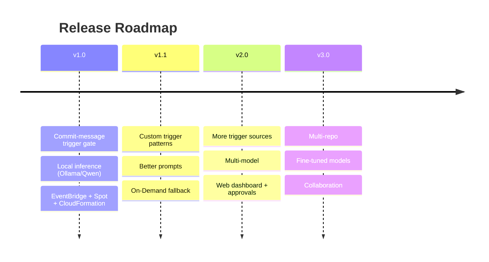

# Roadmap

Planned direction for the **GitHub AI Blog Generator**. Dates are indicative; scope may shift as the project evolves. Items marked ✅ are considered done for the milestone.

Related: [Requirements](./requirements.md) · [Contributing](./contributing.md).

---

## Version 1.0 — Foundation

The core opt-in, event-driven pipeline, deployable from scratch with CloudFormation.

- ✅ **Repository registration (MVP)** — onboard with URL + GitHub PAT; validate access, create the webhook, store metadata (DynamoDB) and the PAT (Secrets Manager)
- ✅ **Commit-message trigger gate** — generation runs only on a `blog:` commit; all other events are acknowledged and ignored
- ✅ GitHub Webhook + HMAC SHA-256 signature validation (API Gateway + lightweight Lambda handler)
- ✅ EventBridge event bus routing matched events to SQS + the instance starter
- ✅ Durable event buffering with Amazon SQS (+ dead-letter queue)
- ✅ On-demand EC2 Spot Instance start (instance-starter) and idle-timeout stop (idle-shutdown)
- ✅ Local inference via Ollama + Qwen — no paid inference API
- ✅ Repository analysis via OpenClaw and **Repository Memory** for continuity
- ✅ Quality review and **optional human approval** before publishing
- ✅ Persistent gp3 EBS volume for models, n8n state, and Repository Memory
- ✅ CloudFormation deployment (VPC, public subnet, IGW, route tables, SGs, IAM, EC2 Spot, EBS, API Gateway, Lambdas, EventBridge, SQS, CloudWatch)
- ✅ n8n workflow orchestration with retries, error handling, and notifications

**Exit criteria:** deploying the stacks + importing the workflows + configuring the webhook yields a pipeline where a `blog:` commit generates and publishes content, a routine commit is ignored, and the instance stops on idle.

---

## Version 1.1 — Trigger Flexibility & Resilience

Make the trigger configurable and the compute layer more robust.

- **Configurable custom trigger patterns** — `[blog]`, regular expressions, per-repository rules
- Improved prompts (better structure, tighter context selection, few-shot examples)
- **On-Demand fallback** when Spot capacity is unavailable
- Multi-Availability-Zone Spot placement
- GPU auto-detection and model right-sizing
- Faster cold start (pre-warmed AMI, model preload tuning)

---

## Version 2.0 — More Trigger Sources & Reach

Extend the trigger system and make model choice and publishing configurable — **without changing the core architecture** (all sources publish to the same EventBridge bus).

- **Additional trigger sources:** GitHub Releases, Git Tags, Pull Request labels
- **Manual blog generation** from the application
- **Scheduled repository summaries**
- **Multi-model support** — different local models per content type
- Additional content types (video/short/podcast scripts, auto-generated diagrams)
- Multi-language content generation
- **Web dashboard** for run history, approvals, and content review

---

## Version 3.0 — Auth, Scale & Collaboration

From single-run tool to team platform, and from PATs to GitHub Apps.

- **GitHub App authentication** (recommended long-term approach, replacing per-repo PATs) + **OAuth login**
- **Automatic webhook management**, fine-grained repository permissions, and **secret rotation**
- **Multiple repositories per user**, repository groups/organisations, and **multi-user workspaces**
- **Web-based repository management dashboard** (run history, approvals, content review)
- **Multi-repository batch processing** (org-wide scans)
- **Fine-tuned local models** for documentation style
- A second local-model review pass for accuracy and tone

---

## Continuously (all versions)

- Hardening security and least-privilege posture
- Cost tracking and optimisation (trigger ratios, idle behaviour, EBS sizing)
- Expanded test coverage and CI checks
- Documentation upkeep

---

## Contributing to the Roadmap

Have an idea or want to pick up a milestone item? Open an issue describing the use case, or comment on an existing one. See [Contributing](./contributing.md). Roadmap items are tracked as GitHub issues/milestones so progress is visible.
