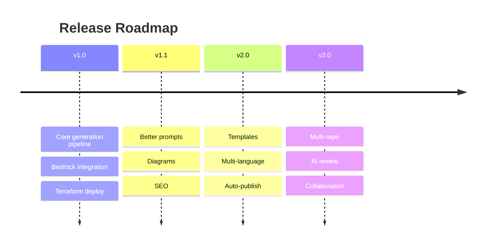

# Roadmap

Planned direction for the **AI GitHub Repository Blog Generator**. Dates are indicative; scope may shift as the project evolves. Items marked ✅ are considered done for the milestone.

Related: [Requirements](./requirements.md) · [Contributing](./contributing.md).

---

## Version 1.0 — Foundation

The core end-to-end pipeline, deployable from scratch with Terraform.

- ✅ GitHub repository analysis (clone, metadata, file discovery, README + source analysis, technology detection)
- ✅ Amazon Bedrock integration for blog generation
- ✅ Markdown blog generation with front matter and versioned S3 storage
- ✅ Terraform deployment (VPC, EC2/n8n, Lambdas, S3, EventBridge, CloudWatch, Secrets Manager, IAM)
- ✅ n8n workflow orchestration with error handling and notifications

**Exit criteria:** a single `terraform apply` + workflow import yields a working pipeline that produces a versioned Markdown post from a public repo.

---

## Version 1.1 — Quality

Improve output quality and discoverability.

- Improved AI prompts (better structure, tighter context selection, few-shot examples)
- Better architecture diagrams (auto-generated Mermaid from detected structure)
- SEO optimization (meta description, slug, tags, reading time, canonical front matter)
- Configurable prompt templates surfaced as variables

---

## Version 2.0 — Flexibility

Make output format and reach configurable.

- Multiple blog templates (tutorial, deep-dive, changelog, "show HN" style)
- Multi-language support (generate posts in multiple human languages)
- Automatic publishing (push to static-site repos, Dev.to, Medium, or a CMS via API)
- Draft/review state before publish

---

## Version 3.0 — Scale & Collaboration

From single-run tool to team platform.

- Multi-repository support (batch analysis; org-wide scans)
- AI content review (a second model pass for accuracy, tone, and fact-checking)
- Team collaboration (roles, review/approval workflow, comments)
- Analytics on generated content performance

---

## Continuously (all versions)

- Hardening security and least-privilege posture
- Cost tracking and optimization
- Expanded test coverage and CI checks
- Documentation upkeep

---

## Contributing to the Roadmap

Have an idea or want to pick up a milestone item? Open an issue describing the use case, or comment on an existing one. See [Contributing](./contributing.md). Roadmap items are tracked as GitHub issues/milestones so progress is visible.
