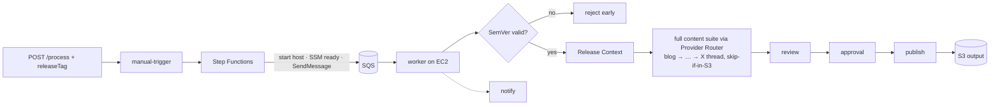

# Runbook: Release → Content (end-to-end validation)

This runbook validates the complete pipeline on a live AWS account: calling
`POST /process` with a release tag produces the **full, reviewed, published
content suite** — blog, storyboard, voice-over, YouTube, Shorts, TikTok, visual
assets, SEO, architecture, LinkedIn, and X thread. It exercises Semantic Version
validation, Milestone 2 (Release Context), the Milestone 3–13 content suite, and
the review/publish/notify stages together. No manual `generate-all` invocation is
required — the worker's release path runs the whole suite automatically.

Related: [Deployment](./deployment.md) · [Manual Trigger](./manual-trigger.md) · [Release Context](./release-context.md) · [Full Content Suite](./content-suite.md).

---

## 1. The flow being validated



The `/process` front door is always up; the state machine **starts the host on
demand** and enqueues the job. The scheduler/idle-stop powers the host off.

---

## 2. Prerequisites

- The stacks are deployed (`blog-gen-serverless`, `blog-gen-compute`,
  `blog-gen-scheduler`, `blog-gen-observability`). See [Deployment](./deployment.md)
  and [Installation → bootstrap](../README.md#installation).
- The `blog-gen-worker` service is active on the instance and Bedrock model
  access (or the Anthropic key secret) is configured.
- The target repository is **registered** (PAT stored) — see §4.
- AWS CLI v2 configured for the account/region.

Set these once for the commands below:

```bash
export AWS_REGION=us-east-1
export STACK=blog-gen
```

---

## 3. Confirm the deployment is healthy

```bash
# Serverless endpoints (note ReleaseContextUrl, RegistrationUrl, ProcessUrl)
aws cloudformation describe-stacks --stack-name ${STACK}-serverless \
  --query "Stacks[0].Outputs" --output table

# Release-context Lambda is deployed
aws lambda get-function --function-name ${STACK}-release-context \
  --query 'Configuration.[State,LastUpdateStatus]' --output text

# The worker is running on the instance (SSH in first — see Deployment §5)
systemctl status blog-gen-worker --no-pager
docker compose -f /opt/blog-gen/docker-compose.yml ps   # n8n + postgres + redis up
```

---

## 4. Register the target repository

Registration creates the GitHub webhook (subscribed to **push and release**
events) and stores the repo's PAT in the shared secret. The worker reads the
repo with that same PAT.

```bash
GITHUB_PAT=github_pat_xxx WEBHOOK_SECRET=$(openssl rand -hex 16) \
  scripts/register-repository.sh --owner <owner> --repository <repo>
```

Confirm in GitHub: **Settings → Webhooks → Recent Deliveries** shows a green ✓,
and **Settings → Webhooks** lists the `release` event.

> The PAT needs **Contents: Read** and **Metadata: Read** (plus **Webhooks:
> Read and write** for registration). The worker reads the repo via the GitHub
> API using this PAT; `GITHUB_TOKEN` on the instance is only a public/unregistered
> fallback.

---

## 5. Trigger a run

> **Reference target.** The pipeline is validated end-to-end against
> `teddynted/designing-an-ai-agent-platform-on-aws` at `v0.3.0` (published 7
> assets). `scripts/process-repository.sh` defaults to that repo, so
> `scripts/process-repository.sh --release-tag v0.3.0` reruns the reference
> release from your localhost. Substitute `<owner>/<repo>` below for any other
> registered repository.

### Option A — full loop (recommended): POST /process with the release tag

1. On the registered repo, ensure the GitHub Release exists (e.g. tag `v0.3.0`).
2. Call `POST /process` with the tag — the state machine starts the host and
   enqueues the job:

```bash
PURL=$(aws cloudformation describe-stacks --stack-name ${STACK}-serverless \
  --query "Stacks[0].Outputs[?OutputKey=='ProcessUrl'].OutputValue" --output text)
curl -sS -X POST "$PURL" -H "x-api-key: $API_KEY" -H "Content-Type: application/json" \
  -d '{"owner":"teddynted","repository":"designing-an-ai-agent-platform-on-aws","releaseTag":"v0.3.0"}'
```

### Option B — context only (no instance needed): call the endpoint

Builds and stores the Release Context without generating content — useful to
verify Milestone 2 in isolation.

```bash
URL=$(aws cloudformation describe-stacks --stack-name ${STACK}-serverless \
  --query "Stacks[0].Outputs[?OutputKey=='ReleaseContextUrl'].OutputValue" --output text)
KEY_ID=$(aws cloudformation describe-stacks --stack-name ${STACK}-serverless \
  --query "Stacks[0].Outputs[?OutputKey=='RegistrationApiKeyId'].OutputValue" --output text)
API_KEY=$(aws apigateway get-api-key --api-key "$KEY_ID" --include-value --query value --output text)

curl -sS -X POST "$URL" -H "x-api-key: $API_KEY" -H "Content-Type: application/json" \
  -d '{"owner":"teddynted","repository":"designing-an-ai-agent-platform-on-aws","releaseTag":"v0.3.0"}'
# -> {"status":"accepted","contextId":"…","location":"s3://…/release-contexts/…json", "warnings":N}
```

---

## 6. Verify each stage

| Stage | Check |
| --- | --- |
| **Accepted** | `POST /process` returns `202`; a Step Functions execution starts. |
| **Enqueued** | State machine reaches EnqueueJob; SQS `ApproximateNumberOfMessages` increments. |
| **Host up** | The instance transitions `stopped` → `running` (started by the state machine). |
| **Context built** | `release-contexts/<date>/<id>.json` exists in the artifacts bucket (Option B), or worker logs `release context built`. |
| **Content generated** | Worker logs `blog post generated` / `content generated`; metric `ReleaseRunsSucceeded`. |
| **Published** | New Markdown in the output destination (§7). |
| **Notified** | Log/webhook/email notification (if configured). |

Commands:

```bash
# Manual-trigger logs (last 5 min)
aws logs tail /aws/lambda/${STACK}-manual-trigger --since 5m --format short

# Release-context Lambda logs
aws logs tail /aws/lambda/${STACK}-release-context --since 10m --format short

# Worker logs on the instance
journalctl -u blog-gen-worker -n 100 --no-pager

# Queue depth (the events queue URL is a serverless-stack output)
QURL=$(aws cloudformation describe-stacks --stack-name ${STACK}-serverless \
  --query "Stacks[0].Outputs[?OutputKey=='QueueUrl'].OutputValue" --output text)
aws sqs get-queue-attributes --queue-url "$QURL" \
  --attribute-names ApproximateNumberOfMessages ApproximateNumberOfMessagesNotVisible
```

---

## 7. Where the output lands

- **Dedicated content bucket** (default): the bootstrap stack creates
  `blog-gen-content-<account>-<region>` and the compute stack wires it into the
  worker's `OUTPUT_S3_BUCKET`. Generated assets land under `OUTPUT_S3_PREFIX` (default
  `generated-content/`), one Markdown file per asset (`blog`, `release-summary`,
  …), keyed by `<owner>/<repo>/releases/<tag>/` for a release run or
  `<owner>/<repo>/<date>/` for a snapshot. The bucket is retained on stack delete. Override with the
  `OUTPUT_S3_BUCKET` repo variable to publish to a pre-existing bucket instead.
  Find the effective name from the stack output:

  ```bash
  aws cloudformation describe-stacks --stack-name blog-gen-compute \
    --query "Stacks[0].Outputs[?OutputKey=='ContentBucketName'].OutputValue" --output text
  ```
- **Instance filesystem** only if `OUTPUT_S3_BUCKET` is cleared: under the
  worker's `OUTPUT_DIR` (default `/data/generated-content`) on the persistent
  EBS volume.
- **Release Contexts**: `release-contexts/<yyyy>/<mm>/<dd>/<contextId>.json` in
  the artifacts bucket.

Fetch and eyeball the blog post:

Release runs are first-class in the path — `.../<owner>/<repo>/releases/<tag>/<kind>.md`
(snapshots keep the dated layout `.../<owner>/<repo>/<date>/<kind>.md`):

```bash
aws s3 ls "s3://<output-bucket>/<prefix>/" --recursive | tail
# a specific release, addressable by tag:
aws s3 cp "s3://<output-bucket>/<prefix>/<owner>/<repo>/releases/v0.3.0/blog.md" - | head -60
```

Acceptance: the `blog.md` opens with YAML front matter (`title`, a **150–160
char** `description`, `tags`), an H1, the full section structure
(Introduction … Conclusion), and — if the repo has Mermaid docs — an
`## Architecture Diagrams` section with fenced `mermaid` blocks.

---

## 8. Troubleshooting

| Symptom | Likely cause / fix |
| --- | --- |
| `POST /process` 202 but nothing runs | Check the Step Functions execution — did it reach EnqueueJob? Is the instance reporting SSM `Online`? |
| Worker logs `release run failed … unauthorized` | Repo PAT lacks Contents:Read, or repo not registered — re-register (§4). |
| `no content generated` | Check the worker log for `ai provider failed`; enable Bedrock model access or set the Anthropic key secret. |
| Context `warnings` include "no CHANGELOG"/"no commits" | Expected for sparse releases; content still generates from what's present. |
| Message keeps redelivering | A stage errors each attempt; check worker logs. After max receives it moves to the DLQ. |
| 403 from `/release-context` | Missing/!wrong `x-api-key` (§5, Option B). |

---

## 9. Cleanup

- Delete generated test objects from the output bucket and
  `release-contexts/` prefix.
- Deregister the test repo (removes the stored PAT + metadata):

  ```bash
  scripts/register-repository.sh --owner <owner> --repository <repo> --delete
  ```

- If you force-started the instance, it stops at the next scheduled stop (20:00),
  or stop it now via `aws lambda invoke --function-name ${STACK}-scheduled-stop /dev/stdout`.
