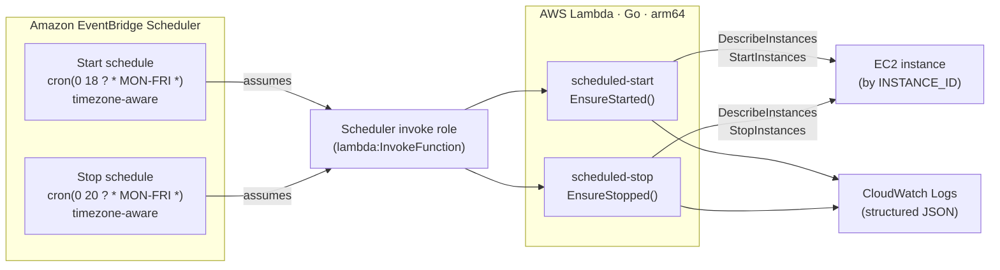

# Scheduled EC2 Power Management

Automatically **start** an EC2 instance in the evening and **stop** it later the
same night, on weekdays only, so the environment is available during a chosen
window (default 18:00 → 20:00, Mon–Fri) but not billed for compute the rest of
the week.

For the blog-gen platform this stack **owns instance power**: it is the
authority for when the On-Demand compute host is available, and the webhook path
never starts the instance itself. The stack is otherwise self-contained
(`infrastructure/scheduler.yaml` + two Go Lambdas), targets an instance by ID,
and can schedule any instance independently of the application stacks.

---

## Architecture



**Flow:** each EventBridge Schedule fires at its cron time in the configured
IANA timezone. It assumes the scheduler invoke role and calls the matching
Lambda. The Lambda reads `INSTANCE_ID` from its environment, checks the current
instance state, and issues `StartInstances` / `StopInstances` **only if a
transition is needed** (idempotent). All actions are logged as structured JSON.

### Why EventBridge Scheduler (not EventBridge Rules)

`AWS::Scheduler::Schedule` supports **`ScheduleExpressionTimezone`** natively, so
the 18:00/20:00 window is evaluated in local wall-clock time (including DST)
without hardcoding UTC. It also invokes Lambda through an **execution role**
(no resource-based `AWS::Lambda::Permission` needed) and has a built-in
`RetryPolicy`.

---

## Components

| Resource | Purpose |
| --- | --- |
| `AWS::Scheduler::Schedule` × 2 | Daily start (18:00) and stop (20:00), timezone-aware |
| `AWS::Lambda::Function` × 2 | `scheduled-start`, `scheduled-stop` (Go, `provided.al2023`, arm64) |
| `AWS::IAM::Role` × 2 | Per-function execution roles (least privilege) |
| `AWS::IAM::Role` × 1 | Scheduler invoke role (`lambda:InvokeFunction` on the two functions only) |
| `AWS::Logs::LogGroup` × 2 | `/aws/lambda/<project>-scheduled-{start,stop}`, configurable retention |

Go source:

- `lambdas/scheduled-start/main.go`, `lambdas/scheduled-stop/main.go` — thin entry points.
- `internal/power/power.go` — the idempotent `Switch` use case (unit-tested).
- `internal/awsec2/ec2.go` — the EC2 adapter (`InstanceState`, `StartInstance`, `StopInstance`).

---

## Deployment

### One command

```bash
INSTANCE_ID=i-0123456789abcdef0 \
TIMEZONE=Africa/Johannesburg \
scripts/deploy-scheduler.sh
```

The script builds both Lambdas (`linux/arm64`), uploads content-hashed zips to
the artifacts bucket, and deploys the stack. See the script header for all env
vars (`REGION`, `PROJECT_NAME`, `START_EXPR`, `STOP_EXPR`, `ENVIRONMENT`,
`BUCKET`). Equivalent Make target:

```bash
make deploy-scheduler INSTANCE_ID=i-0123456789abcdef0
```

### Manual (plain CloudFormation)

```bash
# 1. Build + package
for fn in scheduled-start scheduled-stop; do
  GOOS=linux GOARCH=arm64 CGO_ENABLED=0 go build -o "dist/$fn/bootstrap" "./lambdas/$fn"
  (cd "dist/$fn" && zip -j "../$fn.zip" bootstrap)
  aws s3 cp "dist/$fn.zip" "s3://$ARTIFACTS_BUCKET/scheduler/$fn.zip"
done

# 2. Deploy
aws cloudformation deploy \
  --template-file infrastructure/scheduler.yaml \
  --stack-name blog-gen-scheduler \
  --capabilities CAPABILITY_NAMED_IAM \
  --parameter-overrides \
    InstanceId=i-0123456789abcdef0 \
    ScheduleTimezone=Africa/Johannesburg \
    ArtifactsBucket=$ARTIFACTS_BUCKET \
    StartCodeKey=scheduler/scheduled-start.zip \
    StopCodeKey=scheduler/scheduled-stop.zip
```

### Deployer IAM permissions

The principal running the deploy needs to create the stack's resources:
`cloudformation:*` on the stack, `iam:CreateRole/DeleteRole/PutRolePolicy/PassRole`
(the three roles), `lambda:CreateFunction/UpdateFunctionCode/...`,
`logs:CreateLogGroup/PutRetentionPolicy`, `scheduler:CreateSchedule/...`, and
`s3:PutObject` on the artifacts bucket. `iam:PassRole` is required so Lambda and
Scheduler can assume the created roles.

### Runtime IAM (least privilege)

| Role | Allowed |
| --- | --- |
| `scheduled-start` | `ec2:StartInstances` on the **target instance ARN only**; `ec2:DescribeInstances` on `*` (read-only, not resource-scopable); CloudWatch Logs via `AWSLambdaBasicExecutionRole` |
| `scheduled-stop` | `ec2:StopInstances` on the **target instance ARN only**; `ec2:DescribeInstances` on `*`; Logs |
| scheduler invoke | `lambda:InvokeFunction` on the two function ARNs only; assumable only by `scheduler.amazonaws.com` from this account (`aws:SourceAccount` guard) |

---

## CloudFormation parameters

| Parameter | Default | Description |
| --- | --- | --- |
| `InstanceId` | *(required)* | EC2 instance to start/stop |
| `ProjectName` | `blog-gen` | Resource name prefix + `Project` tag |
| `Environment` | `dev` | `Environment` tag (`dev`/`staging`/`prod`) |
| `ScheduleTimezone` | `Etc/UTC` | IANA timezone for the cron expressions |
| `StartExpression` | `cron(0 18 ? * MON-FRI *)` | Weekday start time |
| `StopExpression` | `cron(0 20 ? * MON-FRI *)` | Weekday stop time |
| `ScheduleState` | `ENABLED` | `DISABLED` pauses both schedules without deleting the stack |
| `ManageSchedules` | `true` | `false` deploys only the Lambdas/roles (manual driving) |
| `ArtifactsBucket` | *(required)* | S3 bucket holding the two Lambda zips |
| `StartCodeKey` / `StopCodeKey` | `scheduled-*.zip` | S3 keys of the packages |
| `LambdaMemorySize` | `128` | MB for both Lambdas |
| `LambdaTimeout` | `30` | Seconds for both Lambdas |
| `LogRetentionDays` | `14` | CloudWatch log retention (valid CW values) |

Outputs: `StartFunctionArn`, `StopFunctionArn`, `StartScheduleName`,
`StopScheduleName`, and `ScheduleWindow` (a human-readable summary).

---

## Scheduling explained

EventBridge Scheduler cron format is `cron(Minutes Hours Day-of-month Month Day-of-week Year)`.

| Expression | Meaning |
| --- | --- |
| `cron(0 18 ? * MON-FRI *)` | 18:00 Monday–Friday |
| `cron(0 20 ? * MON-FRI *)` | 20:00 Monday–Friday |
| `cron(0 18 * * ? *)` | 18:00 every day (7-day variant) |

`?` marks "no specific value" in whichever of the day-of-month / day-of-week
fields is not being constrained. With the `MON-FRI` default the instance runs
**18:00 → 20:00 on weekdays only** and is stopped the rest of the time
(evenings, nights, and all weekend).

### Example EventBridge Scheduler configuration

What the deploy creates (start schedule), viewable with
`aws scheduler get-schedule --name blog-gen-scheduled-start`:

```json
{
  "Name": "blog-gen-scheduled-start",
  "State": "ENABLED",
  "ScheduleExpression": "cron(0 18 ? * MON-FRI *)",
  "ScheduleExpressionTimezone": "Africa/Johannesburg",
  "FlexibleTimeWindow": { "Mode": "OFF" },
  "Target": {
    "Arn": "arn:aws:lambda:us-east-1:123456789012:function:blog-gen-scheduled-start",
    "RoleArn": "arn:aws:iam::123456789012:role/blog-gen-scheduler-invoke-role",
    "RetryPolicy": { "MaximumRetryAttempts": 5, "MaximumEventAgeInSeconds": 3600 }
  }
}
```

## Timezone configuration

Set `ScheduleTimezone` to any [IANA timezone](https://en.wikipedia.org/wiki/List_of_tz_database_time_zones)
name — e.g. `Africa/Johannesburg`, `Europe/London`, `America/New_York`. The
Scheduler evaluates the cron in that zone and **handles daylight-saving
transitions automatically**, so "18:00" stays 18:00 local year-round. Because
the Lambda only issues start/stop by instance ID, no timezone logic lives in the
Go code — it is purely a Scheduler concern.

## How to modify the schedule

Redeploy with new parameters (no code change):

```bash
# e.g. run 20:00 → 06:00 in London time
aws cloudformation deploy --template-file infrastructure/scheduler.yaml \
  --stack-name blog-gen-scheduler --capabilities CAPABILITY_NAMED_IAM \
  --parameter-overrides \
    InstanceId=i-0123456789abcdef0 ArtifactsBucket=$ARTIFACTS_BUCKET \
    StartExpression="cron(0 20 * * ? *)" \
    StopExpression="cron(0 6 * * ? *)" \
    ScheduleTimezone="Europe/London"
```

**Weekdays only?** Use `cron(0 18 ? * MON-FRI *)` / `cron(0 20 ? * MON-FRI *)`.
**Pause entirely:** redeploy with `ScheduleState=DISABLED` (keeps the stack).

## How to manually start / stop

The schedules and manual control are independent — invoke the Lambdas directly:

```bash
# Force a start now
aws lambda invoke --function-name blog-gen-scheduled-start /dev/stdout
# Force a stop now
aws lambda invoke --function-name blog-gen-scheduled-stop /dev/stdout
```

Or bypass the Lambdas entirely:

```bash
aws ec2 start-instances --instance-ids i-0123456789abcdef0
aws ec2 stop-instances  --instance-ids i-0123456789abcdef0
```

Both are safe: the next scheduled run re-checks state and is a no-op if the
instance is already in the desired state.

---

## Example CloudWatch logs

Structured JSON (one object per line). **Start, instance was stopped:**

```json
{"time":"2026-07-10T18:00:01.412Z","level":"INFO","msg":"instance start issued","instance_id":"i-0123456789abcdef0","prior_state":"stopped","changed":true}
{"time":"2026-07-10T18:00:01.532Z","level":"INFO","msg":"scheduled start complete","start_issued":true}
```

**Start, already running (idempotent no-op):**

```json
{"time":"2026-07-11T18:00:00.998Z","level":"INFO","msg":"instance already running; no action","instance_id":"i-0123456789abcdef0","prior_state":"running","changed":false}
{"time":"2026-07-11T18:00:01.061Z","level":"INFO","msg":"scheduled start complete","start_issued":false}
```

**Stop failure (surfaced + retried by Scheduler):**

```json
{"time":"2026-07-11T20:00:00.740Z","level":"ERROR","msg":"scheduled stop failed","error":"stop instance i-0123456789abcdef0: operation error EC2: StopInstances, ... RequestLimitExceeded"}
```

---

## Cost considerations

See [Cost Optimisation](./cost-optimization.md) for the platform-wide view.
For this scheduler specifically:

### Why scheduling reduces EC2 cost

You pay for an EC2 instance only while it is **running**. Running 18:00 → 20:00
on weekdays is **~40 h/month** versus ~730 h for always-on — roughly **5.5%** of
the month, a **~94% compute saving**.

### Estimated monthly savings

For a `g4dn.xlarge` at the On-Demand rate of **$0.526/h** (us-east-1):

| Mode | Hours/month | Compute cost/month |
| --- | --- | --- |
| Always-on (24×7) | ~730 | **~$384** |
| Scheduled (2 h × weekdays) | ~40 | **~$21** |
| **Saving** | | **~$363/mo (~94%)** |

Because the window is fixed and weekday-only, the monthly compute cost is
**known in advance** — it does not scale with webhook volume. (EBS storage is
billed separately and is **not** affected by stopping — see below.)

### Why On-Demand rather than Spot

The compute host is **On-Demand**. Spot would be ~70–90% cheaper per hour, but a
Spot `StartInstances` only succeeds if there is capacity at your max price at
18:00 — for scarce GPU types that regularly fails (`InsufficientInstanceCapacity`),
and Spot instances can be reclaimed mid-window with a 2-minute warning. Since the
fixed weekday window already caps compute cost, On-Demand's guarantee that the
**scheduled start always succeeds and the host stays up for the whole window** is
worth more than the marginal Spot discount. A one-off maintenance run outside the
window is a manual `start-instances` (or a manual invoke of the scheduled-start
Lambda).

### Stopping vs terminating

| | **Stop** (what this does) | **Terminate** |
| --- | --- | --- |
| Compute billing | Stops | Stops |
| EBS root/data volumes | **Retained** (and billed) | Deleted unless `DeleteOnTermination=false` |
| Instance ID | Preserved | Gone |
| Restart | `start-instances` | Must launch a new instance |
| RAM / instance-store | Lost | Lost |

This scheduler **stops** (never terminates), so data on EBS survives the daily
off-window. You still pay for **EBS storage** while stopped (e.g. a 30 GB gp3
root ≈ $2.40/mo) — that is the price of keeping state between windows.

---

## Troubleshooting

| Symptom | Likely cause / fix |
| --- | --- |
| Instance didn't start at 18:00 | Check the start Lambda's log group. Common: wrong `ScheduleTimezone`, or the day is a weekend (the cron is `MON-FRI`). Transient EC2 errors are retried by the Scheduler `RetryPolicy` for 1 h. |
| Schedule never fires | `ScheduleState=DISABLED`, or `ManageSchedules=false` (no schedules created). Check `aws scheduler get-schedule --name <name>`. |
| `AccessDenied` invoking Lambda | Scheduler invoke role misconfigured — confirm the stack created `<project>-scheduler-invoke-role` and it lists both function ARNs. |
| `UnauthorizedOperation` on Start/Stop | The `InstanceId` doesn't match the ARN the role is scoped to (redeployed against a different instance). Redeploy with the correct `InstanceId`. |
| `instance ... not found` / `terminated` | The instance was terminated/replaced (e.g. a compute-stack redeploy); redeploy the scheduler with the new `InstanceId`. |
| Wrong local time | `ScheduleTimezone` is UTC (default). Set it to your IANA zone and redeploy. |
| Logs missing | The log group is created by the stack; if you deleted it, redeploy. Retention is `LogRetentionDays`. |

Inspect recent runs:

```bash
aws logs tail /aws/lambda/blog-gen-scheduled-start --since 1d --follow
aws logs tail /aws/lambda/blog-gen-scheduled-stop  --since 1d
```
