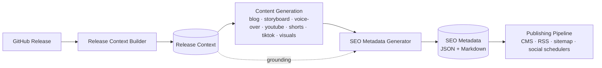
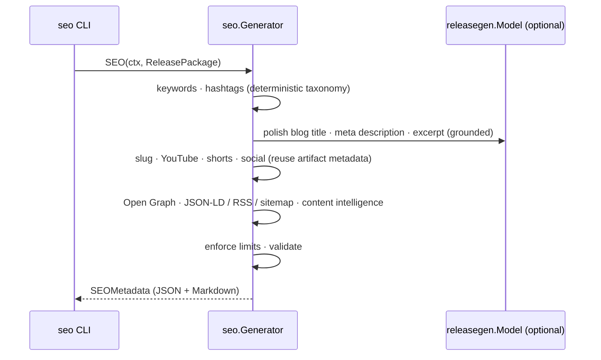

# SEO Metadata Generation (Milestone 10)

Milestone 10 converts the content pipeline's artifacts — [Release Context](./release-context.md)
(M2), [Technical Blog](./blog-generation.md) (M3), [Storyboard](./storyboard.md)
(M4), [Voice-over](./voiceover.md) (M5), [YouTube Script](./youtube.md) (M6),
[YouTube Shorts](./shorts.md) (M7), [TikTok](./tiktok.md) (M8), and
[Visual Assets](./visual-assets.md) (M9) — into the **canonical SEO metadata** for
every channel: blog, YouTube, short-form, social, Open Graph, and structured data.

It generates **metadata, not content.** It is the single source of SEO truth a
publishing system can consume without further transformation.

Related: [Blog Generation](./blog-generation.md) · [YouTube Script](./youtube.md) · [Visual Assets](./visual-assets.md) · [Release Context](./release-context.md) · [Architecture](./architecture.md).

---

## 1. Pipeline



`Generator.SEO(ctx, ReleasePackage) → SEOMetadata`, where `ReleasePackage`
bundles the eight upstream artifacts. The generator **aggregates and normalizes**
their metadata; it never regenerates repository knowledge.

### Sequence



## 2. Design

The engine lives in [`internal/seo`](../internal/seo). It is **deterministic
where it matters** and uses the LLM only for a few high-value strings. Each
planner is a pure, independently-testable function.

| Concern | Produced by |
| --- | --- |
| Keyword taxonomy (primary/secondary/long-tail/technical/technology/AWS/developer) | Deterministic, grounded in the Release Context |
| Slugs (+ alternatives) | Deterministic — lowercase, hyphenated, stop-words dropped |
| Excerpts (50 / 100 / 200 words) | Deterministic truncation (the ~50-word one may be LLM-polished) |
| Hashtags (YouTube / TikTok / LinkedIn / X) | Deterministic, reuse the video generators' tags, deduped + capped |
| YouTube / Shorts / Social SEO | **Reuse** the M6–M8 artifacts' own metadata, normalized |
| Open Graph · Twitter Card · JSON-LD · RSS · sitemap | Deterministic |
| Limits, confidence score, validation | Deterministic |
| Blog title · meta description · excerpt | LLM (`releasegen.Model`) with a grounded fallback |

When `Model` is nil, generation is fully deterministic — every value is drawn
from the artifacts and the Release Context.

## 3. Reuse over regeneration

Most channel metadata already exists upstream, so the SEO engine **aggregates**
rather than re-derives: YouTube titles/description/chapters/pinned-comment/
playlist come from the YouTube script's content intelligence; short-form
titles/captions/hashtags/CTAs come from the Shorts and TikTok artifacts; blog
title/meta/tags come from the blog. The engine's job is to normalize, dedupe,
enforce platform limits, add the deterministic pieces (slugs, Open Graph,
structured data), and validate.

## 4. Platform limits

| Field | Limit | On breach |
| --- | --- | --- |
| Blog meta description | ≤ 160 chars | truncated; **error** if still over |
| YouTube title | ≤ 100 chars (≤ 70 preferred) | truncated to 100; **warning** over 70 |
| Blog SEO title | ≤ 60 preferred | truncated; **warning** over 65 |
| OG / Twitter description | ≤ 200 chars | truncated |

Hard limits are validation **errors**; soft/preferred limits are **warnings**.

## 5. Schema (abridged)

```json
{
  "schemaVersion": "1.0.0",
  "metadata": { "repository": "acme/widget", "release": "v0.2.0" },
  "blog": { "title": "...", "metaDescription": "...", "slug": "inside-widget-v0-2-0-release-context-builder", "excerpts": { "short50": "...", "medium100": "...", "long200": "..." }, "canonical": { "url": "...", "robots": "index, follow" }, "readingTime": "1 min read", "category": "Cloud & DevOps", "topicClusters": [] },
  "youtube": { "title": "...", "alternativeTitles": [], "description": "...", "tags": [], "hashtags": [], "chapterTitles": [], "pinnedComment": "...", "playlists": [], "thumbnailText": [] },
  "shorts": { "items": [ { "platform": "TikTok", "title": "...", "caption": "...", "hashtags": [], "engagementPrompt": "...", "cta": "..." } ] },
  "social": { "items": [ { "platform": "LinkedIn", "title": "...", "summary": "...", "hashtags": [] } ] },
  "keywords": { "primary": [], "secondary": [], "longTail": [], "aws": [], "technology": [], "developer": [] },
  "hashtags": { "youtube": [], "tiktok": [], "linkedin": [], "x": [], "all": [] },
  "openGraph": { "ogTitle": "...", "ogType": "article", "twitter": { "card": "summary_large_image" } },
  "structuredData": { "schemaType": "TechArticle", "jsonLd": { "@type": "TechArticle" }, "rss": {}, "sitemap": {} },
  "contentIntelligence": { "audience": "...", "searchIntent": "informational / how-to", "seoConfidenceScore": 100 }
}
```

The schema is versioned and additive-only, so future publishing systems extend it
without breaking.

## 6. Validation

`SEOMetadata.Validate(pkg)` enforces the Milestone 10 invariants (empty ⇒ valid):

- Required, non-empty metadata for every channel (blog, YouTube, shorts, social,
  keywords, Open Graph, structured data).
- The blog meta description fits its 160-char limit; the YouTube title fits 100.
- The slug is valid (lowercase, hyphen-separated, no spaces/underscores/edges).
- Keywords and hashtags are deduplicated.
- At least one primary keyword or tag is grounded in the Release Context.

## 7. Structured data

The engine emits **Schema.org `TechArticle` JSON-LD**, an **RSS item**, and a
**sitemap entry** — ready for a CMS, feed, or search engine. The JSON-LD carries
the headline, description, keywords, author/publisher, word count, and dates,
grounded in the release.

## 8. Running it

The `seo` CLI reads a Release Context and reuses any artifacts you pass,
generating the rest, then emits Markdown (default) or JSON:

```bash
# Fully offline from a context + an existing blog (deterministic):
go run ./cmd/seo --context ctx.json --blog post.md --offline

# Generate the whole chain via Ollama, then the SEO as JSON:
go run ./cmd/seo --context ctx.json --format json --out seo.json
```

Flags: `--context` (required), `--blog`, `--storyboard`, `--voiceover`,
`--youtube`, `--shorts`, `--tiktok`, `--format md|json`, `--model`
(`OLLAMA_MODEL`), `--ollama` (`OLLAMA_URL`), `--offline`, `--out`, `--timeout`.

## 9. Status

**Implemented:** the SEO engine (keyword taxonomy, slug, excerpt, title,
description, tag, hashtag, blog / YouTube / shorts / social planners, Open Graph,
structured data, content intelligence with a confidence score), the versioned
JSON schema, the Markdown renderer, structural + limit validation, and the `seo`
CLI. Unit-tested at 80%+ with deterministic and model-backed paths.

**Next (future milestones):** feed this metadata directly into a publishing
pipeline — CMS front matter, RSS/sitemap generation, and social schedulers — with
no additional transformation; it is the canonical SEO source for every channel.
