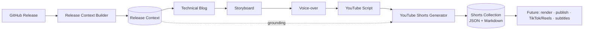
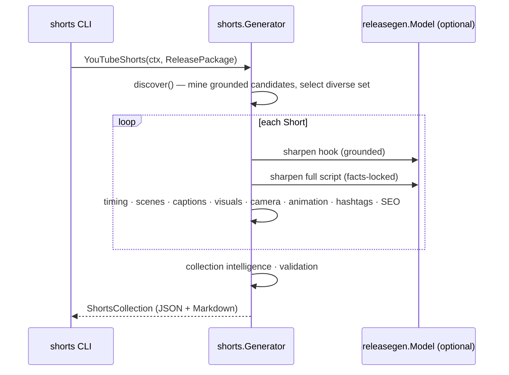

# YouTube Shorts Generation (Milestone 7)

Milestone 7 mines the previously generated artifacts — [Release Context](./release-context.md)
(M2), [Technical Blog](./blog-generation.md) (M3), [Storyboard](./storyboard.md)
(M4), [Voice-over Script](./voiceover.md) (M5), and long-form [YouTube Script](./youtube.md)
(M6) — for the most valuable technical moments and turns each into a standalone
**30–60 second YouTube Short** plan. It is the **Short-form Video** engine; it
plans Shorts, it does not render them.

Related: [YouTube Script](./youtube.md) · [Voice-over](./voiceover.md) · [Storyboard](./storyboard.md) · [Release Context](./release-context.md) · [Architecture](./architecture.md).

---

## 1. Pipeline



`Generator.YouTubeShorts(ctx, ReleasePackage) → ShortsCollection`, where
`ReleasePackage{Context, Blog, Storyboard, VoiceOver, YouTube}` bundles the five
upstream artifacts. The generator **consumes** them and never regenerates content.

### Sequence



## 2. Design

The engine lives in [`internal/shorts`](../internal/shorts). Like the storyboard,
voice-over, and YouTube engines, it is **deterministic where it matters** and uses
the LLM only for punch. Each planner is a pure, independently-testable function.

| Concern | Produced by |
| --- | --- |
| **Short discovery** (which moments become Shorts) | Deterministic, mined from grounded YouTube chapter callouts + types + Release Context stats |
| Timing (30–60s window, scene split) | Deterministic |
| Scenes · camera · animation | Deterministic (rule-based per angle & scene role) |
| Captions (timed, burned-in chunks) | Deterministic, spread across the duration |
| Visuals | Deterministic, each carrying a **grounded `reference`** |
| Hashtags · CTA · SEO · collection intelligence | Deterministic |
| Hook, script, caption wording | LLM (`releasegen.Model`) with a deterministic fallback |

It reuses the shared **`Model` port** (the Provider Router (Bedrock -> Anthropic)) and
consumes the Milestone 2–6 types unchanged. When `Model` is nil, generation is
fully deterministic — hooks and scripts are assembled from grounded seeds.

## 3. Short discovery

Candidates are mined, most-valuable-first, then a **diverse, deduplicated** set
is selected (≤ `MaxShorts`, default 6). Each candidate is anchored to a real
source and a grounded seed — never invented:

| Angle | Mined from |
| --- | --- |
| Architecture Reveal | `Architecture Decision` callout / architecture chapter + Mermaid diagram |
| AWS Best Practice | `Best Practice` callout |
| Developer Tip | `Tip` callout |
| Optimization | `Performance Note` callout |
| Lesson Learned | `Lesson Learned` callout |
| Common Mistake | `Common Mistake` / `Warning` callout |
| CloudFormation Tip | `Warning` on a CloudFormation chapter |
| Code Walkthrough | implementation chapter with a demonstration |
| Demo Highlight | results chapter |
| Interesting Statistic | Release Context commit/file stats (e.g. "9 commits across 12 files") |

Each Short communicates **one** idea: hook → core explanation → takeaway → CTA.

## 4. Structure of a Short

Hook (3–5s), a full spoken script, a 3–4 scene breakdown (each with duration,
visual, camera, animation, overlay, transition, narration), timed burned-in
captions, grounded visuals, per-scene camera and animation, a brief CTA,
hashtags, and per-Short SEO (thumbnail text, description, alt titles, publish
slot). Every Short ends on the repository so viewers can find the full project.

## 5. Schema (abridged)

```json
{
  "schemaVersion": "1.0.0",
  "metadata": { "repository": "acme/widget", "release": "v0.2.0", "shortCount": 6, "sourceSchemas": { "youTube": "1.0.0" } },
  "shorts": [
    {
      "id": 1, "title": "This architecture in under a minute", "angle": "Architecture Reveal",
      "duration": "0:45", "durationSec": 45,
      "hook": "This is the whole architecture in one shot.",
      "script": "...", "coreExplanation": "...", "takeaway": "...",
      "scenes": [ { "number": 1, "durationSec": 15, "visual": "...", "camera": "Zoom In", "animation": "Zoom", "transition": "Slide", "narration": "..." } ],
      "captions": [ { "text": "This is the whole architecture", "startSec": 0, "endSec": 5, "style": "large-bold" } ],
      "visuals": [ { "kind": "Mermaid Animation", "description": "...", "reference": "docs/architecture.md" } ],
      "camera": [], "animations": [],
      "cta": "The full architecture walkthrough is on the channel.",
      "hashtags": ["#SystemDesign", "#AWS"],
      "seo": { "thumbnailText": "THE ARCHITECTURE", "description": "...", "suggestedPublishTime": "Tue 9:00am (local)" },
      "source": { "chapter": 2, "storyboardScene": 2, "seed": "Each component has a single responsibility." }
    }
  ],
  "contentIntelligence": { "shortCount": 6, "totalDurationSec": 270, "publishCadence": "..." }
}
```

The schema is versioned and additive-only, so future rendering/publishing/
subtitle milestones extend it without breaking.

## 6. Validation

`ShortsCollection.Validate(pkg)` enforces the Milestone 7 invariants (empty ⇒ valid):

- Every Short has a hook, a CTA, and captions.
- Duration stays within the 30–60s window.
- Scenes are non-empty (each has narration and a visual).
- **Visual references are grounded** in the Release Context, Storyboard, or
  YouTube Script (checked against the real source set).
- No two Shorts are duplicates (by normalized title).

## 7. Running it

The `shorts` CLI reads a Release Context and reuses any artifacts you pass,
generating the rest, then emits Markdown (default) or JSON:

```bash
# Fully offline from a context + an existing blog (deterministic):
go run ./cmd/shorts --context ctx.json --blog post.md --offline

# Cap the batch and emit JSON, generating the whole chain via the Provider Router (Anthropic):
go run ./cmd/shorts --context ctx.json --max 4 --format json --out shorts.json
```

Flags: `--context` (required), `--blog`, `--storyboard`, `--voiceover`,
`--youtube`, `--max`, `--format md|json`, `--model` (Anthropic model id, provider default when empty), `--offline`, `--out`, `--timeout`.

## 8. Status

**Implemented:** the Shorts engine (discovery, hook, script, scene, caption,
visual, camera, animation, CTA, hashtag, and metadata planners), the versioned
JSON schema, the Markdown renderer, structural validation, and the `shorts` CLI.
Unit-tested at 80%+ with deterministic and model-backed paths.

**Next (future milestones):** render the Shorts to vertical video, publish
directly to YouTube, repurpose for TikTok and Instagram Reels, and generate
subtitles — all without modifying the Shorts Generator; this collection is the
canonical short-form input for each of them.
