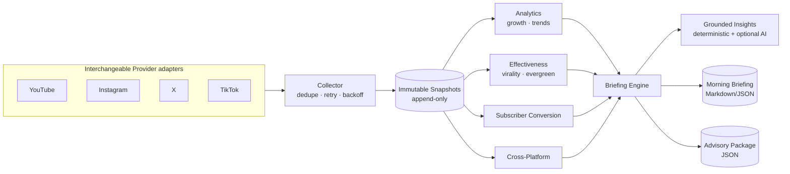

# Social Media Intelligence (Milestone 16)

Milestone 16 is a cross-platform **Social Media Intelligence** platform. It
collects daily performance data from **YouTube, Instagram, X, and TikTok**,
stores **immutable historical snapshots**, and turns them into grounded
analytics: growth trends, content effectiveness, subscriber conversion,
cross-platform comparison, a daily **morning briefing**, and a structured
**Business Advisory Council** package.

Every statistic is derived from a stored snapshot. AI is used only to *phrase*
insights over metrics that already exist — it never invents numbers.

Related: [Publishing](./publishing.md) · [Governance](./governance.md) · [Architecture](./architecture.md) · [Security](./security.md) · [Scheduling](./scheduling.md) · [Monitoring](./monitoring.md).

---

## 1. Pipeline



Scheduled daily by **EventBridge**; monitored via **CloudWatch** (see §7).

## 2. Design

The platform lives in [`internal/socialintel`](../internal/socialintel) and
follows Clean Architecture with strict dependency inversion. The domain
([`model.go`](../internal/socialintel/model.go)) is pure; every engine depends
only on ports ([`ports.go`](../internal/socialintel/ports.go)), never on
concrete providers, HTTP, or a database.

| Port | Responsibility | Shipped adapter |
|------|----------------|-----------------|
| `Provider` | Collect account + content metrics for a platform | YouTube / Instagram / X / TikTok + `SyntheticProvider` |
| `Repository` | Persist & query immutable snapshots | `MemoryRepository` (SQLite DDL in [`social-intel-schema.sql`](./social-intel-schema.sql)) |
| `AIInsighter` | Turn grounded metrics into qualitative notes | `ModelInsighter` (Bedrock/Ollama) |
| `Monitor` | Emit counters/durations/errors | `LogMonitor` (→ CloudWatch) / `nopMonitor` |
| `Clock` | Time (deterministic in tests) | `time.Now` / fixed |
| `HTTPDoer` | HTTP for provider adapters | `*http.Client` / mock |

**Adding a platform** (Facebook, Threads, Reddit, …) means writing one new
`Provider` — no change to the collector, analytics, or reporting engines. The
`Platform` constants for those future networks already exist.

## 3. Collection — immutable, idempotent, resilient

[`collector.go`](../internal/socialintel/collector.go) runs collection across all
enabled providers:

- **Immutable snapshots.** A day's metrics are written once and never
  overwritten (`UNIQUE(platform, date)`). This preserves an honest historical
  record for trend analysis.
- **Dedupe.** If a snapshot already exists for `(platform, date)`, the day is
  skipped — re-runs are safe.
- **Retry with exponential backoff.** Errors are classified *recoverable*
  (network, timeout, rate-limit, 5xx, partial) vs *permanent* (auth, quota,
  missing config) in [`errors.go`](../internal/socialintel/errors.go). Only
  recoverable errors are retried, with capped exponential backoff.
- **Backfill.** `Backfill(from, to)` fills gaps for historical import and
  recovery, skipping days that already exist.

## 4. Analytics (deterministic, grounded)

[`analytics.go`](../internal/socialintel/analytics.go) computes, per platform metric:

- **Growth** — day-over-day, week-over-week, month-over-month deltas (absolute +
  %). Deltas are looked up **by date**, not array index, so gaps don't distort
  comparisons.
- **Rolling 7-day average**, **velocity** (avg daily change), and **momentum**
  (`accelerating | steady | decelerating | flat`, from first-half vs second-half
  velocity).
- **Trend** direction (`up | down | flat`) over the retention window.

### Content effectiveness ([`effectiveness.go`](../internal/socialintel/effectiveness.go))

| Signal | Formula |
|--------|---------|
| Engagement rate | `(likes + comments + shares + saves) / views × 100` |
| Virality score | `(shareRate×3 + saveRate) × 100 × 20`, clamped 0–100 (shares weighted heaviest) |
| Evergreen score | ratio of recent vs early daily view gain across the item's snapshot history (sustained views → higher) |
| Overall score | `min(engagement×2, 40) + virality×0.3 + evergreen×0.2 + retention×0.1`, clamped 0–100 |

### Subscriber conversion ([`conversion.go`](../internal/socialintel/conversion.go))

Net subscribers (`gained − lost`), conversion rate (`net / views %`), and
views-per-subscriber, ranked to surface the best and worst subscriber-driving
content.

### Cross-platform ([`crossplatform.go`](../internal/socialintel/crossplatform.go))

Identifies the **best**, **fastest-growing**, **highest-engagement**,
**highest-conversion**, and **highest-retention** platform for the day.

## 5. Grounded insights & reporting

[`insights.go`](../internal/socialintel/insights.go) always produces
**deterministic** insights and recommendations straight from the metrics. The
optional `ModelInsighter` (Bedrock/Ollama) is given the metrics as JSON with an
explicit instruction to invent no numbers; its notes are *appended* to — never
substituted for — the deterministic findings. Any model error or unparseable
output falls back silently to the deterministic set.

The [`BriefingEngine`](../internal/socialintel/briefing.go) assembles:

- **Morning briefing** — headline, per-platform performance vs yesterday, new
  followers, top/worst content, best subscriber conversion, trending topics,
  insights, recommendations, alerts, and publishing windows. Rendered as
  Markdown ([`markdown.go`](../internal/socialintel/markdown.go)) or JSON.
- **Advisory package** — structured JSON for the Business Advisory Council:
  yesterday's performance, historical comparison, growth trends, content
  effectiveness, cross-platform standing, recommendations, and strategic actions.

## 6. CLI

[`cmd/socialintel`](../cmd/socialintel) drives the whole pipeline. Use
`--offline` to run the deterministic `SyntheticProvider` with **no network and
no secrets** — ideal for demos, CI, and reviewing output shapes.

```bash
# Offline demo: seed 30 days of synthetic history, print the morning briefing.
go run ./cmd/socialintel briefing --offline --days 30

# Advisory-council package as JSON over a synthetic backfill range.
go run ./cmd/socialintel advisory --offline --from 2026-06-01 --to 2026-06-30

# Real collection for today (requires env credentials, see §8).
go run ./cmd/socialintel collect

# Grounded AI enrichment via Ollama (falls back to deterministic on error).
go run ./cmd/socialintel briefing --offline --ai
```

Commands: `collect` · `backfill` · `briefing` · `advisory`.

## 7. Scheduling & monitoring (AWS)

- **EventBridge** triggers a daily collection run (e.g. `cron(0 6 * * ? *)` UTC),
  then the briefing/advisory generation. Because collection is idempotent, a
  retried or duplicated trigger never corrupts history.
- **CloudWatch** receives the `Monitor` signals emitted by `LogMonitor`:
  `collection.success`, `collection.skipped`, `collection.retry`,
  `collection.failed`, `collection.duration`, `db.write.*`. Alarm on
  `collection.failed` and on a drop in `collection.success` to detect a broken
  provider or expired credential.

## 8. Security

Credentials are read from the environment via
[`credentials.go`](../internal/socialintel/credentials.go) and are **never
logged, serialized, or embedded in errors** — only their *presence* is checked,
and only the credential's env-var **name** (never its value) is ever recorded.

| Variable | Platform |
|----------|----------|
| `YOUTUBE_ACCESS_TOKEN` | YouTube |
| `INSTAGRAM_ACCESS_TOKEN`, `INSTAGRAM_USER_ID` | Instagram |
| `X_BEARER_TOKEN`, `X_USER_ID` | X |
| `TIKTOK_ACCESS_TOKEN` | TikTok |

- **Rotation** is transparent: each call re-reads the environment, so a rotated
  secret takes effect on the next run with no code change.
- **Audit.** The optional `api_audit_log` table
  ([`social-intel-schema.sql`](./social-intel-schema.sql)) records which
  credential *name*, endpoint, and status/error code was used — for rate-limit,
  quota, and rotation forensics — never the secret itself.
- In production, source secrets from AWS Secrets Manager / SSM Parameter Store
  and inject them as environment variables.

## 9. Persistence

The shipped `MemoryRepository` implements the `Repository` port. A production
deployment implements the same interface over SQLite/Postgres using
[`social-intel-schema.sql`](./social-intel-schema.sql) — no engine code changes.
The immutability invariant is enforced at the schema level with
`UNIQUE(platform, date)` and `INSERT … ON CONFLICT DO NOTHING`.

## 10. Testing

`go test ./internal/socialintel/` covers collection (dedupe/retry/backfill),
analytics (growth windows, velocity, momentum), effectiveness ranking,
subscriber conversion, cross-platform intelligence, grounded + AI insights, the
morning briefing and advisory package, and all provider adapters via a mock
`HTTPDoer` — **no network or real credentials** are ever required.
