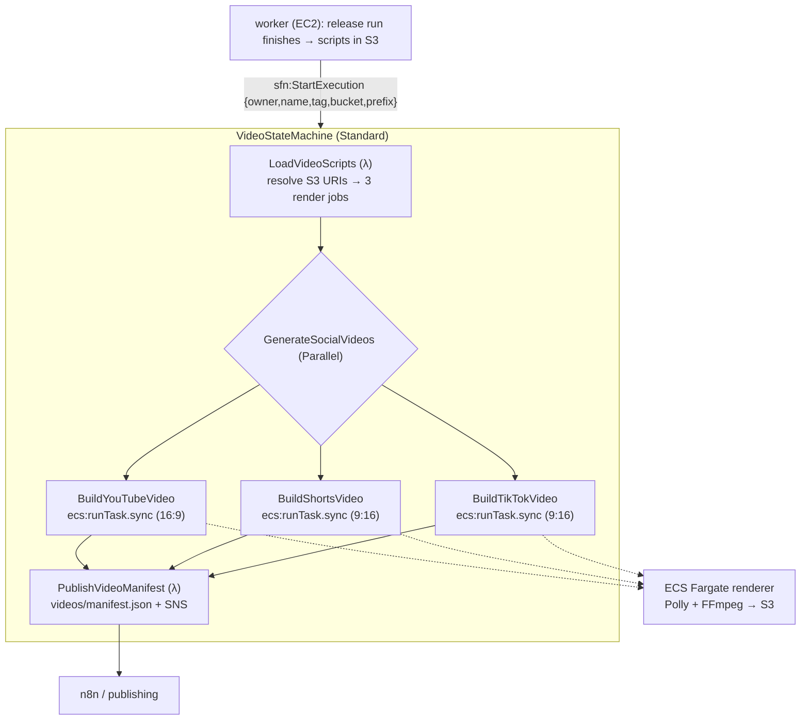

# Social Video Generation (`GenerateSocialVideos`)

Renders the generated video **scripts** (YouTube, YouTube Shorts, TikTok) into
**MP4s**, stores them in S3, and publishes a manifest of the resulting URIs for
downstream publishing (n8n / YouTube / TikTok). Opt-in via `ENABLE_VIDEO=true`.

Related: [Architecture](./architecture.md) · [Workflows](./workflows.md) ·
[Infrastructure](./infrastructure.md) · [Manual Trigger](./manual-trigger.md).

---

## 1. How it fits the pipeline

The core platform generates all artifacts **asynchronously in the worker** (the
orchestration state machine only starts the host + enqueues). So video rendering
is a **separate, dedicated Step Functions state machine** that the worker starts
*after* a successful release run — not part of the orchestration machine.



Each Parallel branch has a `Catch`, so one format failing (or a missing script)
does not fail the others — the manifest records per-format `rendered` / `failed`.

---

## 2. The renderer (ECS Fargate)

One Fargate task per format (`arm64`, from the `blog-gen-video-renderer` ECR
image built by `deploy.yml`). Container env is set by the state machine:
`FORMAT, SCRIPT_S3_URI, STORYBOARD_S3_URI, VOICEOVER_S3_URI, OUTPUT_S3_URI, ASPECT`.

`cmd/video-renderer` (in `containers/video-renderer/Dockerfile` = FFmpeg + the Go
binary) does: pick the scene source for the format → per scene, synthesize
narration with **Amazon Polly** (neural) → render a caption + narration MP4
segment with FFmpeg at the format aspect ratio (`1920×1080` / `1080×1920`) →
concatenate → upload the final MP4 to `OUTPUT_S3_URI`.

**Per-format scene source:** `youtube` renders from the **storyboard** (the
long-form plan its script references by scene index); `youtube-shorts` and
`tiktok` render from their **own native vertical scripts** (`shorts[0].scenes` /
`videos[0].scenes`), using each scene's on-screen `overlay` as the caption and
falling back to a capped storyboard if the format script is missing.

**Scene backgrounds.** Each scene gets exactly one background, chosen in this order:

1. **AI-generated scene image** — when `ENABLE_SCENE_IMAGES` is on. The renderer
   generates a picture for *every* scene from its `visual` direction using the
   **canonical `storyboardscenes.ScenePrompt`** (the same prompt logic the
   `storyboard-scenes` artifact uses: shared brand style + focal subject /
   grounded metaphor + a rotated cinematic composition). Scenes whose direction
   is diagram/text/logo-centric resolve to a grounded *metaphor* image for their
   type, so they still get real imagery. The backend is **Replicate** (FLUX.1
   [schnell] by default, or SDXL) when a token is configured, else Amazon Bedrock
   **Nova Canvas**. See [image backends](#41-scene-image-backends).
2. **Deep-slate title slide** — the fallback for every scene: a `#0F172A`
   background with the scene title large and centred. Any image miss (throttle,
   disabled, backend error) degrades to this, so a render never fails on a visual.

> The architecture diagram is **not** used as a video background — it rendered
> poorly as a full-frame image, so scenes use AI imagery instead. The
> `architecture-diagram.svg` artifact is still produced by the content suite for
> other consumers (blog/docs); the renderer simply no longer fetches it.

**Idempotency.** Before doing any Polly/FFmpeg work, the renderer `HeadObject`s
`OUTPUT_S3_URI`; if the MP4 already exists it skips and exits successfully, so a
re-run reuses existing videos. Set `FORCE_RENDER=true` (or delete the MP4) to
regenerate — e.g. after a renderer change.

> **Remaining follow-ups:** **music / branded intro-outro** (needs bundled static
> assets). Per-scene AI imagery, title slides, per-format scripts, captions, and
> idempotency are implemented.

---

## 3. S3 layout

Rendered videos + manifest land in the video bucket
(`<project>-video-<account>-<region>`):

```text
s3://blog-gen-video-.../
└── <owner>/<name>/<tag>/
    ├── youtube/final-youtube.mp4
    ├── youtube-shorts/final-youtube-shorts.mp4
    ├── tiktok/final-tiktok.mp4
    └── videos/manifest.json      # repo, version, per-format {status, outputUri}
```

Scripts are read from the content bucket's existing artifact layout
(`generated-content/<owner>/<name>/releases/<tag>/.artifacts/<stage>.json`).

---

## 4. Configuration

| Setting | Where | Purpose |
| --- | --- | --- |
| `ENABLE_VIDEO=true` | repo variable | Deploys the video stack + wires the release run to it |
| `RendererImageTag` | video stack param | Renderer image tag (deploy passes the commit SHA) |
| `TaskCpu` / `TaskMemory` | video stack params | Fargate size (default 2 vCPU / 8 GB) |
| `ENABLE_SCENE_IMAGES=true` | repo variable → `EnableSceneImages` param → renderer env | Turn on AI images for every scene (default off) |
| `REPLICATE_TOKEN_SECRET_ARN` | repo variable → `ReplicateTokenSecretArn` param | Secrets Manager ARN of a Replicate API token; injected as the `REPLICATE_API_TOKEN` container secret |
| `REPLICATE_IMAGE_MODEL` | repo variable → `ReplicateImageModel` param | Replicate model `owner/name` (default `black-forest-labs/flux-schnell`; e.g. `stability-ai/sdxl`) |
| `FORCE_RENDER=true` | renderer env | Bypass the already-exists skip and regenerate |

A start failure of the video machine is **non-fatal** — it never fails the
release run that already published.

### 4.1 Scene image backends

The renderer selects the image backend at runtime (`imagegen.NewFromEnv`):

- **Replicate** (recommended) when `REPLICATE_API_TOKEN` is present — a hosted
  FLUX/SDXL API with real quota. Enable it by storing a token in Secrets Manager
  and pointing `REPLICATE_TOKEN_SECRET_ARN` at it, plus `ENABLE_SCENE_IMAGES=true`.
- **Amazon Bedrock Nova Canvas** otherwise — IAM-authenticated, no key, but note
  the account's on-demand image quota is currently `0` and non-adjustable, so
  Nova Canvas throttles before doing work; use Replicate until that is lifted.

Either way, a generation failure degrades to the title slide — a bad backend
never breaks a video.

---

## 5. Infrastructure

`infrastructure/video.yaml` (deploy after network+serverless+compute) provisions:
the video S3 bucket, the ECR repo, an ECS Fargate cluster + task definition
(`VideoTaskRole` = S3 R/W + `polly:SynthesizeSpeech`), the two Lambdas
(`load-video-scripts`, `publish-video-manifest`), an SNS topic, and the
`VideoStateMachine` (+ role scoped for `ecs:runTask.sync`: RunTask / PassRole /
DescribeTasks + the managed EventBridge rule). Fargate runs in the network
stack's public subnet (egress-only SG) to reach ECR/S3/Polly.

---

## 6. Verification

- `cfn-lint infrastructure/video.yaml`; `go build ./...`, `go vet`; unit tests for
  `load-video-scripts` (URI resolution), `publish-video-manifest` (manifest +
  SNS), `cmd/video-renderer` (scene parsing + FFmpeg arg construction), and the
  worker `videoTriggeringRunner`.
- `docker build -f containers/video-renderer/Dockerfile .` (validates the image).
- **End-to-end (deploy):** set `ENABLE_VIDEO=true`, deploy, `POST /process` with a
  `releaseTag`; after the release run publishes, the video machine renders the
  three MP4s and writes `videos/manifest.json` to the video bucket.
