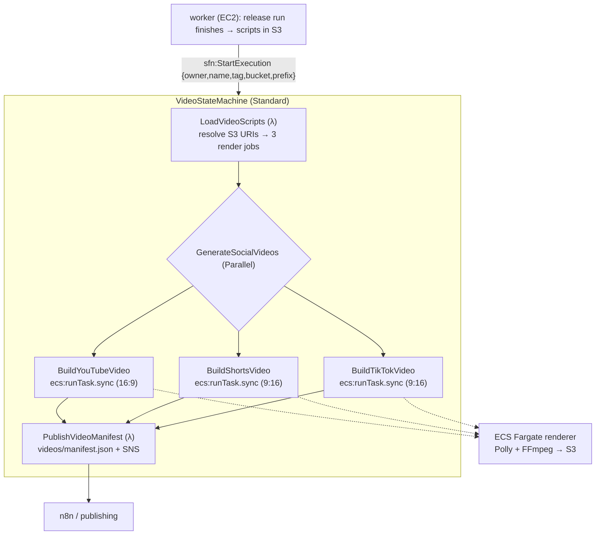

# Social Video Generation (`GenerateSocialVideos`)

Renders the generated video **scripts** (YouTube, YouTube Shorts, TikTok) into
**MP4s**, stores them in S3, and publishes a manifest of the resulting URIs for
downstream publishing (n8n / YouTube / TikTok). Opt-in via `ENABLE_VIDEO=true`.

Related: [Architecture](./architecture.md) · [Workflows](./workflows.md) ·
[Infrastructure](./infrastructure.md) · [Manual Trigger](./manual-trigger.md).

---

## 1. How it fits the pipeline

The core platform generates all artifacts **asynchronously in the worker** (the
orchestration state machine only starts the host + enqueues). So video rendering
is a **separate, dedicated Step Functions state machine** that the worker starts
*after* a successful release run — not part of the orchestration machine.



Each Parallel branch has a `Catch`, so one format failing (or a missing script)
does not fail the others — the manifest records per-format `rendered` / `failed`.

---

## 2. The renderer (ECS Fargate)

One Fargate task per format (`arm64`, from the `blog-gen-video-renderer` ECR
image built by `deploy.yml`). Container env is set by the state machine:
`FORMAT, SCRIPT_S3_URI, STORYBOARD_S3_URI, VOICEOVER_S3_URI, OUTPUT_S3_URI, ASPECT`.

`cmd/video-renderer` (in `containers/video-renderer/Dockerfile` = FFmpeg + the Go
binary) does: download the storyboard → per scene, synthesize narration with
**Amazon Polly** (neural) → render a caption + narration MP4 segment with FFmpeg
at the format aspect ratio (`1920×1080` / `1080×1920`) → concatenate → upload the
final MP4 to `OUTPUT_S3_URI`.

> **v1 scope.** All formats are driven from the **storyboard** scenes (a single,
> stable schema); short formats are capped to a few scenes. Visuals are Polly
> narration + text-card captions. Per-format script scene selection and richer
> visuals (AI images from `visual-assets`, diagram overlays, music/intro-outro)
> are follow-ups — the platform produces image *prompts* and Mermaid diagrams,
> not finished imagery.

---

## 3. S3 layout

Rendered videos + manifest land in the video bucket
(`<project>-video-<account>-<region>`):

```text
s3://blog-gen-video-.../
└── <owner>/<name>/<tag>/
    ├── youtube/final-youtube.mp4
    ├── youtube-shorts/final-youtube-shorts.mp4
    ├── tiktok/final-tiktok.mp4
    └── videos/manifest.json      # repo, version, per-format {status, outputUri}
```

Scripts are read from the content bucket's existing artifact layout
(`generated-content/<owner>/<name>/releases/<tag>/.artifacts/<stage>.json`).

---

## 4. Configuration

| Setting | Where | Purpose |
| --- | --- | --- |
| `ENABLE_VIDEO=true` | repo variable | Deploys the video stack + wires the worker |
| `VIDEO_STATE_MACHINE_ARN` | worker env (compute stack) | The video machine the worker starts; deterministic `…:stateMachine:<project>-video` |
| `RendererImageTag` | video stack param | Renderer image tag (deploy passes the commit SHA) |
| `TaskCpu` / `TaskMemory` | video stack params | Fargate size (default 2 vCPU / 8 GB) |

The worker only starts the video machine when **both** `VIDEO_STATE_MACHINE_ARN`
and `OUTPUT_S3_BUCKET` are set (the renderer reads scripts from S3). A start
failure is **non-fatal** — it never fails the release run that already published.

---

## 5. Infrastructure

`infrastructure/video.yaml` (deploy after network+serverless+compute) provisions:
the video S3 bucket, the ECR repo, an ECS Fargate cluster + task definition
(`VideoTaskRole` = S3 R/W + `polly:SynthesizeSpeech`), the two Lambdas
(`load-video-scripts`, `publish-video-manifest`), an SNS topic, and the
`VideoStateMachine` (+ role scoped for `ecs:runTask.sync`: RunTask / PassRole /
DescribeTasks + the managed EventBridge rule). Fargate runs in the network
stack's public subnet (egress-only SG) to reach ECR/S3/Polly.

---

## 6. Verification

- `cfn-lint infrastructure/video.yaml`; `go build ./...`, `go vet`; unit tests for
  `load-video-scripts` (URI resolution), `publish-video-manifest` (manifest +
  SNS), `cmd/video-renderer` (scene parsing + FFmpeg arg construction), and the
  worker `videoTriggeringRunner`.
- `docker build -f containers/video-renderer/Dockerfile .` (validates the image).
- **End-to-end (deploy):** set `ENABLE_VIDEO=true`, deploy, `POST /process` with a
  `releaseTag`; after the release run publishes, the video machine renders the
  three MP4s and writes `videos/manifest.json` to the video bucket.
