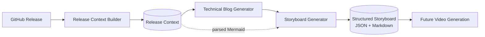

# Storyboard Generation (Milestone 4)

Milestone 4 turns a generated technical blog ([Milestone 3](./blog-generation.md))
into a **structured, scene-by-scene storyboard** — the canonical **Video
Planning** artifact for downstream video milestones (YouTube, Shorts, TikTok,
LinkedIn/Reels, AI video, voice-over, motion graphics). It plans the video; it
does not render it.

Related: [Release Context](./release-context.md) · [Blog Generation](./blog-generation.md) · [Architecture](./architecture.md).

---

## 1. Pipeline



`Generator.Storyboard(ctx, BlogPost, *ReleaseContext) → Storyboard`.

## 2. Design

The engine lives in [`internal/storyboard`](../internal/storyboard). It is
**deterministic where it matters** and uses the LLM only for wording:

| Concern | Produced by |
| --- | --- |
| Scene extraction (## sections → concepts) | Deterministic |
| Timing (word-count → seconds, clamped 5–25s) | Deterministic |
| Camera, animation, overlay, transition, asset, music planning | Deterministic (rule-based per scene type) |
| **Diagram references** (source, nodes, highlights, zoom) | **From the parsed Mermaid in the Release Context — never invented** |
| Code visualization (fenced blocks → instructions) | Deterministic |
| Content intelligence (chapters, complexity, thumbnail, SEO) | Deterministic |
| Narration wording | LLM (`releasegen.Model`) with a deterministic fallback |

It reuses the shared **`Model` port** (local Ollama today, Bedrock later — though
this project runs local-only) and the **`BlogPost`** type from Milestone 3. When
`Model` is nil, generation is fully deterministic (narration is drawn from the
blog prose). **Architecture is never invented:** every `DiagramRef`'s source,
type, and highlighted nodes come from the parsed diagrams in the Release Context.

## 3. Scene structure

Each scene carries: number, title, type (`introduction | problem | architecture
| cloudformation | repository | implementation | results | lessons | conclusion
| diagram | generic`), objective, duration (min/max/recommended/pacing),
narration, visuals, camera direction, sequenced animations, overlays, diagram
references, code references, transition, music mood, sound effects, and assets.

Scene types drive the creative direction — e.g. an `architecture`/`diagram`
scene gets **Diagram Focus** camera, a **Diagram Build** + per-node **Highlight
Node** animation sequence (one per real diagram node), and **AWS Service Label**
overlays; a `cloudformation` scene gets **Code Highlight** + "Zoom into
CloudFormation resource".

## 4. Timing

Per-scene recommended duration = `round(narrationWords / 2.6 wps)` clamped to
**5–25 s**, with a min/max window and a pacing label. The whole video reports
total runtime, voice-over duration, scene count, and pacing; long-form targets
8–15 minutes (a warning is emitted when a blog is too thin to reach it).

## 5. Schema (abridged)

```json
{
  "schemaVersion": "1.0.0",
  "metadata": { "repository": "...", "release": "v0.2.0", "sourceBlogTitle": "..." },
  "video": { "targetFormat": "long-form", "aspectRatio": "16:9", "sceneCount": 9, "totalDurationSec": 540, "voiceoverDurationSec": 500, "pacing": "medium" },
  "scenes": [
    {
      "sceneNumber": 1, "title": "Introduction", "type": "introduction",
      "objective": "...", "duration": { "recommendedSec": 8, "minSec": 5, "maxSec": 13, "pacing": "fast" },
      "narration": "...", "visuals": {}, "camera": {}, "animations": [], "overlays": [],
      "diagrams": [], "code": [], "transition": {}, "assets": []
    }
  ],
  "contentIntelligence": { "difficulty": "intermediate", "audience": "...", "chapters": [], "seoKeywords": [] }
}
```

The schema is versioned and additive-only, so future video milestones extend it
without breaking.

## 6. Running it

The `storyboard` CLI reads a Release Context JSON and a blog (existing file or
generated via Ollama), and emits Markdown (default) or JSON:

```bash
# Offline, from an existing blog file (deterministic narration):
go run ./cmd/storyboard --context ctx.json --blog post.md --offline

# Generate the blog via Ollama, then the storyboard as JSON:
go run ./cmd/storyboard --context ctx.json --format json --out board.json
```

Flags: `--context` (required), `--blog`, `--format md|json`, `--model`
(`OLLAMA_MODEL`), `--ollama` (`OLLAMA_URL`), `--offline`, `--out`, `--timeout`.

### Via the unified `content` CLI (recommended)

`cmd/content` is the suite entrypoint. Use `--from-blog` to derive the storyboard
from an existing `blog.md` (skipping the expensive blog regeneration) and
`--provider` to choose where the per-scene narration is polished:

```bash
# Fast: polish narration via the Claude Code subscription (`claude -p`).
# A few minutes; no ANTHROPIC_API_KEY needed.
go run ./cmd/content \
  --artifact storyboard \
  --from-blog output/releases/v0.6.0/blog.md \
  --no-history \
  --no-cache \
  --context fixtures/designing-v0.6.0.json \
  --provider claude-code

# Local-only: polish narration via Ollama (default provider).
# Slower on CPU (~2 min/scene); watch the per-scene progress logs on stderr.
go run ./cmd/content \
  --artifact storyboard \
  --from-blog output/releases/v0.6.0/blog.md \
  --no-history \
  --no-cache \
  --context fixtures/designing-v0.6.0.json \
  --provider ollama
```

Both write `output/releases/<version>/storyboard.md`, where `<version>` comes
from the `--context` fixture. Progress is logged per scene and per model call
(`storyboard narrating scene 3 of 13`, plus a 15s "… still generating"
heartbeat), so a long CPU-bound Ollama run never goes silent.

## 7. Status

**Implemented:** the storyboard engine (scene extraction, timing, camera,
animation, overlay, Mermaid, code, transition, and asset planners; content
intelligence), the versioned JSON schema, the Markdown renderer, structural
validation, and the `storyboard` CLI. Unit-tested at 80%+ with deterministic and
model-backed paths.

**Next (future milestones):** generate voice-over from `narration`, render
scenes/animations, and cut Shorts/TikTok/Reels directly from this storyboard —
it is the canonical input for all of them.
