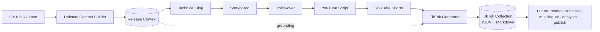
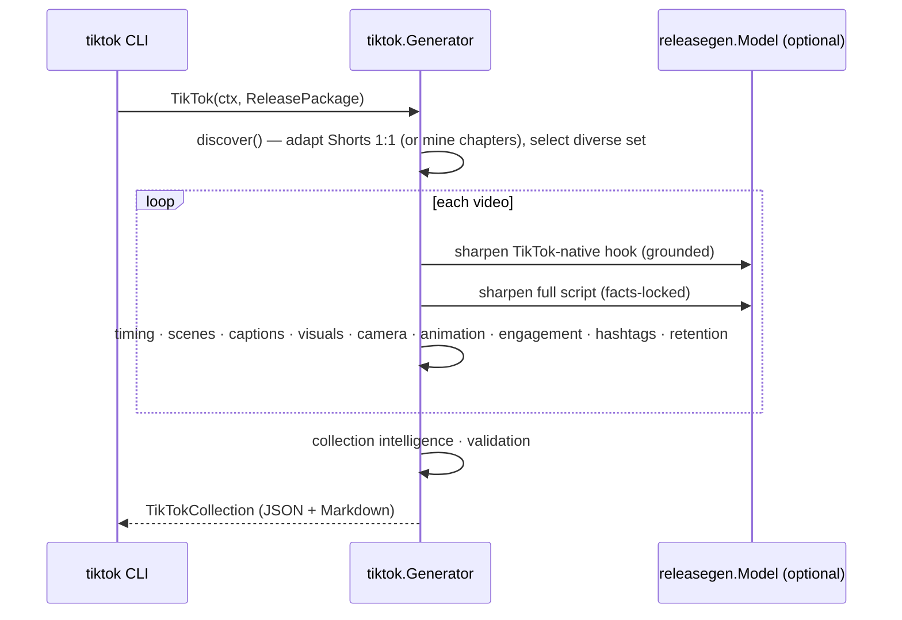

# TikTok Generation (Milestone 8)

Milestone 8 adapts the previously generated artifacts — [Release Context](./release-context.md)
(M2), [Technical Blog](./blog-generation.md) (M3), [Storyboard](./storyboard.md)
(M4), [Voice-over Script](./voiceover.md) (M5), long-form [YouTube Script](./youtube.md)
(M6), and [YouTube Shorts](./shorts.md) (M7) — into multiple **TikTok-native
educational videos** (20–60 seconds). It is the **Social Video** engine; it plans
TikToks, it does not render them.

Related: [YouTube Shorts](./shorts.md) · [YouTube Script](./youtube.md) · [Voice-over](./voiceover.md) · [Storyboard](./storyboard.md) · [Release Context](./release-context.md) · [Architecture](./architecture.md).

---

## 1. Pipeline



`Generator.TikTok(ctx, ReleasePackage) → TikTokCollection`, where
`ReleasePackage{Context, Blog, Storyboard, VoiceOver, YouTube, Shorts}` bundles
the six upstream artifacts. The generator **adapts** them and never regenerates
repository knowledge.

### Sequence



## 2. Design

The engine lives in [`internal/tiktok`](../internal/tiktok). Like the earlier
video engines, it is **deterministic where it matters** and uses the LLM only for
punch. Each planner is a pure, independently-testable function.

| Concern | Produced by |
| --- | --- |
| **Topic discovery** (which concepts become TikToks) | Deterministic — adapts YouTube Shorts 1:1, or mines chapters + Release Context stats |
| Timing (20–60s window, scene split) | Deterministic |
| Scenes · camera · animation | Deterministic (rule-based per topic & scene role) |
| Captions (timed, burned-in, technical-term highlights) | Deterministic |
| Visuals | Deterministic, each carrying a **grounded `reference`** (reuses the source Short's) |
| Engagement · hashtags · CTA · retention score · SEO · intelligence | Deterministic |
| Hook, script, caption wording | LLM (`releasegen.Model`) with a deterministic fallback |

When `Model` is nil, generation is fully deterministic — hooks and scripts are
assembled from grounded seeds.

## 3. Topic discovery — adapt, don't regenerate

The prompt's guiding rule is *adapt existing content to TikTok*. So discovery
**prefers adapting each YouTube Short 1:1**, mapping its angle to a TikTok topic
and reusing its grounded visuals:

| YouTube Short angle | TikTok topic |
| --- | --- |
| Architecture Reveal | Architecture Insight |
| AWS Best Practice | AWS Tip |
| CloudFormation Tip | CloudFormation Trick |
| Optimization | Code Optimization |
| Developer Tip / Code Walkthrough | Developer Productivity |
| Common Mistake | Common Mistake |
| Lesson Learned | Best Practice |
| Demo Highlight | GitHub Automation |
| Interesting Statistic | Interesting Statistic |

When **no Shorts** are present, it falls back to mining the YouTube chapters and
their callouts, plus a grounded Release Context statistic — the same approach as
M7. A diverse, deduplicated set is then selected (≤ `MaxVideos`, default 6).

## 4. Structure of a TikTok

Each video teaches **one** concept: a 2–3s hook, then a
**hook → problem → solution → takeaway → engagement prompt → CTA** script, a 4-scene
breakdown (duration, narration, visual, camera, animation, overlay, transition),
timed burned-in captions (technical terms highlighted), grounded visuals,
per-scene camera and animation, an engagement prompt, a short CTA, hashtags
(incl. `#TechTok`), and per-video SEO. A deterministic **retention score**
(0–100) estimates hold — favouring strong opening topics, the ~25–40s sweet spot,
dense captions, and visual variety. Every video ends on the repository.

## 5. Schema (abridged)

```json
{
  "schemaVersion": "1.0.0",
  "metadata": { "repository": "acme/widget", "release": "v0.2.0", "videoCount": 6, "sourceSchemas": { "shorts": "1.0.0" } },
  "videos": [
    {
      "id": 1, "title": "The architecture nobody explains", "topic": "Architecture Insight",
      "duration": "0:38", "durationSec": 38,
      "hook": "This one architecture decision changed everything.",
      "script": "...", "problem": "...", "solution": "...", "takeaway": "...",
      "scenes": [ { "number": 1, "durationSec": 10, "narration": "...", "visual": "...", "camera": "Push In", "animation": "Zoom Effects", "transition": "Zoom" } ],
      "captions": [ { "text": "This one architecture decision", "startSec": 0, "endSec": 2, "style": "large-bold" } ],
      "visuals": [ { "kind": "Mermaid Diagram", "description": "...", "reference": "docs/architecture.md" } ],
      "camera": [], "animations": [],
      "engagementPrompt": "Would you have designed it differently? Tell me how.",
      "cta": "Full architecture walkthrough on YouTube — link in bio.",
      "hashtags": ["#SystemDesign", "#AWS", "#TechTok"],
      "seo": { "caption": "...", "postingTime": "Tue 7:00pm (local)" },
      "source": { "short": 1, "storyboardScene": 2, "seed": "Each component has a single responsibility." },
      "retentionScore": 88
    }
  ],
  "contentIntelligence": { "videoCount": 6, "averageRetentionScore": 84, "postingCadence": "..." }
}
```

The schema is versioned and additive-only, so future rendering/subtitle/
multilingual/analytics/publishing milestones extend it without breaking.

## 6. Validation

`TikTokCollection.Validate(pkg)` enforces the Milestone 8 invariants (empty ⇒ valid):

- Every TikTok has a hook, captions, an engagement prompt, and a CTA.
- Duration stays within the 20–60s window.
- Scenes are non-empty (each has narration).
- **Visual references are grounded** in the Release Context, Storyboard, YouTube,
  or Shorts assets.
- No two videos are duplicates (by normalized title).

## 7. Running it

The `tiktok` CLI reads a Release Context and reuses any artifacts you pass,
generating the rest, then emits Markdown (default) or JSON:

```bash
# Fully offline from a context + an existing blog (deterministic):
go run ./cmd/tiktok --context ctx.json --blog post.md --offline

# Cap the batch and emit JSON, generating the whole chain via Ollama:
go run ./cmd/tiktok --context ctx.json --max 4 --format json --out tiktok.json
```

Flags: `--context` (required), `--blog`, `--storyboard`, `--voiceover`,
`--youtube`, `--shorts`, `--max`, `--format md|json`, `--model` (`OLLAMA_MODEL`),
`--ollama` (`OLLAMA_URL`), `--offline`, `--out`, `--timeout`.

## 8. Status

**Implemented:** the TikTok engine (topic discovery, hook, script, scene,
caption, visual, camera, animation, engagement, CTA, hashtag, and metadata
planners incl. a retention score), the versioned JSON schema, the Markdown
renderer, structural validation, and the `tiktok` CLI. Unit-tested at 80%+ with
deterministic and model-backed paths.

**Next (future milestones):** render the TikToks to vertical video, generate
subtitles and multilingual versions, wire up analytics, and publish directly to
TikTok — all without modifying the TikTok Generator; this collection is the
canonical social-video input for each of them.
