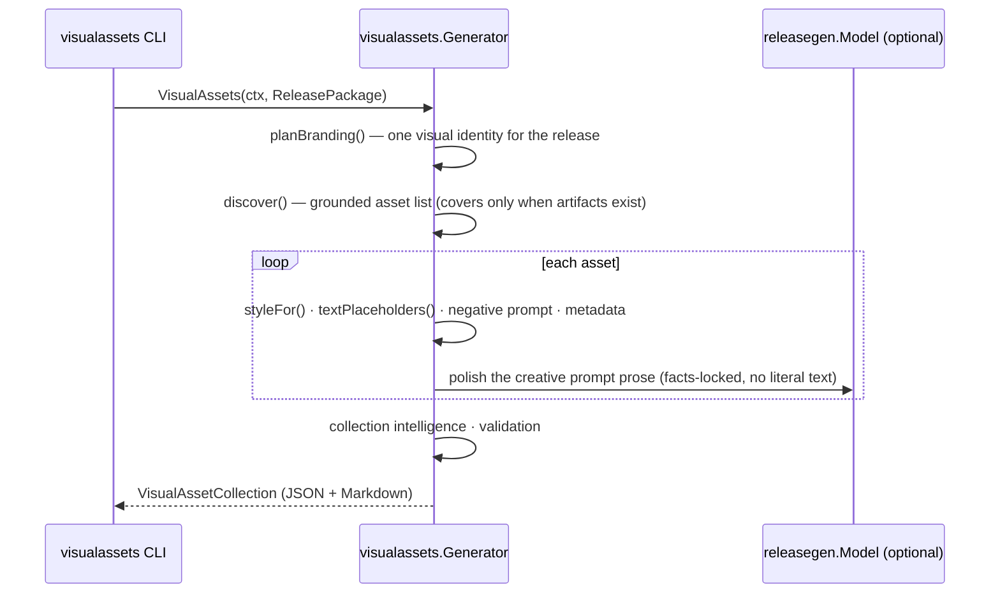

# Visual Asset Generation (Milestone 9)

Milestone 9 converts the previously generated artifacts — [Release Context](./release-context.md)
(M2), [Technical Blog](./blog-generation.md) (M3), [Storyboard](./storyboard.md)
(M4), [Voice-over](./voiceover.md) (M5), [YouTube Script](./youtube.md) (M6),
[YouTube Shorts](./shorts.md) (M7), and [TikTok](./tiktok.md) (M8) — into
structured, **provider-neutral AI image prompts** for thumbnails, social
graphics, blog headers, promotional banners, and technical illustrations. It is
the **Visual Design** engine.

**It produces prompts, not images.** The output drives any image model (GPT
Image, DALL·E, Stable Diffusion, Midjourney, Amazon Nova Canvas, Flux, …) without
vendor lock-in.

Related: [Storyboard](./storyboard.md) · [YouTube Script](./youtube.md) · [Shorts](./shorts.md) · [TikTok](./tiktok.md) · [Release Context](./release-context.md) · [Architecture](./architecture.md).

---

## 1. Pipeline

```mermaid
flowchart LR
    REL[GitHub Release] --> RCB[Release Context Builder]
    RCB --> RCX[(Release Context)]
    RCX --> BLOG[Technical Blog]
    BLOG --> SB[Storyboard]
    SB --> VO[Voice-over]
    VO --> YT[YouTube Script]
    YT --> SH[YouTube Shorts]
    SH --> TT[TikTok]
    TT --> VA[Visual Asset Generator]
    RCX -.grounding.-> VA
    VA --> OUT[(Visual Asset Collection<br/>JSON + Markdown)]
    OUT --> IMG[Future: GPT Image · DALL·E · SD · Midjourney · Nova Canvas · Flux]
```



`Generator.VisualAssets(ctx, ReleasePackage) → VisualAssetCollection`, where
`ReleasePackage{Context, Blog, Storyboard, VoiceOver, YouTube, Shorts, TikTok}`
bundles the seven upstream artifacts. The generator **consumes** them and never
regenerates repository knowledge.

### Sequence



## 2. Design

The engine lives in [`internal/visualassets`](../internal/visualassets). Like the
earlier engines, it is **deterministic where it matters** and uses the LLM only
for creative prose. Each planner is a pure, independently-testable function.

| Concern | Produced by |
| --- | --- |
| **Asset discovery** (what to make) | Deterministic — platform/format list, covers gated on artifact presence |
| **Branding** (one visual identity) | Deterministic — AWS-forward releases earn an AWS-orange accent |
| Style (composition, perspective, lighting, palette) | Deterministic, per category (thumbnail / social / banner / illustration) |
| Text placeholders (reserved zones — no baked-in text) | Deterministic |
| Negative prompts | Deterministic — universal + category + ungrounded-AWS exclusions |
| Metadata (complexity, cost band, filename, SEO) | Deterministic |
| Prompt prose | LLM (`releasegen.Model`) with a deterministic fallback |

When `Model` is nil, generation is fully deterministic — prompts are assembled
from grounded specs.

## 3. Grounding & accuracy

Every asset is anchored to the Release Context: its subject comes from the
architecture overview / summary / primary feature, and its `references` list
cites real artifacts (repo, tag, Mermaid source, AWS services). Prompts **never
name an AWS service the release doesn't use** — validation scans the prompt
against a service catalogue and rejects any service absent from the context.

## 4. No text in images

Images render **no literal text**. Each asset lists structured
`textPlaceholders` (reserved zones like "left third → headline") and every prompt
ends with an explicit instruction to render no text, letters, logos, or
watermarks — a downstream compositor adds real copy. This keeps prompts reusable
and avoids the garbled-text failure mode of image models.

## 5. Assets discovered

YouTube Thumbnail (16:9), Repository Hero Image, GitHub Social Card (1.91:1),
LinkedIn Banner, X Image, Blog Header, Dev.to Cover, Medium Cover, Release Card
(1:1), Promotional Graphic — always. Architecture Illustration and AWS Workflow
Diagram — only when the context has architecture. YouTube Shorts Cover and TikTok
Cover (9:16) — only when those artifacts are present.

## 6. Schema (abridged)

```json
{
  "schemaVersion": "1.0.0",
  "metadata": { "repository": "acme/widget", "release": "v0.2.0", "assetCount": 14, "sourceSchemas": { "tikTok": "1.0.0" } },
  "branding": { "primaryColors": ["#0B1F33", "#12263A"], "accentColors": ["#FF9900", "#4F9DFF"], "illustrationStyle": "...", "visualTone": "..." },
  "assets": [
    {
      "id": 1, "type": "YouTube Thumbnail", "platform": "YouTube", "aspectRatio": "16:9", "dimensions": "1280x720",
      "title": "...", "purpose": "...",
      "prompt": "YouTube Thumbnail illustration depicting an event-driven pipeline... Render NO text... 16:9 aspect ratio (1280x720).",
      "negativePrompt": "no gibberish text, no watermarks, no photorealistic human faces, ...",
      "style": { "composition": "...", "perspective": "...", "lighting": "...", "mood": "...", "colorPalette": ["#0B1F33", "#FF9900"], "style": "...", "technicalFocus": "release architecture at a glance" },
      "branding": { },
      "textPlaceholders": [ { "area": "left third", "purpose": "headline" } ],
      "references": ["widget", "v0.2.0", "AWS Lambda", "Amazon SQS"],
      "metadata": { "visualComplexity": "medium", "estimatedCost": "~1 credit (standard quality)", "recommendedFilename": "widget-v0-2-0-youtube-thumbnail.png" }
    }
  ],
  "contentIntelligence": { "assetCount": 14, "platforms": ["YouTube", "GitHub", "LinkedIn"], "visualComplexity": "high", "estimatedCost": "..." }
}
```

The schema is versioned and additive-only, so future image-generation/publishing
milestones extend it without breaking.

## 7. Validation

`VisualAssetCollection.Validate(pkg)` enforces the Milestone 9 invariants (empty ⇒ valid):

- Every prompt is grounded in the Release Context (a reference resolves to a real
  artifact).
- Every prompt names a platform and an aspect ratio.
- Every prompt carries style guidance.
- No prompt names an AWS service absent from the Release Context.
- No two prompts are duplicates (by type+platform or by prompt text).

## 8. Running it

The `visualassets` CLI reads a Release Context and reuses any artifacts you pass,
generating the rest, then emits Markdown (default) or JSON:

```bash
# Fully offline from a context + an existing blog (deterministic):
go run ./cmd/visualassets --context ctx.json --blog post.md --offline

# Cap the batch and emit JSON, generating the whole chain via Ollama:
go run ./cmd/visualassets --context ctx.json --max 10 --format json --out assets.json
```

Flags: `--context` (required), `--blog`, `--storyboard`, `--voiceover`,
`--youtube`, `--shorts`, `--tiktok`, `--max`, `--format md|json`, `--model`
(`OLLAMA_MODEL`), `--ollama` (`OLLAMA_URL`), `--offline`, `--out`, `--timeout`.

## 9. Status

**Implemented:** the Visual Asset engine (asset discovery, branding, thumbnail /
social / banner / illustration style planners, negative prompts, metadata), the
versioned JSON schema, the Markdown renderer, structural validation, and the
`visualassets` CLI. Unit-tested at 80%+ with deterministic and model-backed paths.

**Next (future milestones):** send these prompts to an image model to render the
assets, then publish them alongside the blog, videos, and social posts — the
prompts are the canonical visual-design input, and the shared Branding keeps every
rendered asset on-brand.
