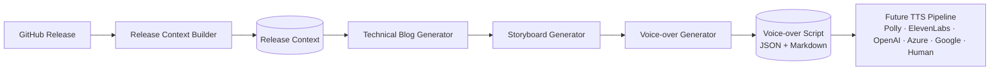
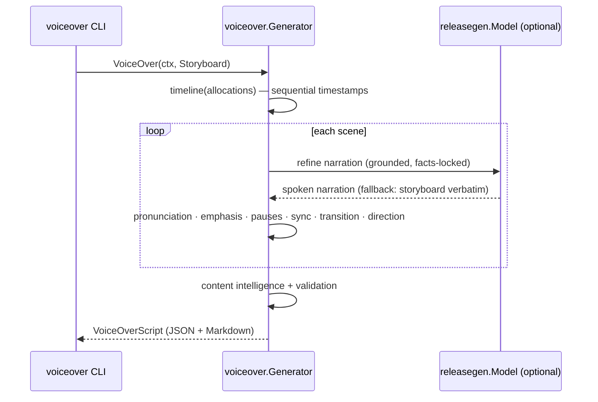

# Voice-over Script Generation (Milestone 5)

Milestone 5 turns a generated [Storyboard](./storyboard.md) into a **structured,
synchronized voice-over script** — the canonical **Narration** artifact for
downstream Text-to-Speech pipelines (Amazon Polly, ElevenLabs, OpenAI TTS, Azure
Speech, Google Cloud TTS) and human narrators. It writes the narration; it does
**not** synthesize speech.

Related: [Storyboard](./storyboard.md) · [Blog Generation](./blog-generation.md) · [Release Context](./release-context.md) · [Architecture](./architecture.md).

---

## 1. Pipeline



`Generator.VoiceOver(ctx, Storyboard) → VoiceOverScript`.

The Voice-over Generator **never regenerates the storyboard** — it *enriches* it.
The storyboard is already grounded in the Release Context, so it is the single
source of truth: narration comes from the storyboard, pronunciation and emphasis
are extracted from that narration, and every sync cue points at the storyboard's
real diagrams, code, camera moves, and overlays. Nothing is invented.

### Sequence



## 2. Design

The engine lives in [`internal/voiceover`](../internal/voiceover). Like the
storyboard engine, it is **deterministic where it matters** and uses the LLM only
for wording. Each planner is a pure, independently-testable function.

| Concern | Produced by |
| --- | --- |
| Timestamps (sequential, gap-free `MM:SS`) | Deterministic |
| Speaking pace, voice direction, emotion, energy | Deterministic (rule-based per scene type) |
| Pronunciation (curated lexicon → SSML `say-as`) | Deterministic — only terms present in the narration |
| Emphasis (clarity cue phrases + release tag) | Deterministic |
| Pauses (opening / before-diagram / before-demonstration / after-key-takeaway / closing) | Deterministic |
| **Sync cues** (diagram reveal, code highlight, camera move, overlay) | **From the storyboard scene — never invented** |
| Transitions (spoken bridges between scenes) | Deterministic, using the next scene's real title/type |
| Content intelligence (words, speaking/recording time, density, TTS voice) | Deterministic |
| Narration wording | LLM (`releasegen.Model`) with a deterministic fallback |

It reuses the shared **`Model` port** (local Ollama today, Bedrock later) and the
Milestone 4 **`Storyboard`** type. When `Model` is nil, narration is taken from
the storyboard **verbatim** — generation is fully deterministic and grounded.

## 3. Scene structure

Each scene carries: number, title, timestamp (start/end/label + raw seconds),
duration (allocated vs. estimated speech time + a `fits` flag), speaking pace,
voice direction, emotion, energy, opening cue, narration, pronunciation guide,
emphasis words, pauses, sync cues, transition, closing cue, and word count.

Scene types drive the direction — e.g. an `introduction` gets high energy and a
warm, inviting voice; an `architecture`/`diagram` scene gets a slow, instructive
pace, a **before-diagram** pause, and a **Diagram Reveal** sync cue; a
`conclusion` gets a long **after-key-takeaway** pause and a closing line.

## 4. TTS-agnostic by design

The script never names a provider voice ID. Instead it emits neutral direction
any engine or narrator can honour:

- **Pronunciation** entries carry an SSML `say-as` hint (`spell-out` for acronyms
  like AWS/JSON/IAM, `as-written` for words like CloudFormation/Ollama/Bedrock).
- **Pauses** carry a `durationMs` that maps directly to SSML `<break time="…">`.
- **Voice** carries a provider-neutral recommendation (style, persona, language,
  words-per-minute).

Future milestones map these to Polly, ElevenLabs, OpenAI TTS, Azure, or Google
**without changing the Voice-over Generator**.

## 5. Schema (abridged)

```json
{
  "schemaVersion": "1.0.0",
  "metadata": { "repository": "acme/widget", "release": "v0.2.0", "sceneCount": 4, "totalDurationSec": 49 },
  "voice": { "style": "Professional, educational, conversational", "persona": "an experienced software engineer teaching another engineer", "language": "en-US", "wordsPerMinute": 156 },
  "scenes": [
    {
      "sceneNumber": 2, "title": "Architecture and Design",
      "timestamp": { "start": "00:12", "end": "00:27", "startSec": 12, "endSec": 27, "label": "00:12–00:27" },
      "duration": { "allocatedSec": 15, "estimatedSpeechSec": 14, "fits": true },
      "pace": "Slow", "voiceDirection": "Clear and instructive", "emotion": "focused", "energy": "medium",
      "openingCue": "Hold a beat as the diagram begins to build, then start narrating.",
      "narration": "The system is event-driven on AWS Lambda and Amazon SQS...",
      "pronunciation": [ { "term": "AWS", "phonetic": "A-W-S", "sayAs": "spell-out" } ],
      "emphasis": [], "pauses": [ { "type": "medium", "position": "before-diagram", "durationMs": 600 } ],
      "syncCues": [ { "visual": "Diagram Reveal", "cue": "Begin the explanation only after the diagram has built...", "target": "docs/architecture.md" } ],
      "transition": "Now that we've walked the architecture, let's see how it's built.",
      "closingCue": "Settle the last word cleanly so the transition can carry the cut."
    }
  ],
  "contentIntelligence": { "totalWords": 96, "estimatedSpeakingTime": "0:37", "averageWordsPerMinute": 156, "technicalDensity": "medium", "recommendedTTSVoice": "Neural, en-US, warm and conversational (provider-neutral)", "recommendedLanguage": "en-US" }
}
```

The schema is versioned and additive-only, so future TTS milestones extend it
without breaking.

## 6. Validation

`VoiceOverScript.Validate()` enforces the Milestone 5 invariants (empty ⇒ valid):

- Every scene has non-empty narration.
- Narration fits the allocated scene time (`estimatedSpeechSec ≤ allocated + tolerance`).
- Timestamps are sequential and gap-free (`scene[i].startSec == scene[i-1].endSec`).
- Pronunciation entries are unique within a scene.
- A transition cue exists for every scene (incl. the closing line on the last).
- Timing information is present (`allocatedSec > 0`, `end > start`).

## 7. Example narration

```
## Scene 1 — Introduction

- Timestamp: 00:00–00:12 (12s allocated, ~11s spoken)
- Voice: Warm and inviting, confident · enthusiastic · energy high · pace Conversational
- Opening cue: Open on the title card; begin speaking as it settles into frame.

  "Welcome. This release ships a Release Context builder for GitHub.
   Notice how it grounds every downstream artifact."

- Emphasize: "notice"
- Pauses: [short] opening; [short] closing
- Transition: With the stage set, let's step through the architecture.
```

## 8. Running it

The `voiceover` CLI reads an existing storyboard JSON, or builds one from a
Release Context (+ optional blog), then emits Markdown (default) or JSON:

```bash
# From an existing storyboard JSON, fully offline (deterministic narration):
go run ./cmd/voiceover --storyboard board.json --offline

# From a Release Context + a blog file, offline end-to-end:
go run ./cmd/voiceover --context ctx.json --blog post.md --offline

# Generate the storyboard via Ollama first, then the voice-over as JSON:
go run ./cmd/voiceover --context ctx.json --format json --out script.json
```

Flags: `--storyboard`, `--context`, `--blog`, `--format md|json`, `--model`
(`OLLAMA_MODEL`), `--ollama` (`OLLAMA_URL`), `--offline`, `--out`, `--timeout`.

## 9. Status

**Implemented:** the voice-over engine (timestamp, pace, pronunciation, emphasis,
pause, sync, transition, and voice-direction planners; content intelligence), the
versioned JSON schema, the Markdown renderer, structural validation, and the
`voiceover` CLI. Unit-tested at 80%+ with deterministic and model-backed paths.

**Next (future milestones):** map the pronunciation/pause/voice direction onto a
concrete TTS provider (Amazon Polly, ElevenLabs, OpenAI TTS, Azure Speech, Google
Cloud TTS) or a human narrator, and mux the resulting audio with the storyboard's
visuals — this script is the canonical narration input for all of them.
