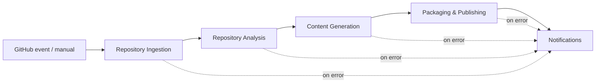
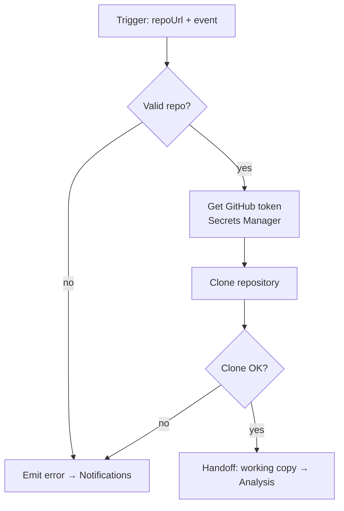
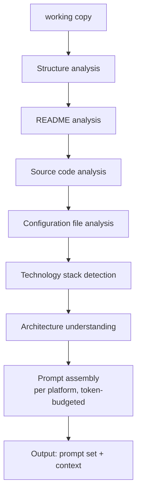
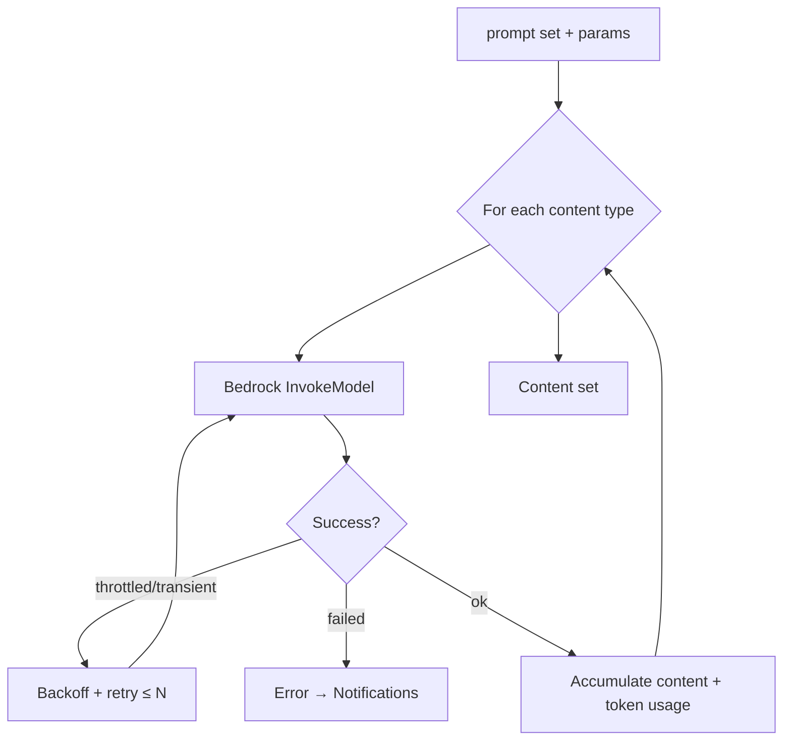
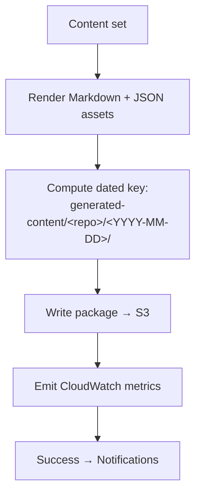
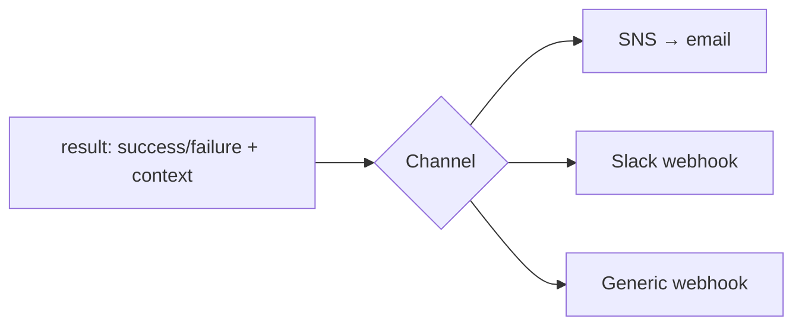

# Workflows

The platform's control flow is implemented as **n8n workflows**. Each workflow is a discrete, versioned unit exported as JSON under `workflows/n8n/`. n8n (running on the EC2 host) performs cloning, analysis, prompt building, Amazon Bedrock invocation, packaging, and notifications, passing structured data between stages.

Related: [Architecture](./architecture.md) · [Infrastructure](./infrastructure.md) · [Monitoring](./monitoring.md).

---

## 1. Workflow Catalog

| Workflow | File | Trigger | Purpose |
| --- | --- | --- | --- |
| Repository Ingestion | `repository-ingestion.json` | GitHub event / manual | Entry point; validates input, clones repo |
| Repository Analysis | `repository-analysis.json` | Called by ingestion | Structure, README, source, config, tech stack, architecture |
| Content Generation | `content-generation.json` | Called by analysis | Invokes Amazon Bedrock per content type |
| Packaging & Publishing | `packaging-publishing.json` | Called by generation | Assembles the package, writes it to S3 |
| Notifications | `notifications.json` | Called on success/failure | Sends notifications |

The workflows compose into a single pipeline; each can also be executed independently for testing ([WF-6](./requirements.md#6-workflow-requirements)).

> **Scheduling note:** the daily EC2 start/stop (19:00–21:00) is **not** an n8n workflow — it is an **EventBridge Scheduler** rule invoking the `ec2-scheduler` Go Lambda ([Infrastructure §6](./infrastructure.md#6-amazon-eventbridge)). Content runs are triggered by **GitHub events** or **manual** invocation.

---

## 2. End-to-End Pipeline



---

## 3. Repository Ingestion

Entry point. Validates the target repo, resolves the GitHub token from Secrets Manager, clones the repository to the EC2 working directory, and hands off to analysis.



**Triggers:** push, pull request, release, repository creation, workflow dispatch, manual ([FR-5](./requirements.md#15-github-event-triggers)).
**Input:** `{ repoUrl, event, branch? }` · **Output:** `{ workingCopyRef, repoMeta }`

---

## 4. Repository Analysis

Builds a structured understanding of the repository.



**Input:** `{ workingCopyRef, repoMeta }` · **Output:** `{ prompts, contextManifest }`

Implements [FR-1](./requirements.md#11-repository-analysis) (repository analysis) and feeds [AI Requirements](./requirements.md#5-ai-requirements).

---

## 5. Content Generation

Invokes Amazon Bedrock once per content type with platform-tuned prompts and configured model parameters; retries on throttling with exponential backoff.



**Content types:** `blog`, `medium`, `devto`, `hashnode`, `newsletter`, `linkedin`, `twitter-thread`, `reddit`, `faq`, `readme-suggestions`, `image-prompts`, `seo`, `metadata` ([FR-2](./requirements.md#12-content-generation)).
**Input:** `{ prompts, model, temperature, maxTokens }` · **Output:** `{ contentSet, tokenUsage }`

Model ID and parameters come from Terraform config ([AI-2](./requirements.md#5-ai-requirements)).

---

## 6. Packaging & Publishing



The package is written under `generated-content/<repository-name>/<YYYY-MM-DD>/` with S3 versioning enabled, containing all articles plus `seo.json`, `metadata.json`, and `image-prompts.md`. Metadata (`title`, `date`, `source_repo`, `tags`, `reading_time`, `model`) is captured in `metadata.json` ([FR-2](./requirements.md#12-content-generation), [Storage Requirements](./requirements.md#7-storage-requirements)). Failures never overwrite an existing package ([FR-6.3](./requirements.md#16-error-handling--retries)).

---

## 7. Notifications

A shared sub-workflow invoked on both success and failure paths.



**Input:** `{ status, repo, packagePrefix?, error? }` ([FR-6](./requirements.md#16-error-handling--retries)).

---

## 8. Importing Workflows

1. Open n8n on the EC2 host via SSM port-forwarding (no public ingress — see [Deployment §7](./deployment.md#7-deployment-verification)); locally it's `http://localhost:5678`.
2. **Workflows → Import from File** and select each JSON in `workflows/n8n/`.
3. Configure **Credentials** (AWS, GitHub, notification channel) in the n8n editor — these reference Secrets Manager values in AWS.
4. Activate the workflows.

### Exporting after changes

Export edited workflows back to JSON and commit them so the repo stays the source of truth:

```bash
# via the n8n editor: Workflow → Download
git add workflows/n8n/*.json
git commit -m "chore(workflows): update content generation flow"
```

Keep exported JSON free of embedded secrets — credentials are referenced by ID, not value ([WF-5](./requirements.md#6-workflow-requirements)).
