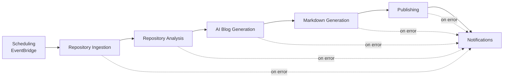
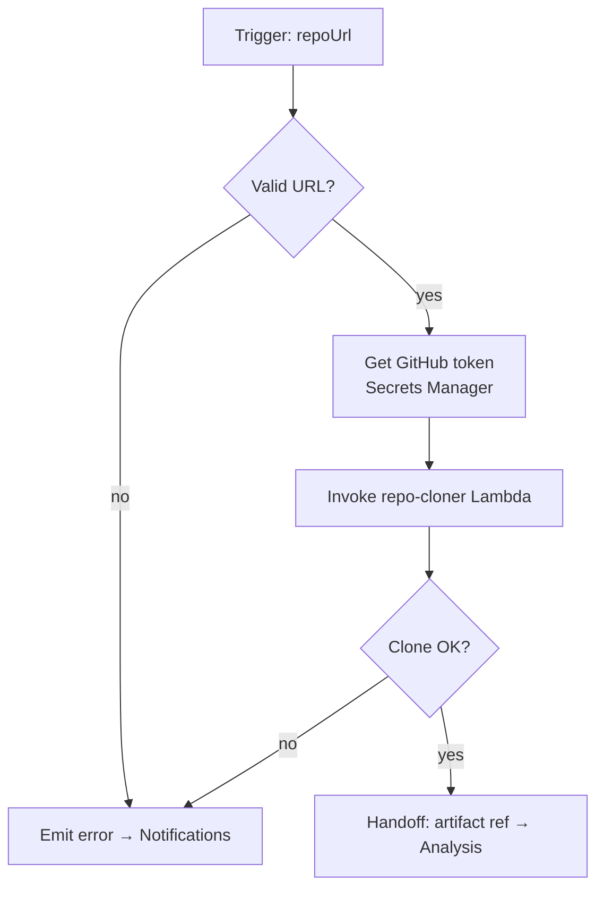
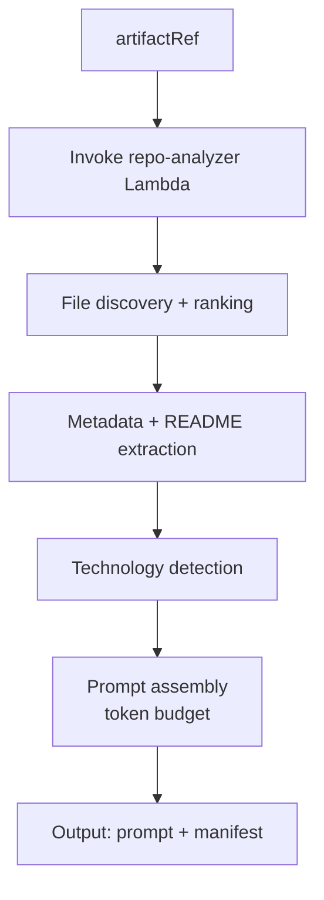
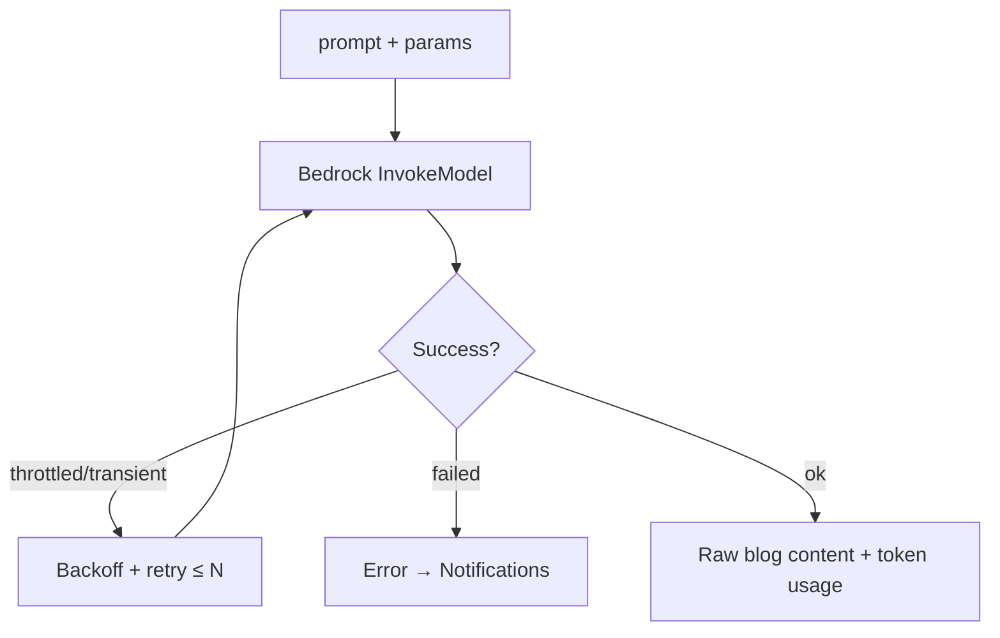
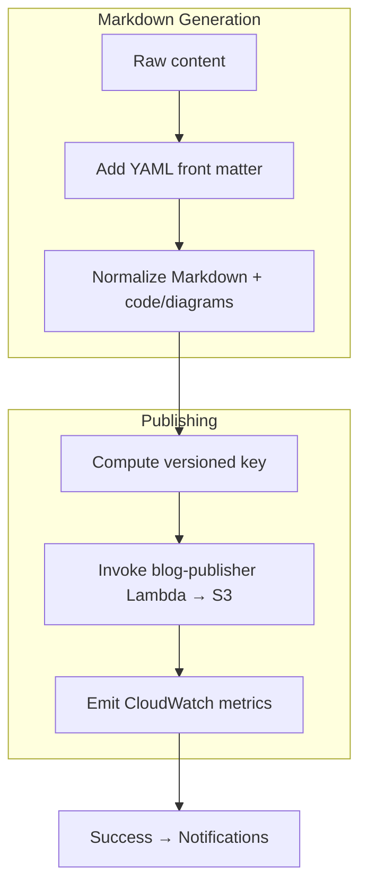
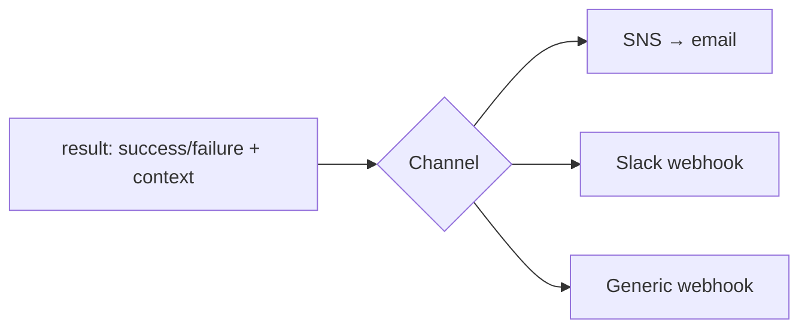

# Workflows

The platform's control flow is implemented as **n8n workflows**. Each workflow is a discrete, versioned unit exported as JSON under `workflows/n8n/`. Workflows call Go Lambda functions and Amazon Bedrock, and pass structured data between stages.

Related: [Architecture](./architecture.md) · [Infrastructure](./infrastructure.md) · [Monitoring](./monitoring.md).

---

## 1. Workflow Catalog

| Workflow | File | Trigger | Purpose |
| --- | --- | --- | --- |
| Repository Ingestion | `repository-ingestion.json` | EventBridge / manual | Entry point; validates input, clones repo |
| Repository Analysis | `repository-analysis.json` | Called by ingestion | File discovery, metadata, tech detection, prompt |
| AI Blog Generation | `ai-blog-generation.json` | Called by analysis | Invokes Amazon Bedrock |
| Markdown Generation | `markdown-generation.json` | Called by generation | Renders Markdown + front matter |
| Publishing | `publishing.json` | Called by markdown gen | Versions + writes to S3 posts bucket |
| Notifications | `notifications.json` | Called on success/failure | Sends notifications |
| Scheduling | EventBridge rule (IaC) | cron | Fires ingestion on schedule |

The workflows compose into a single pipeline; each can also be executed independently for testing.

---

## 2. End-to-End Pipeline



---

## 3. Repository Ingestion

Entry point. Validates the target repo URL, resolves the GitHub token from Secrets Manager, invokes `repo-cloner`, and hands off to analysis.



**Input:** `{ repoUrl, branch?, options? }` · **Output:** `{ artifactRef, repoMeta }`

---

## 4. Repository Analysis

Reads the cloned snapshot, discovers and ranks files, extracts metadata and README content, detects technologies, and assembles the token-budgeted prompt.



**Input:** `{ artifactRef, repoMeta }` · **Output:** `{ prompt, contextManifest }`

Implements [FR-4](./requirements.md#14-file-discovery) through [FR-8](./requirements.md#18-ai-prompt-generation).

---

## 5. AI Blog Generation

Invokes Amazon Bedrock with the assembled prompt and configured model parameters; retries on throttling with exponential backoff.



**Input:** `{ prompt, model, temperature, maxTokens }` · **Output:** `{ content, tokenUsage }`

Model ID and parameters come from Terraform config ([FR-9](./requirements.md#19-amazon-bedrock-integration)).

---

## 6. Markdown Generation & Publishing



**Front matter** includes `title`, `date`, `source_repo`, `tags`, and `model`. **Key scheme:** `posts/<owner>/<repo>/<UTC-timestamp>.md`, with S3 versioning enabled ([FR-11](./requirements.md#111-markdown-generation)–[FR-13](./requirements.md#113-content-storage)).

---

## 7. Scheduling & Notifications

**Scheduling** is an EventBridge rule (defined in Terraform, not in n8n) that periodically POSTs to the ingestion workflow's webhook or triggers it via the n8n API. Schedule expression is configurable (`n8n_operating_schedule` / a dedicated `generation_schedule` variable).

**Notifications** is a shared sub-workflow invoked on both success and failure paths.



**Input:** `{ status, repo, postKey?, error? }` ([FR-17](./requirements.md#117-notifications)).

---

## 8. Importing Workflows

1. Open n8n (local: `http://localhost:5678`; AWS: via SSM port-forward — see [Deployment](./deployment.md#7-deployment-verification)).
2. **Workflows → Import from File** and select each JSON in `workflows/n8n/`.
3. Configure **Credentials** (AWS, GitHub, notification channel) in the n8n editor — these reference Secrets Manager values in AWS.
4. Activate the workflows.

### Exporting after changes

Export edited workflows back to JSON and commit them so the repo stays the source of truth:

```bash
# via the n8n editor: Workflow → Download
# commit the updated JSON under workflows/n8n/
git add workflows/n8n/*.json
git commit -m "chore(workflows): update AI blog generation flow"
```

Keep exported JSON free of embedded secrets — credentials are referenced by ID, not value.
