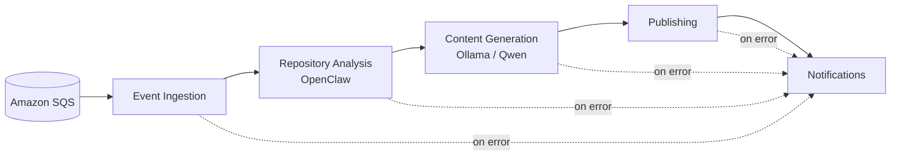
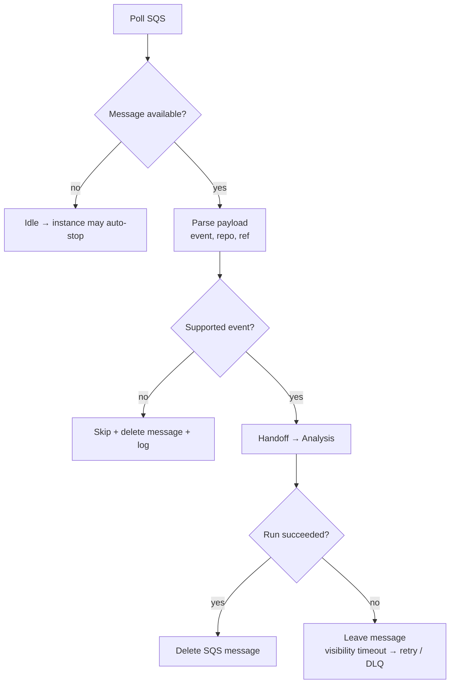
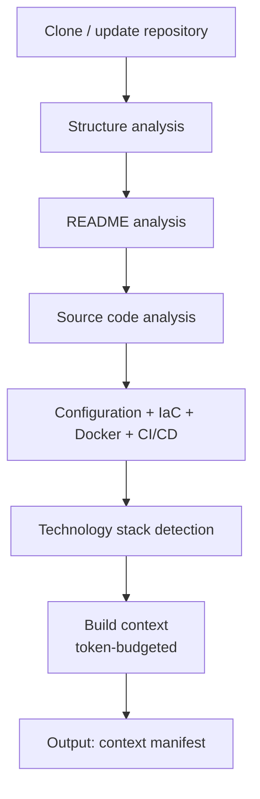
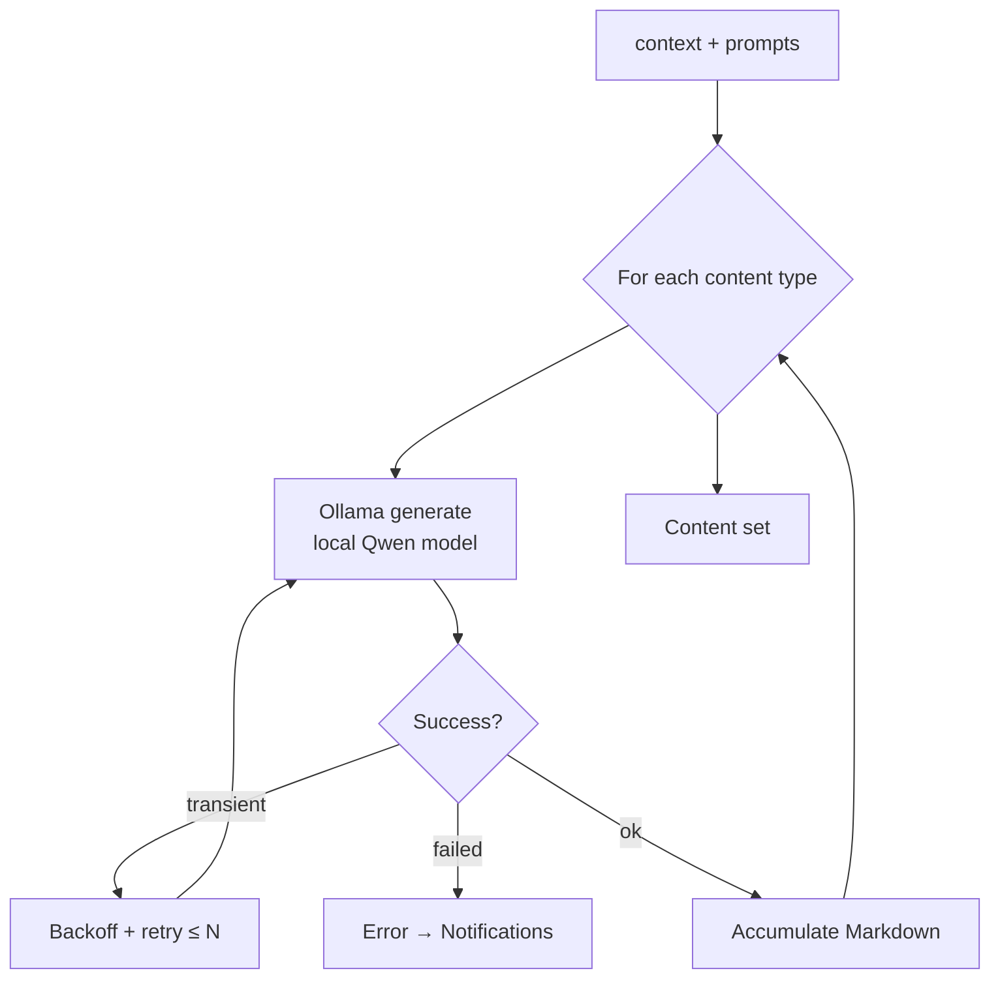
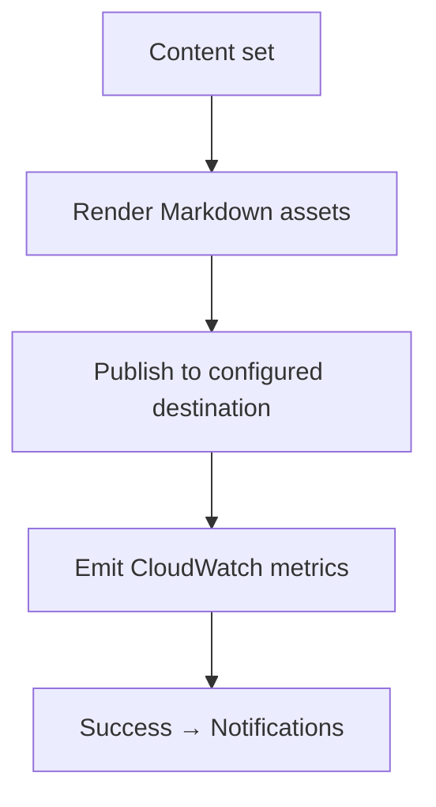
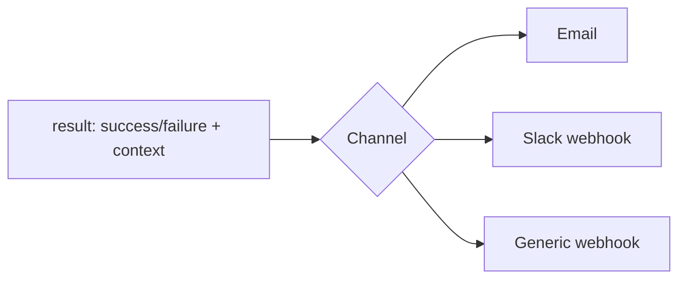

# Workflows

The platform's control flow on the instance is implemented as **n8n workflows**. Each workflow is a discrete, versioned unit exported as JSON under `workflows/`. n8n **polls Amazon SQS** for events, then drives cloning, analysis (via **OpenClaw**), local inference (via **Ollama/Qwen**), publishing, and notifications, passing structured data between stages.

Related: [Architecture](./architecture.md) · [Infrastructure](./infrastructure.md) · [Monitoring](./monitoring.md).

---

## 1. Workflow Catalog

| Workflow | File | Trigger | Purpose |
| --- | --- | --- | --- |
| Event Ingestion | `event-ingestion.json` | **SQS poll** | Pulls queued events, parses the payload, decides whether to process |
| Repository Analysis | `repository-analysis.json` | Called by ingestion | Clone + structure, README, source, config, tech-stack analysis via OpenClaw |
| Content Generation | `content-generation.json` | Called by analysis | Runs local inference via Ollama per content type |
| Publishing | `publishing.json` | Called by generation | Renders Markdown and publishes to the configured destination |
| Notifications | `notifications.json` | Called on success/failure | Notifies users |

The workflows compose into a single pipeline; each can also be executed independently for testing ([WF-8](./requirements.md#4-workflow-requirements)).

> **Trigger note:** the primary trigger is a **GitHub Webhook**, but n8n never receives it directly. The webhook is validated and enqueued by the **Webhook Handler Lambda**; n8n **polls SQS**. Manual invocation is also supported. Instance start/stop is handled by Lambda ([webhook handler](./architecture.md#4-event-driven-trigger-path) + [idle-shutdown](./cost-optimization.md#2-automatic-shutdown)), **not** by an n8n workflow.

---

## 2. End-to-End Pipeline



---

## 3. Event Ingestion

Drains the queue and starts a run per message. n8n polls SQS on the instance; each message is a validated GitHub event.



- A message is **deleted only after a successful run** ([WF-6](./requirements.md#4-workflow-requirements)); a failure lets the **visibility timeout** expire so the message is retried, and repeated failures land in the **dead-letter queue**.
- When the queue is empty and the system stays idle, the **idle-shutdown Lambda** stops the instance ([Cost Optimisation](./cost-optimization.md#2-automatic-shutdown)).

**Input:** SQS message `{ event, repo, ref, delivery_id }` · **Output:** `{ runId, repoMeta, event }`

---

## 4. Repository Analysis

Builds a structured understanding of the repository using **OpenClaw**.



**Input:** `{ runId, repoMeta }` · **Output:** `{ context, contextManifest }`

Implements [FR-2](./requirements.md#12-repository-cloning--analysis) and feeds [AI Requirements](./requirements.md#3-ai--local-inference-requirements). Repository clones are transient — they live on the instance disk during the run.

---

## 5. Content Generation

Runs **local inference via Ollama** once per content type with purpose-tuned prompts; retries transient failures with backoff.



**Content types:** technical blog post, README improvements, project documentation, architecture summary, API documentation, project overview, release notes, changelog, technical tutorial ([FR-3](./requirements.md#13-documentation--content-generation)).

**Input:** `{ context, model, prompts }` · **Output:** `{ contentSet }`

The model (`OLLAMA_MODEL`, default Qwen) and generation parameters come from configuration ([AI-2](./requirements.md#3-ai--local-inference-requirements)); there is **no external inference API**.

---

## 6. Publishing



All output is **GitHub-flavoured Markdown**. The publishing destination is deployment-configurable (for example a Git repository, an object store, or a CMS). A failure never corrupts previously published output ([FR-5.5](./requirements.md#15-reliability-retry-logging--error-handling)).

---

## 7. Notifications

A shared sub-workflow invoked on both success and failure paths.



**Input:** `{ status, repo, publishedRefs?, error? }` ([FR-4](./requirements.md#14-output-publishing--notifications)).

---

## 8. Importing Workflows

1. Start the instance and open n8n over an **SSH tunnel** (the UI is not publicly exposed — see [Deployment §5](./deployment.md#5-import-the-n8n-workflows)); locally it's `http://localhost:5678`.
2. **Workflows → Import from File** and select each JSON in `workflows/`.
3. Configure **Credentials** (AWS/SQS, GitHub, notification channel) in the editor.
4. Activate the workflows.

### Exporting after changes

Export edited workflows back to JSON and commit them so the repo stays the source of truth:

```bash
# via the n8n editor: Workflow → Download
git add workflows/*.json
git commit -m "chore(workflows): update content generation flow"
```

Keep exported JSON free of embedded secrets — credentials are referenced by ID, not value ([WF-7](./requirements.md#4-workflow-requirements)).
