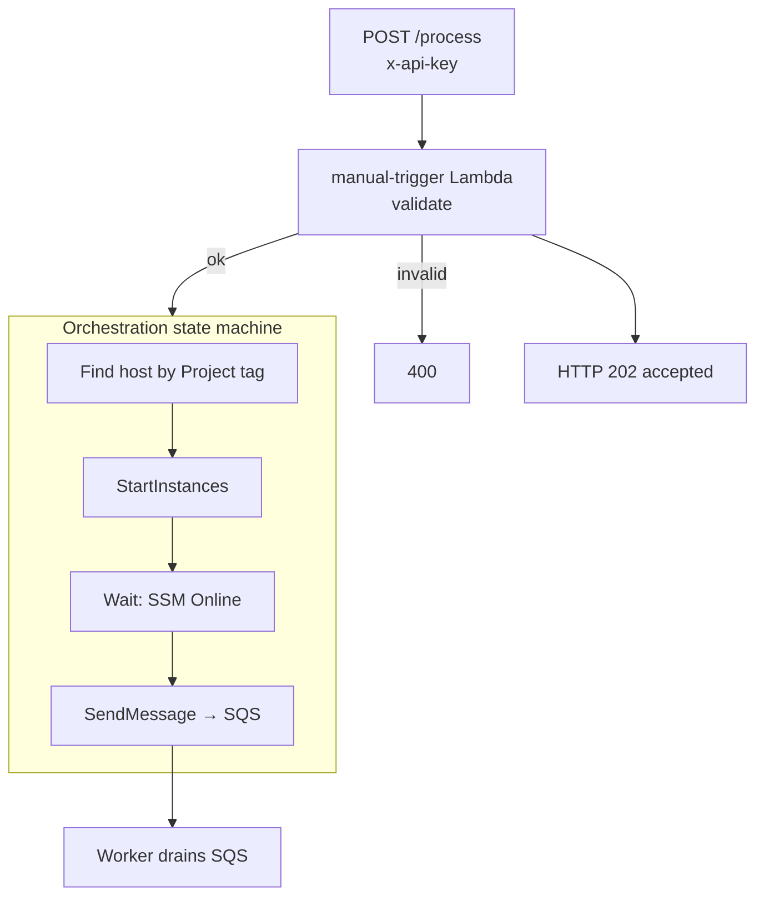
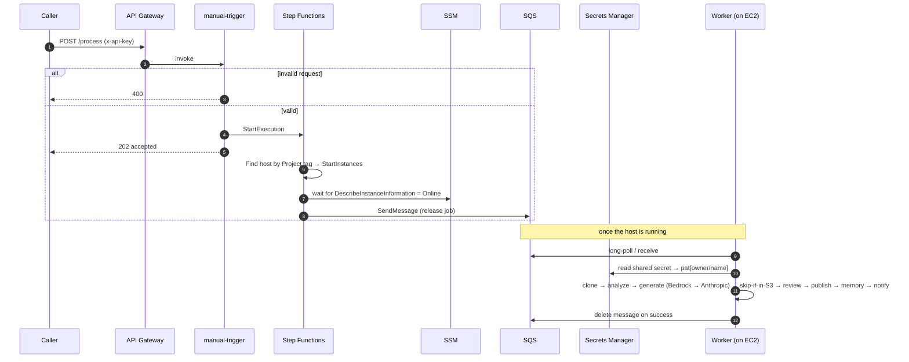
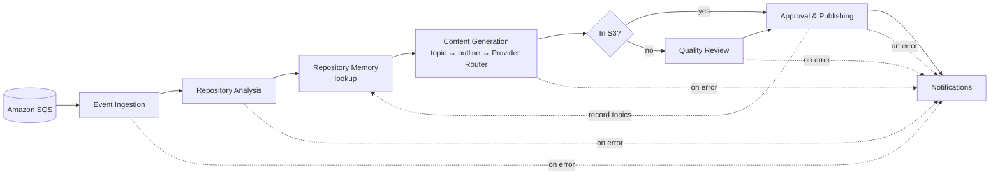
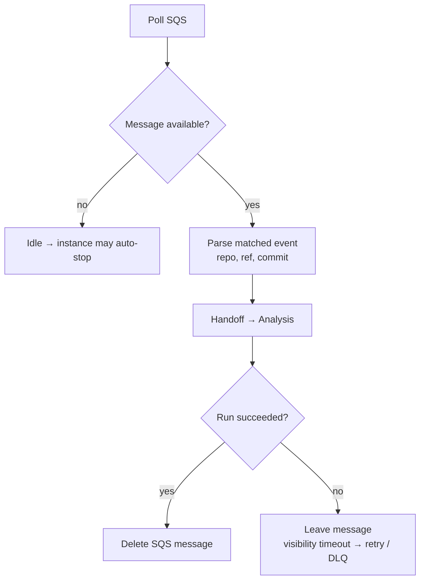
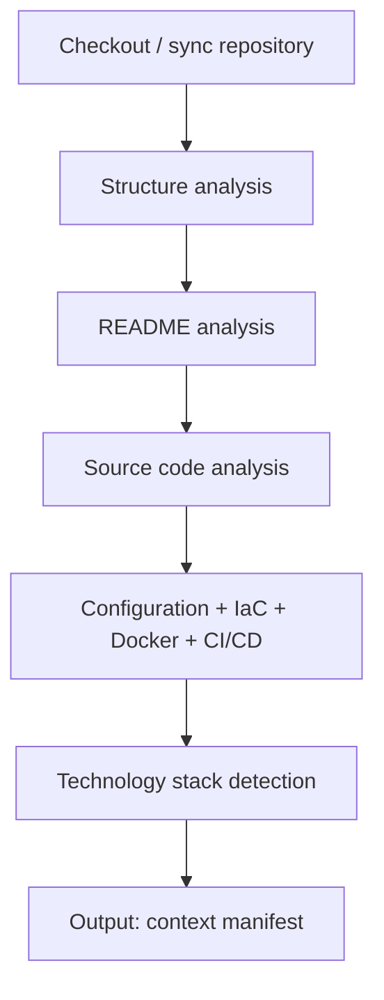
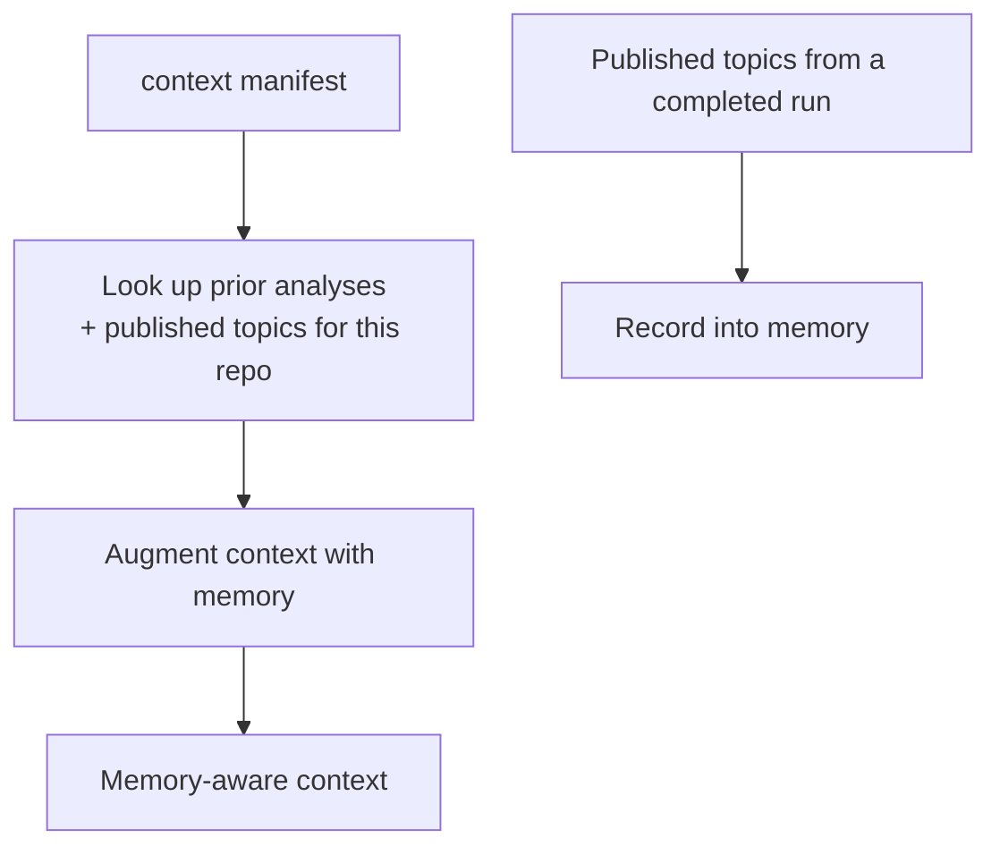
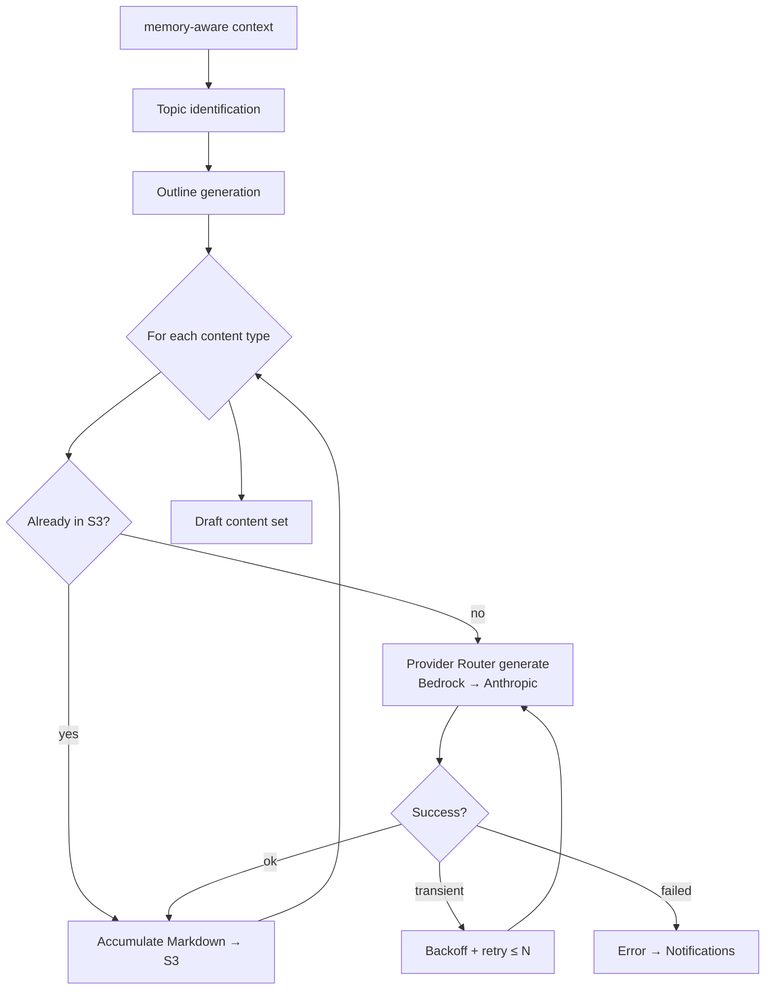
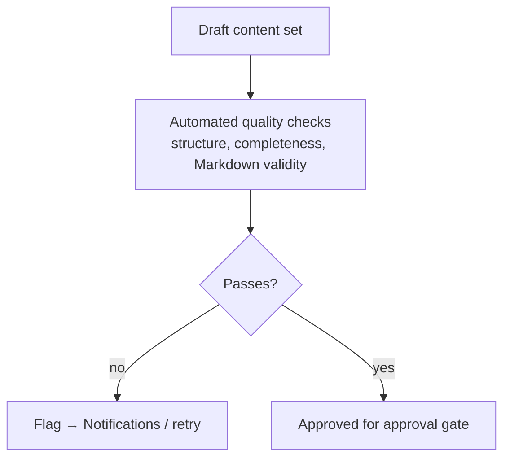
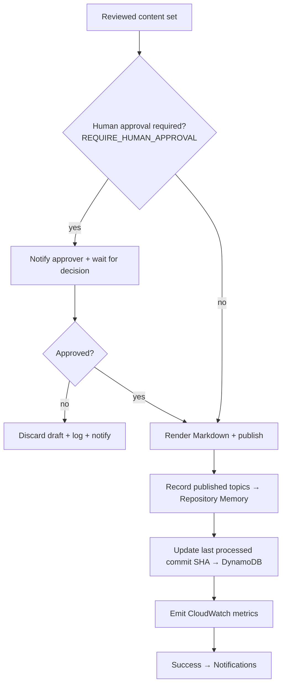
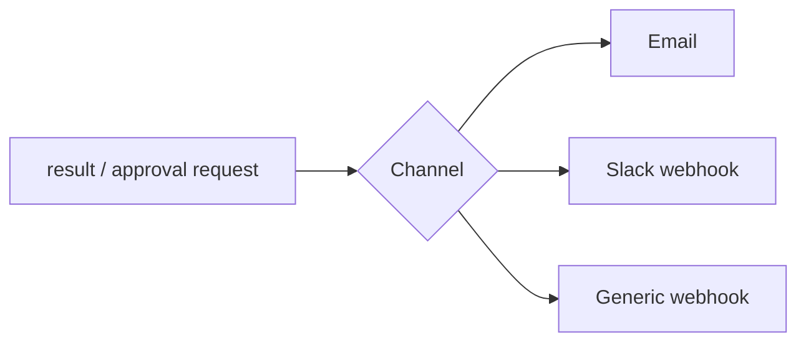

# Workflows

Control flow spans two layers. `POST /process` starts an **AWS Step Functions** execution that starts the host, waits for it to report ready via SSM, and enqueues the job onto **Amazon SQS**. The **worker** on the On-Demand EC2 instance drains the queue and generates each artifact through the **Provider Router** (Bedrock → Anthropic), reusing anything already in S3; then **n8n** drives quality review, optional human approval, GitHub PRs, publishing, and notifications.

> **Registration is not an n8n workflow.** Onboarding a repository (URL + PAT → validate → store metadata + PAT) is handled by the **Registration Lambda** ([Architecture §2](./architecture.md#2-repository-registration-mvp)). These workflows cover only the per-run generation pipeline.

Related: [Architecture](./architecture.md) · [Infrastructure](./infrastructure.md) · [Monitoring](./monitoring.md).

---

## 1. Trigger (POST /process → Step Functions)

A run always starts with an authenticated `POST /process`. The manual-trigger Lambda validates it and starts a Step Functions execution; the state machine owns the compute-host lifecycle.



- The manual-trigger Lambda does **only**: validate → `states:StartExecution` → 202. No analysis, inference, or PAT access.
- The **state machine** starts the host on demand (no operating-window gate) and hands the job to SQS. Power-**off** is owned by the [scheduler](./scheduling.md).

### 1a. Run sequence (end to end)

What happens on `POST /process`. The caller gets an immediate `HTTP 202`; the AI
work happens later, on the instance, once it reports ready.



---

## 2. Workflow Catalog (n8n)

| Workflow | File | Trigger | Purpose |
| --- | --- | --- | --- |
| Event Ingestion | `event-ingestion.json` | **SQS poll** | Pulls jobs, parses the payload |
| Repository Analysis | `repository-analysis.json` | Called by ingestion | Checkout + structure/README/source/config analysis |
| Repository Memory | `repository-memory.json` | Called by analysis | Looks up prior analyses and published topics; records new ones |
| Content Generation | `content-generation.json` | Called by analysis | Topic ID, outline, and generation via the Provider Router (Bedrock → Anthropic) per content type; skips artifacts already in S3 |
| Quality Review | `quality-review.json` | Called by generation | Reviews drafts before publishing |
| Approval & Publishing | `approval-publishing.json` | Called by review | Optional human approval, GitHub PR, then publishes Markdown |
| Notifications | `notifications.json` | Called on success/failure | Notifies users |

Each workflow can also be executed independently for testing ([WF-8](./requirements.md#4-workflow-requirements)).

> **Trigger note:** every job in SQS was enqueued by the Step Functions state machine after `POST /process`. Instance start is handled by the state machine; stop by EventBridge Scheduler / idle-stop — **not** by n8n.

---

## 3. End-to-End Pipeline



---

## 4. Event Ingestion

Drains the queue and starts a run per matched event.



A message is **deleted only after a successful run** ([WF-6](./requirements.md#4-workflow-requirements)); a failure lets the visibility timeout expire so the message is retried, and repeated failures land in the **dead-letter queue**.

**Input:** SQS message `{ repo, ref, commit, delivery_id }` · **Output:** `{ runId, repoMeta }`

---

## 5. Repository Analysis

Builds a structured understanding of the repository (clone + static analysis in the worker).



**Input:** `{ runId, repoMeta }` · **Output:** `{ context, contextManifest }`

Implements [FR-2](./requirements.md#12-repository-cloning--analysis). Clones are transient — they live on the instance disk during the run.

---

## 6. Repository Memory

Provides continuity across runs so the platform avoids duplicate content and builds on prior work.



Repository Memory is a **persistent per-repository store on the EBS volume**. On lookup it returns previously identified topics and published posts; after publishing, the run records new topics ([REG-MEM requirements](./requirements.md#5-repository-memory-requirements)).

**Input:** `{ context }` · **Output:** `{ memoryAwareContext }`

---

## 7. Content Generation

Identifies topics, builds an outline, then generates via the **Provider Router** (Bedrock → Anthropic) once per content type — skipping any artifact already in S3; retries transient failures with backoff.



**Content types (repository run):** technical blog post, README improvements, project documentation, architecture summary, API documentation, project overview, release notes, changelog, technical tutorial ([FR-3](./requirements.md#13-documentation--content-generation)).

**Release run:** a `/process` call with a release tag runs the **full content suite** — blog, storyboard, voice-over, YouTube script, Shorts, TikTok, visual assets, SEO, architecture diagrams, LinkedIn, and X thread — gated by SemVer validation and the same review/approval/publish stages. See [Full Content Suite](./content-suite.md).

The models (`BEDROCK_MODEL_ID` primary, `ANTHROPIC_MODEL` fallback) and parameters come from configuration ([AI-2](./requirements.md#6-ai--local-inference-requirements)); see [AI Provider Router](./hybrid-ai-routing.md).

---

## 8. Quality Review



A review stage checks drafts before they can be published ([FR-3.12](./requirements.md#13-documentation--content-generation)).

---

## 9. Approval & Publishing



**Optional human approval** (`REQUIRE_HUMAN_APPROVAL`, default `false`) pauses the pipeline for a human decision before publishing. All output is **GitHub-flavoured Markdown**; a failure never corrupts previously published output ([FR-5.5](./requirements.md#16-reliability-retry-logging--error-handling)).

---

## 10. Notifications

A shared sub-workflow invoked on success, failure, and approval-request paths.



**Input:** `{ status, repo, publishedRefs?, approvalRequest?, error? }` ([FR-4](./requirements.md#14-output-publishing--notifications)).

---

## 11. Importing Workflows

1. Start the instance and open n8n over an **SSH tunnel** (the UI is not publicly exposed — see [Deployment §5](./deployment.md#5-import-the-n8n-workflows)); locally it's `http://localhost:5678`.
2. **Workflows → Import from File** and select each JSON in `workflows/`.
3. Configure **Credentials** (AWS/SQS, GitHub, notification channel).
4. Activate the workflows.

### Exporting after changes

```bash
# via the n8n editor: Workflow → Download
git add workflows/*.json
git commit -m "chore(workflows): update content generation flow"
```

Keep exported JSON free of embedded secrets — credentials are referenced by ID, not value ([WF-7](./requirements.md#4-workflow-requirements)).
