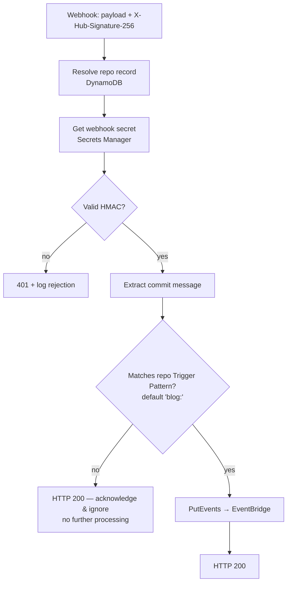
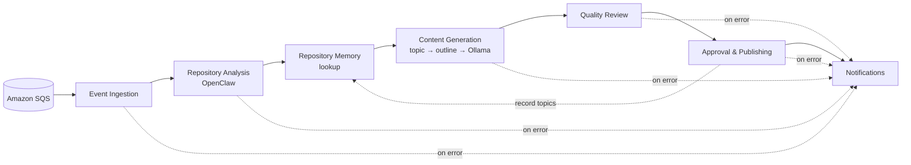
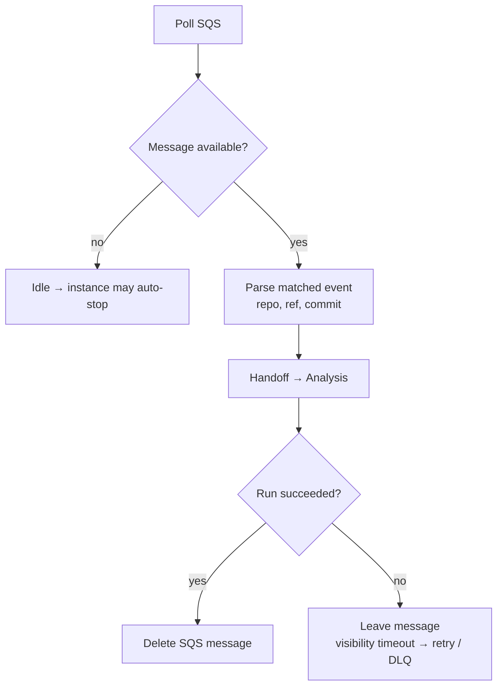
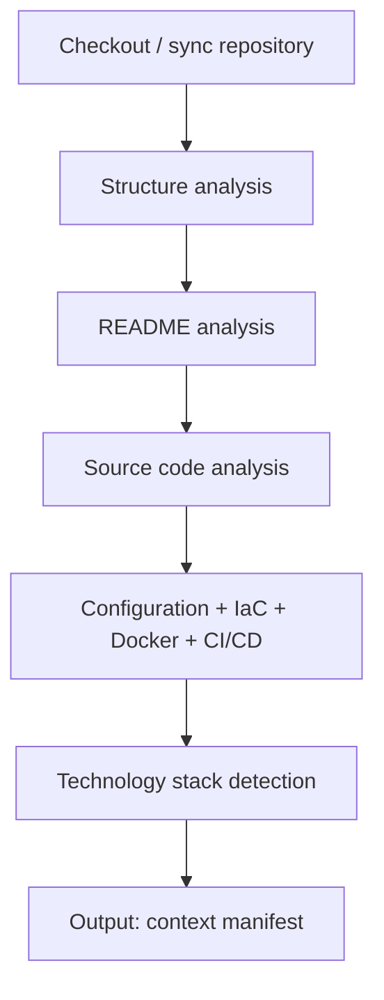
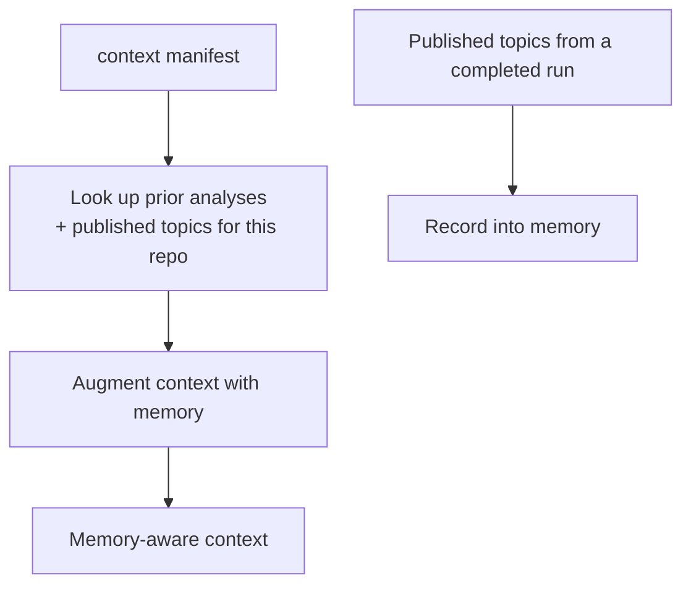
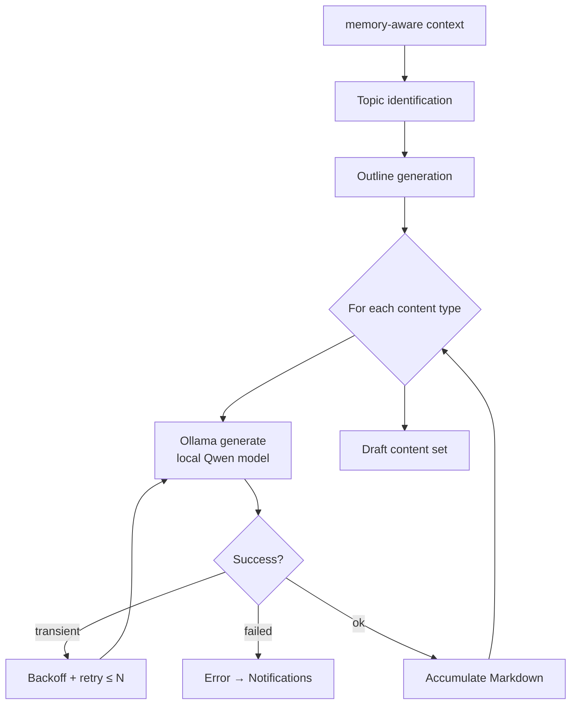
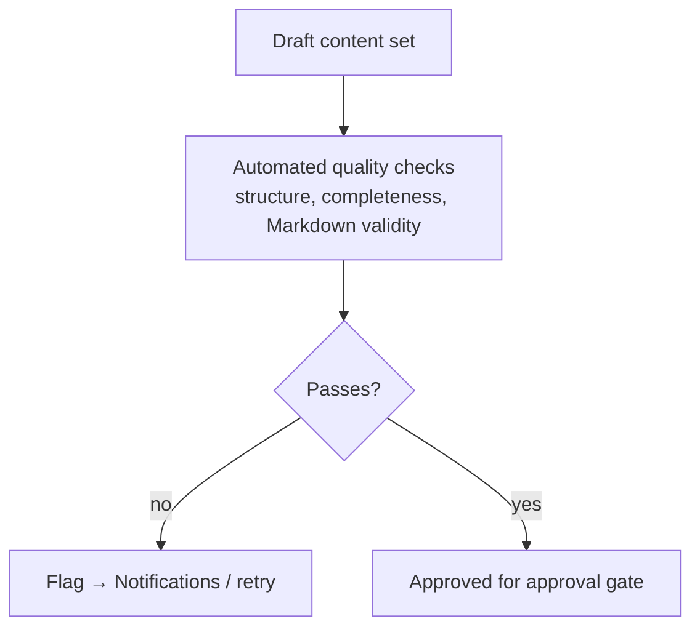
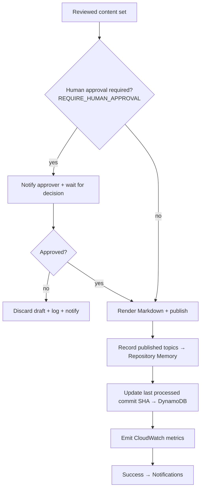
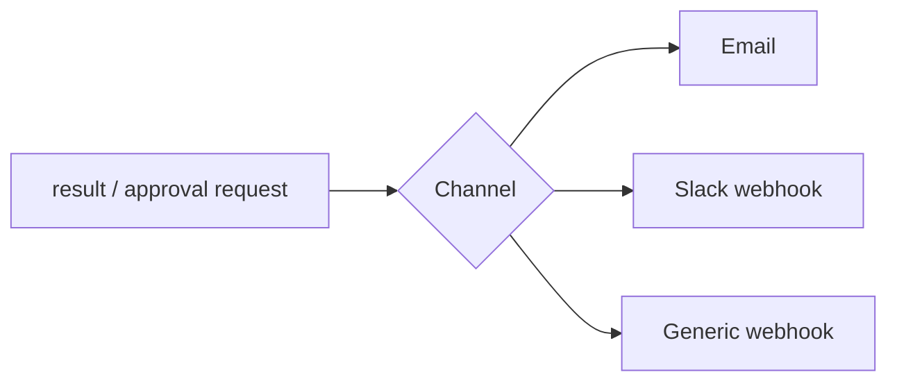

# Workflows

Control flow spans two layers. A **lightweight Webhook Handler Lambda** performs the **commit-message trigger gate**; only matched events reach the **n8n workflows** on the EC2 Spot Instance, which run the full generation pipeline. Matched events are buffered in **Amazon SQS** (via EventBridge) and **invoke the n8n workflow** once the instance is healthy; n8n then drives checkout, analysis (**OpenClaw**), **Repository Memory**, generation (**Ollama/Qwen**), quality review, optional human approval, publishing, and notifications.

> **Registration is not an n8n workflow.** Onboarding a repository (URL + PAT → validate → create webhook → store metadata + PAT) is handled by the **Registration Lambda** ([Architecture §2](./architecture.md#2-repository-registration-mvp)). These workflows cover only the per-event generation pipeline.

Related: [Architecture](./architecture.md) · [Infrastructure](./infrastructure.md) · [Monitoring](./monitoring.md).

---

## 1. Trigger Gate (Webhook Handler Lambda)

Before any n8n workflow runs, the handler decides whether a run should happen at all.



- The handler is **not** an n8n workflow — it is a Lambda ([Architecture §3](./architecture.md#3-commit-message-trigger-gate)).
- It performs **only**: resolve repo record → verify signature (per-repo secret) → extract commit info → validate trigger → publish matched event → return 200. It does **no** analysis or inference, and **never reads the PAT**.
- EventBridge routes matched events to **SQS** (buffer) and the **Instance Starter Lambda** (start the Spot host).

---

## 2. Workflow Catalog (n8n)

| Workflow | File | Trigger | Purpose |
| --- | --- | --- | --- |
| Event Ingestion | `event-ingestion.json` | **SQS poll** | Pulls matched events, parses the payload |
| Repository Analysis | `repository-analysis.json` | Called by ingestion | Checkout + structure/README/source/config analysis via OpenClaw |
| Repository Memory | `repository-memory.json` | Called by analysis | Looks up prior analyses and published topics; records new ones |
| Content Generation | `content-generation.json` | Called by analysis | Topic ID, outline, and local inference via Ollama per content type |
| Quality Review | `quality-review.json` | Called by generation | Reviews drafts before publishing |
| Approval & Publishing | `approval-publishing.json` | Called by review | Optional human approval, then publishes Markdown |
| Notifications | `notifications.json` | Called on success/failure | Notifies users |

Each workflow can also be executed independently for testing ([WF-8](./requirements.md#4-workflow-requirements)).

> **Trigger note:** every event in SQS has already passed the commit-message trigger gate in the handler. n8n never sees ignored events. Instance start/stop is handled by Lambda (starter + idle-shutdown), **not** by n8n.

---

## 3. End-to-End Pipeline



---

## 4. Event Ingestion

Drains the queue and starts a run per matched event.



A message is **deleted only after a successful run** ([WF-6](./requirements.md#4-workflow-requirements)); a failure lets the visibility timeout expire so the message is retried, and repeated failures land in the **dead-letter queue**.

**Input:** SQS message `{ repo, ref, commit, delivery_id }` · **Output:** `{ runId, repoMeta }`

---

## 5. Repository Analysis

Builds a structured understanding of the repository using **OpenClaw**.



**Input:** `{ runId, repoMeta }` · **Output:** `{ context, contextManifest }`

Implements [FR-2](./requirements.md#12-repository-cloning--analysis). Clones are transient — they live on the instance disk during the run.

---

## 6. Repository Memory

Provides continuity across runs so the platform avoids duplicate content and builds on prior work.



Repository Memory is a **persistent per-repository store on the EBS volume**. On lookup it returns previously identified topics and published posts; after publishing, the run records new topics ([REG-MEM requirements](./requirements.md#5-repository-memory-requirements)).

**Input:** `{ context }` · **Output:** `{ memoryAwareContext }`

---

## 7. Content Generation

Identifies topics, builds an outline, then runs **local inference via Ollama** once per content type; retries transient failures with backoff.



**Content types:** technical blog post, README improvements, project documentation, architecture summary, API documentation, project overview, release notes, changelog, technical tutorial ([FR-3](./requirements.md#13-documentation--content-generation)).

The model (`OLLAMA_MODEL`, default Qwen) and parameters come from configuration ([AI-2](./requirements.md#6-ai--local-inference-requirements)); there is **no external inference API**.

---

## 8. Quality Review



A review stage checks drafts before they can be published ([FR-3.12](./requirements.md#13-documentation--content-generation)).

---

## 9. Approval & Publishing



**Optional human approval** (`REQUIRE_HUMAN_APPROVAL`, default `false`) pauses the pipeline for a human decision before publishing. All output is **GitHub-flavoured Markdown**; a failure never corrupts previously published output ([FR-5.5](./requirements.md#16-reliability-retry-logging--error-handling)).

---

## 10. Notifications

A shared sub-workflow invoked on success, failure, and approval-request paths.



**Input:** `{ status, repo, publishedRefs?, approvalRequest?, error? }` ([FR-4](./requirements.md#14-output-publishing--notifications)).

---

## 11. Importing Workflows

1. Start the instance and open n8n over an **SSH tunnel** (the UI is not publicly exposed — see [Deployment §5](./deployment.md#5-import-the-n8n-workflows)); locally it's `http://localhost:5678`.
2. **Workflows → Import from File** and select each JSON in `workflows/`.
3. Configure **Credentials** (AWS/SQS, GitHub, notification channel).
4. Activate the workflows.

### Exporting after changes

```bash
# via the n8n editor: Workflow → Download
git add workflows/*.json
git commit -m "chore(workflows): update content generation flow"
```

Keep exported JSON free of embedded secrets — credentials are referenced by ID, not value ([WF-7](./requirements.md#4-workflow-requirements)).
