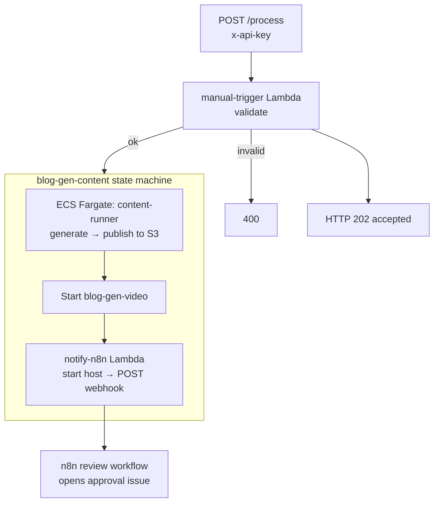
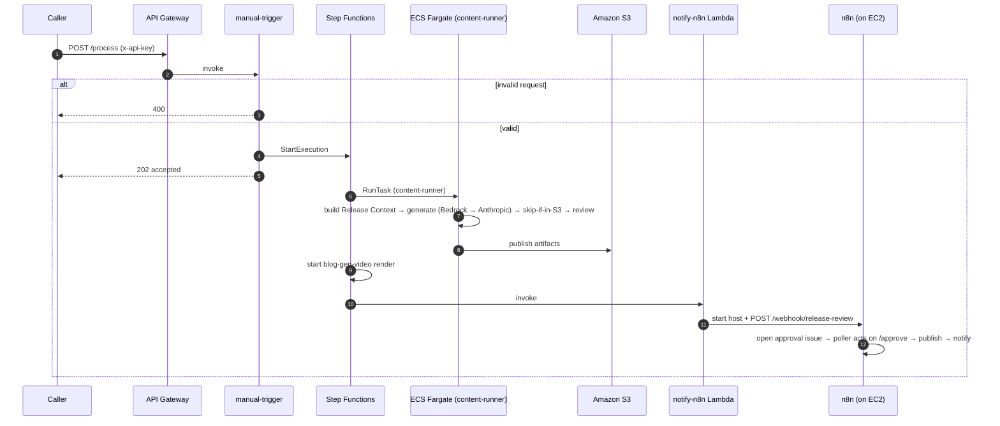
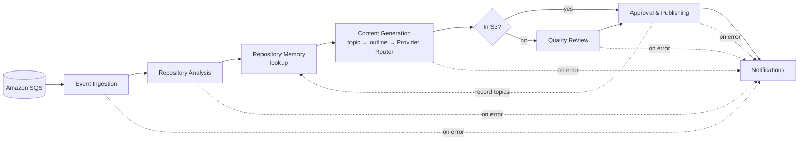
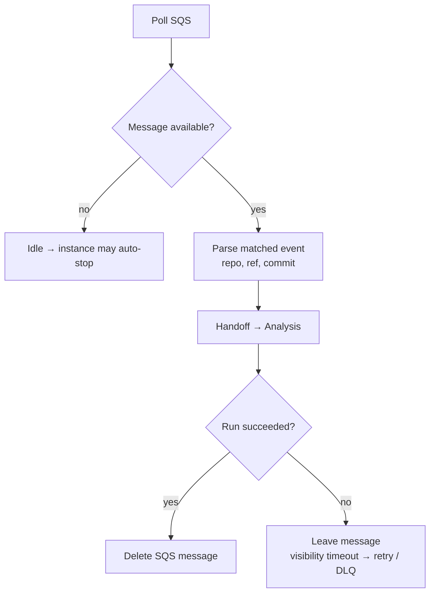
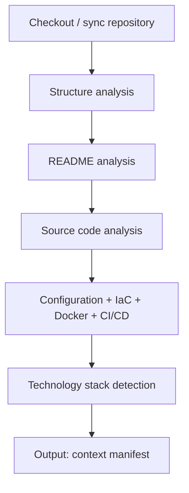
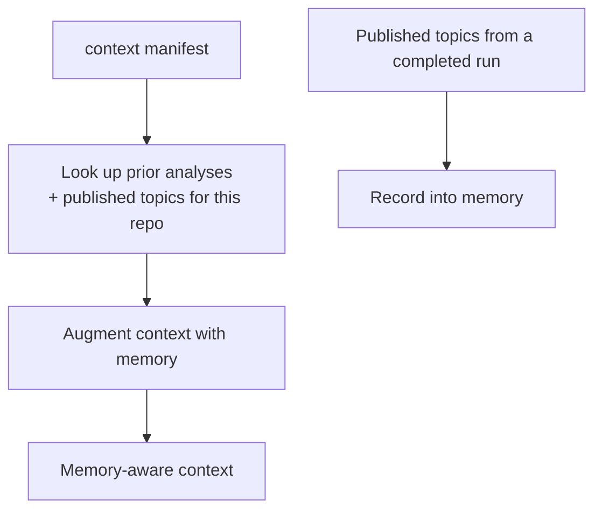
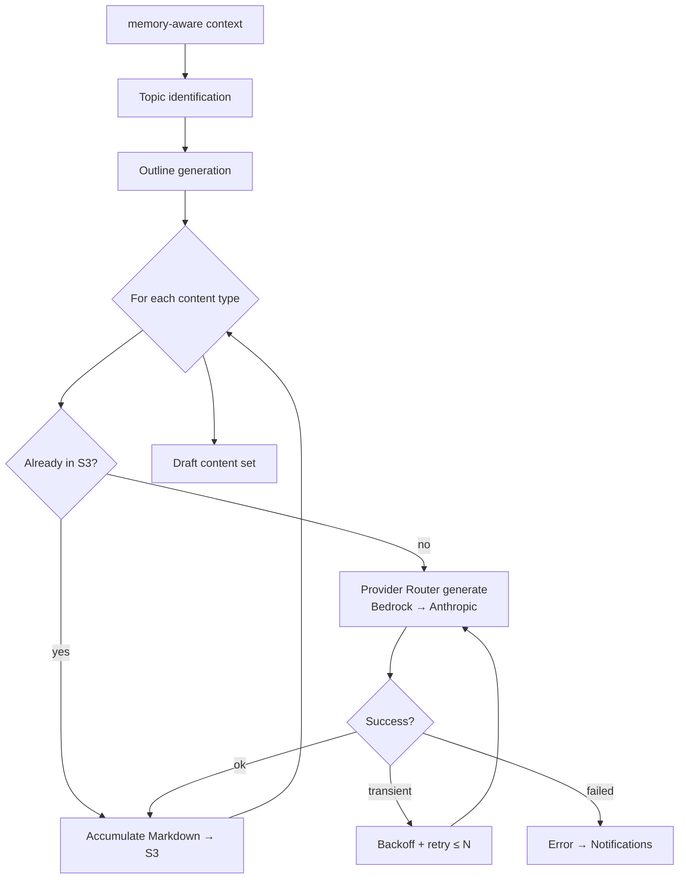
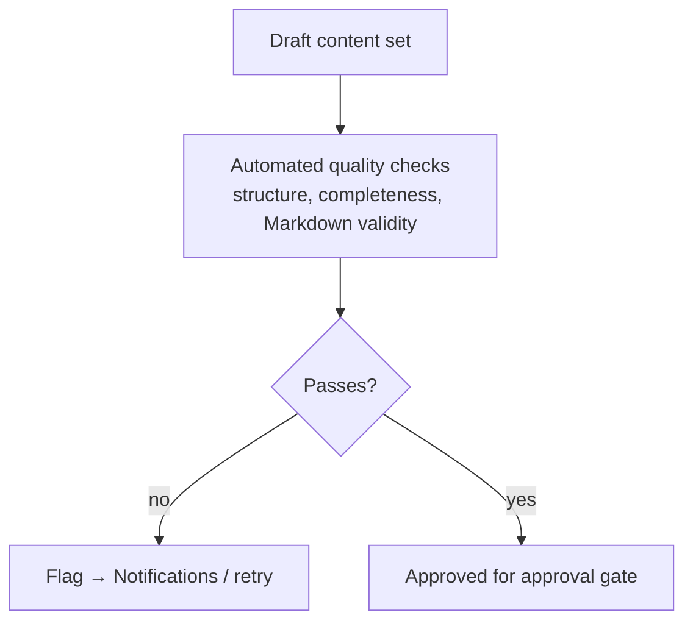
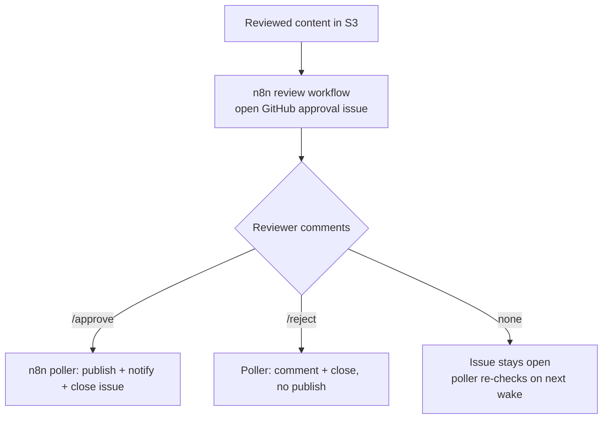
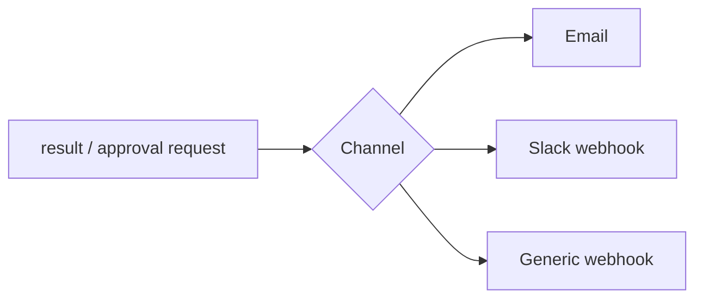

# Workflows

Control flow spans two layers. `POST /process` starts the **`blog-gen-content` Step Functions** execution, which runs the **`content-runner` task on ECS Fargate** (serverless — no EC2 worker, no SQS): it generates each artifact through the **Provider Router** (Bedrock → Anthropic), reusing anything already in S3, and publishes to **S3**. The machine then starts the video render and invokes the **`notify-n8n` Lambda**, which **starts the on-demand EC2 host** and **POSTs the release to n8n's `/release-review` webhook**. From there **n8n is the orchestrator**: it opens a **GitHub approval issue**, a scheduled **Approval Poller** acts on an authorized `/approve`, then n8n **publishes and notifies**.

> **Legacy note.** An earlier design drained an **Amazon SQS** queue with a Go **worker** on the EC2 host. That path is retained only as rollback ([Phase B teardown](./phase-b-teardown.md)); the SQS/worker mentions in the deeper sections below refer to it.

> **Registration is not an n8n workflow.** Onboarding a repository (URL + PAT → validate → store metadata + PAT) is handled by the **Registration Lambda** ([Architecture §2](./architecture.md#2-repository-registration-mvp)). These workflows cover only the per-run generation pipeline.

Related: [Architecture](./architecture.md) · [Infrastructure](./infrastructure.md) · [Monitoring](./monitoring.md).

---

## 1. Trigger (POST /process → Step Functions)

A run always starts with an authenticated `POST /process`. The manual-trigger Lambda validates it and starts a Step Functions execution; the state machine owns the compute-host lifecycle.



- The manual-trigger Lambda does **only**: validate → `states:StartExecution` → 202. No analysis, inference, or PAT access.
- The **state machine** runs generation on Fargate, then starts the host on demand and hands the release to n8n. Power-**off** is owned by the [scheduler](./scheduling.md) (idle-stop).

### 1a. Run sequence (end to end)

What happens on `POST /process`. The caller gets an immediate `HTTP 202`; the AI
work happens later, on the instance, once it reports ready.



---

## 2. Workflow Catalog (n8n)

Generation, review/scoring, and S3 publishing already run inside the serverless **`content-runner`**. n8n owns the **human-approval loop** on top of that, as two active workflows:

| Workflow | Trigger | Purpose |
| --- | --- | --- |
| **Release Review & Approval** | Webhook `POST /webhook/release-review` (from the `notify-n8n` Lambda) | Opens a **GitHub approval issue** for the release (body carries a machine-readable marker) using the `githubApi` credential |
| **Approval Poller** | Schedule (every few minutes, while the host is up) | Searches open approval issues, reads comments, and on an authorized **`/approve`** posts a confirmation + **closes** the issue and **notifies**; **`/reject`** cancels |

Authorization is enforced by the commenter's `author_association` (OWNER / COLLABORATOR / MEMBER). Because the approval issue lives on GitHub, a pending approval survives the host powering off — the poller resumes on the next wake. On `/approve` the poller calls the **publish-release** API (`POST /publish`, `X-Publish-Secret`-gated) which opens a blog PR and promotes the release's artifacts to an approved-only `published/` S3 prefix. The exact live workflows are committed at [`n8n-review-workflow.json`](./n8n-review-workflow.json) and [`n8n-approval-poller.json`](./n8n-approval-poller.json).

> **Trigger note:** n8n is invoked by the state machine's `notify-n8n` step after generation — there is no SQS. Instance **start** is triggered by that step (on a release) and the daily window; **stop** by EventBridge Scheduler / idle-stop.

---

## 3. End-to-End Pipeline



---

## 4. Event Ingestion

Drains the queue and starts a run per matched event.



A message is **deleted only after a successful run** ([WF-6](./requirements.md#4-workflow-requirements)); a failure lets the visibility timeout expire so the message is retried, and repeated failures land in the **dead-letter queue**.

**Input:** SQS message `{ repo, ref, commit, delivery_id }` · **Output:** `{ runId, repoMeta }`

---

## 5. Repository Analysis

Builds a structured understanding of the repository (clone + static analysis in the worker).



**Input:** `{ runId, repoMeta }` · **Output:** `{ context, contextManifest }`

Implements [FR-2](./requirements.md#12-repository-cloning--analysis). Clones are transient — they live on the instance disk during the run.

---

## 6. Repository Memory

Provides continuity across runs so the platform avoids duplicate content and builds on prior work.



Repository Memory is a **persistent per-repository store on the EBS volume**. On lookup it returns previously identified topics and published posts; after publishing, the run records new topics ([REG-MEM requirements](./requirements.md#5-repository-memory-requirements)).

**Input:** `{ context }` · **Output:** `{ memoryAwareContext }`

---

## 7. Content Generation

Identifies topics, builds an outline, then generates via the **Provider Router** (Bedrock → Anthropic) once per content type — skipping any artifact already in S3; retries transient failures with backoff.



**Content types (repository run):** technical blog post, README improvements, project documentation, architecture summary, API documentation, project overview, release notes, changelog, technical tutorial ([FR-3](./requirements.md#13-documentation--content-generation)).

**Release run:** a `/process` call with a release tag runs the **full content suite** — blog, storyboard, voice-over, YouTube script, Shorts, TikTok, visual assets, SEO, architecture diagrams, LinkedIn, and X thread — gated by SemVer validation and the same review/approval/publish stages. See [Full Content Suite](./content-suite.md).

The models (`BEDROCK_MODEL_ID` primary, `ANTHROPIC_MODEL` fallback) and parameters come from configuration ([AI-2](./requirements.md#6-ai--local-inference-requirements)); see [AI Provider Router](./hybrid-ai-routing.md).

---

## 8. Quality Review



A review stage checks drafts before they can be published ([FR-3.12](./requirements.md#13-documentation--content-generation)).

---

## 9. Approval & Publishing



**Human approval is a GitHub issue, owned by n8n.** After generation, n8n opens an approval issue for the release; the scheduled **Approval Poller** acts on an authorized `/approve` (publish + notify + close) or `/reject` (cancel). Because the decision lives on the issue, a pending approval **survives the host powering off** — the poller resumes on the next wake. All output is **GitHub-flavoured Markdown**; a failure never corrupts previously published output ([FR-5.5](./requirements.md#16-reliability-retry-logging--error-handling)).

---

## 10. Notifications

A shared sub-workflow invoked on success, failure, and approval-request paths.



**Input:** `{ status, repo, publishedRefs?, approvalRequest?, error? }` ([FR-4](./requirements.md#14-output-publishing--notifications)).

---

## 11. Importing Workflows

The live workflows are exported to `docs/`; to recreate them on a fresh n8n:

1. Reach n8n (SSH tunnel, or `docker exec` over SSM — the UI/port is not publicly exposed). CLI import: `n8n import:workflow --input=<file>` (this n8n build needs an `id` in the JSON — inject a 16-char nanoid first).
2. Import [`n8n-review-workflow.json`](./n8n-review-workflow.json) (webhook `release-review` → opens the approval issue) and [`n8n-approval-poller.json`](./n8n-approval-poller.json) (schedule → `/approve` → publish + close).
3. Create the credentials the nodes reference:
   - **`githubApi`** ("GitHub (blog-gen)") — a token with `Contents`, `Issues`, `PRs` write.
   - **`httpHeaderAuth`** ("Publish Secret (header)") — header `X-Publish-Secret` = the value in SSM `/blog-gen/publish/shared-secret` (only if publish-on-approve is enabled).
4. Set `N8N_RUNNERS_ENABLED=false` (the poller's Code node needs the in-process executor) — already baked into the compute stack's compose.
5. Activate both workflows and **restart n8n** so the webhook + schedule register.

### Exporting after changes

```bash
# via the n8n editor: Workflow → Download
git add workflows/*.json
git commit -m "chore(workflows): update content generation flow"
```

Keep exported JSON free of embedded secrets — credentials are referenced by ID, not value ([WF-7](./requirements.md#4-workflow-requirements)).
