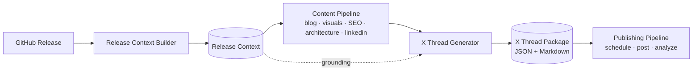
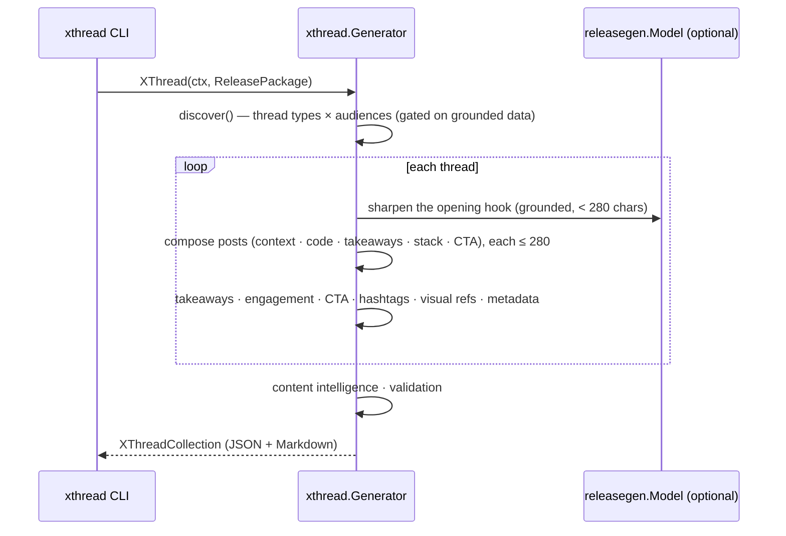

# X Thread Generation (Milestone 13)

Milestone 13 converts the content pipeline's artifacts — [Release Context](./release-context.md)
(M2) through [LinkedIn](./linkedin.md) (M12) — into technical **X (Twitter)
threads**: multiple thread variations targeting developer, cloud, AI, and DevOps
audiences. It is the **Social Marketing** engine for micro-content.

It generates structured thread packages, **not** published threads, and every
thread is **educational, technically accurate, concise, and grounded in the
Release Context** — no invented features, metrics, or performance claims, and
code snippets come only from the blog's real fenced blocks.

Related: [LinkedIn](./linkedin.md) · [SEO](./seo.md) · [Architecture Diagrams](./architecture-diagrams.md) · [Visual Assets](./visual-assets.md) · [Release Context](./release-context.md).

---

## 1. Pipeline



`Generator.XThread(ctx, ReleasePackage) → XThreadCollection`, where
`ReleasePackage` bundles the eleven upstream artifacts. The generator **composes**
threads from them; it never regenerates repository knowledge.

### Sequence



## 2. Design

The engine lives in [`internal/xthread`](../internal/xthread). It is
**deterministic where it matters** and uses the LLM only to sharpen the opening
hook. Each planner is a pure, independently-testable function.

| Concern | Produced by |
| --- | --- |
| Thread discovery (types × audiences) | Deterministic, gated on grounded data |
| Post composition + **character-limit enforcement (≤ 280)** | Deterministic |
| **Code snippets** | Deterministic — extracted from the blog's real fenced blocks; never fabricated |
| Key takeaways | Deterministic, from the Release Context |
| Engagement prompts · CTAs | Deterministic; CTAs reuse the SEO blog URL / repo URL |
| Hashtags | Deterministic — reuse the SEO X hashtags, capped tight (≤ 4) |
| Visual references | Point at existing Visual Assets (M9) + Architecture diagrams (M11) — never regenerated |
| Metadata, engagement & technical-confidence scores | Deterministic |
| Opening hook | LLM (`releasegen.Model`) with a grounded fallback, re-trimmed to 280 |

When `Model` is nil, generation is fully deterministic.

## 3. Configurable thread length

`PostsPerThread` sets the thread length (default **5**, clamped **3–10**). Each
thread is a pool of grounded candidate posts — hook → context → code → per-takeaway
points → stack → CTA — trimmed to the requested length, with the hook always first
and the CTA always last. Code-focused threads place the snippet before the
takeaways so it survives the trim. **Every post is enforced ≤ 280 characters**
(by rune) on a word boundary; even LLM hook output is re-trimmed.

## 4. Thread types

Each targets a different audience/objective, gated on grounded data: Release
Announcement, Feature Breakdown, Architecture Walkthrough, Implementation Deep
Dive (needs code), Engineering Lessons Learned, Performance Improvements (needs an
infra signal), AWS Best Practices, AI Engineering Insights (needs AI in the
stack), Developer Tips, Open Source Update. A diverse, deduplicated set is
selected (≤ `MaxThreads`, default 5).

## 5. Schema (abridged)

```json
{
  "schemaVersion": "1.0.0",
  "metadata": { "repository": "acme/widget", "release": "v0.2.0", "threadCount": 5, "postsPerThread": 5 },
  "threads": [
    {
      "id": 2, "type": "Feature Breakdown", "audience": "Developers evaluating the project", "length": 5,
      "posts": [
        { "index": 1, "content": "A short thread on the headline feature in widget v0.2.0 🧵", "visualReference": "widget-v0-2-0-x-image.png", "characterCount": 57 },
        { "index": 3, "content": "Here's the core of it 👇", "codeSnippet": "func (b *Builder) Build() error { return assemble() }", "characterCount": 23 }
      ],
      "summary": "...", "keyTakeaways": ["release context builder"],
      "engagementPrompt": "How would you approach this problem?",
      "cta": "Code's on GitHub 👉 https://github.com/acme/widget",
      "hashtags": ["#OpenSource", "#AWS"],
      "metadata": { "engagementScore": 74, "technicalConfidence": 90, "totalCharacters": 250 }
    }
  ],
  "contentIntelligence": { "threadCount": 5, "averageEngagementScore": 76, "tone": "technical, concise, educational" }
}
```

The schema is versioned and additive-only, so future publishing automation
extends it without breaking.

## 6. Validation

`XThreadCollection.Validate(pkg)` enforces the Milestone 13 invariants (empty ⇒ valid):

- Every thread is grounded in the Release Context.
- Every thread has a CTA, hashtags, an engagement prompt, and ≥ 1 key takeaway.
- Every post is non-empty and **within the 280-character limit**.
- Every key takeaway is grounded (technical claims are validated).
- No two threads are duplicates (by type or body).

## 7. Running it

The `xthread` CLI reads a Release Context (and optional blog), builds the content
chain, then emits Markdown (default) or JSON:

```bash
# Fully offline from a context + an existing blog (deterministic):
go run ./cmd/xthread --context ctx.json --blog post.md --offline

# 7-post threads, JSON, generating the chain via Ollama:
go run ./cmd/xthread --context ctx.json --posts 7 --format json --out xthreads.json
```

Flags: `--context` (required), `--blog`, `--max`, `--posts` (3–10), `--format
md|json`, `--model` (`OLLAMA_MODEL`), `--ollama` (`OLLAMA_URL`), `--offline`,
`--out`, `--timeout`.

## 8. Status

**Implemented:** the X-thread engine (thread discovery, post composition with
character-limit enforcement, code-snippet extractor, key-takeaway generator,
engagement, CTA, hashtag, visual-reference, and metadata planners with engagement
+ technical-confidence scores), the versioned JSON schema, the Markdown renderer,
structural + grounding + limit validation, and the `xthread` CLI. Unit-tested at
80%+ with deterministic and model-backed paths.

**Next (future milestones):** publish directly to X, schedule threads, analyze
engagement, and personalize/translate — all without modifying the X Thread
Generator; this package is the canonical micro-content output.
