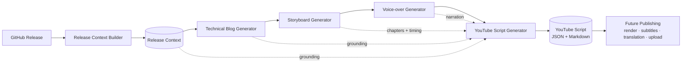
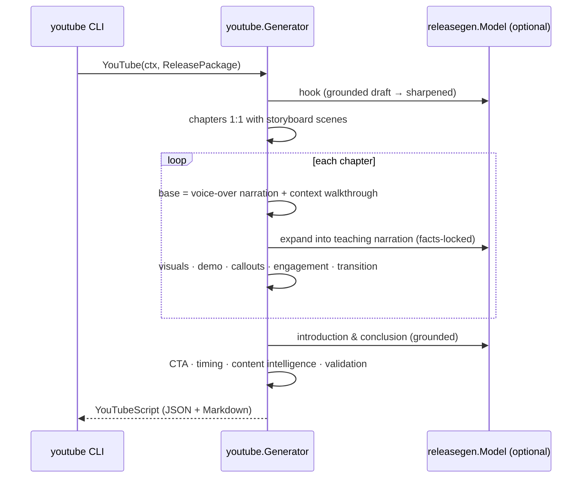

# YouTube Video Script Generation (Milestone 6)

Milestone 6 combines the previously generated artifacts — [Release Context](./release-context.md)
(M2), [Technical Blog](./blog-generation.md) (M3), [Storyboard](./storyboard.md)
(M4), and [Voice-over Script](./voiceover.md) (M5) — into a single,
**production-ready long-form YouTube script** optimized for educational
software-engineering videos (**10–20 minutes**). It is the **Long-form Video**
engine; it composes existing artifacts and never regenerates their content.

Related: [Voice-over](./voiceover.md) · [Storyboard](./storyboard.md) · [Blog Generation](./blog-generation.md) · [Release Context](./release-context.md) · [Architecture](./architecture.md).

---

## 1. Pipeline



`Generator.YouTube(ctx, ReleasePackage) → YouTubeScript`, where
`ReleasePackage{Context, Blog, Storyboard, VoiceOver}` bundles the four upstream
artifacts.

### Sequence



## 2. Design

The engine lives in [`internal/youtube`](../internal/youtube). Like the storyboard
and voice-over engines, it is **deterministic where it matters** and uses the LLM
only for prose. Each planner is a pure, independently-testable function.

| Concern | Produced by |
| --- | --- |
| Chapter structure (1:1 with storyboard scenes) | Deterministic |
| Timestamps (hook offset + sequential, gap-free) | Deterministic |
| Timing / runtime target band (10–20 min) | Deterministic |
| Hook type selection · CTA · educational callouts · engagement cadence | Deterministic (rule-based) |
| **Architecture / repository walkthrough** | **From the Release Context — never invented** |
| Demonstration steps | Deterministic, from the storyboard scene's real code/diagrams |
| Content intelligence (SEO, titles, tags, description, chapters, pinned comment) | Deterministic |
| Hook, introduction, chapter narration, transitions, conclusion wording | LLM (`releasegen.Model`) with a deterministic fallback |

It reuses the shared **`Model` port** (local Ollama today, Bedrock later) and
consumes the Milestone 3–5 types unchanged. When `Model` is nil, generation is
fully deterministic — narration is built from the voice-over script and the
Release Context, so nothing is fabricated.

## 3. Structure

- **Hook** — 15–30s opener at `00:00`. The type (`problem | insight | outcome |
  showcase | comparison`) is chosen from the Release Context; the line is grounded
  and non-clickbait.
- **Introduction** — 30–60s framing: overview, release summary, technologies,
  learning outcomes, and the agenda (the body chapter titles).
- **Chapters** — one per storyboard scene, so chapters align with the storyboard
  and **every scene is represented**. Each carries teaching narration, visual
  references, storyboard/voice-over scene links, demonstration steps, educational
  callouts, optional engagement prompts, and a transition.
- **Conclusion** — 20–45s recap: what was built, key takeaways, and the next
  release preview.
- **Call to Action** — concrete, concise CTAs (repo, docs, subscribe, like,
  comment, future releases, contribute) plus a pinned comment.

### Chapters map 1:1 to storyboard scenes

Because the storyboard already derived its scenes from the blog's own structure
(and its timing feeds the voice-over), reusing them 1:1 keeps the YouTube
timeline **exactly aligned** with the storyboard and voice-over, and makes the
"every scene represented" and "timestamps sequential" invariants hold by
construction. The Hook adds a pre-roll offset; Introduction and Conclusion are
distinct sections that *reference* the intro/conclusion scenes rather than adding
runtime.

## 4. Timing

Chapter target durations come from the storyboard's per-scene seconds; total
runtime = hook + Σ chapters. The **10–20 minute** band is a *target*: an under-run
(a blog too thin to fill ten minutes) is emitted as a **warning**, while
`Validate` enforces internal timing consistency and sequential timestamps.

## 5. Schema (abridged)

```json
{
  "schemaVersion": "1.0.0",
  "metadata": { "repository": "acme/widget", "release": "v0.2.0", "sourceSchemas": { "storyboard": "1.0.0", "voiceOver": "1.0.0" } },
  "video": { "title": "...", "format": "long-form", "duration": "12:40", "durationSec": 760, "audience": "...", "difficulty": "intermediate" },
  "hook": { "type": "showcase", "script": "...", "durationSec": 20, "timestamp": {} },
  "introduction": { "script": "...", "technologies": [], "learningOutcomes": [], "agenda": [] },
  "chapters": [
    {
      "number": 2, "title": "Architecture", "type": "architecture",
      "timestamp": { "start": "02:40", "end": "05:20", "label": "02:40–05:20" },
      "duration": { "minSec": 115, "maxSec": 135, "targetSec": 120 },
      "script": "...", "visualReferences": ["Diagram: docs/architecture.md"],
      "storyboardScenes": [2], "voiceOverReferences": [2],
      "demonstration": [], "callouts": [ { "kind": "Architecture Decision", "text": "..." } ],
      "engagement": [], "transition": "..."
    }
  ],
  "conclusion": { "script": "...", "whatWasBuilt": [], "keyTakeaways": [], "nextRelease": "..." },
  "callToAction": { "script": "...", "items": [ { "kind": "GitHub Repository", "url": "https://github.com/acme/widget" } ], "pinnedComment": "..." },
  "contentIntelligence": { "estimatedRuntime": "12:40", "wordCount": 1900, "suggestedTitle": "...", "alternativeTitles": [], "suggestedTags": [], "suggestedDescription": "...", "chapterMarkers": [] }
}
```

The schema is versioned and additive-only, so future publishing/subtitle/
translation milestones extend it without breaking.

## 6. Validation

`YouTubeScript.Validate(sceneCount)` enforces the Milestone 6 invariants (empty ⇒ valid):

- Every storyboard scene is represented by some chapter.
- Every chapter has non-empty narration.
- Timestamps are sequential and gap-free (chapters follow the hook).
- Runtime is internally consistent (`hook + Σ chapters == video.durationSec`).
- Introduction, conclusion, and a call to action are all present.

## 7. Running it

The `youtube` CLI reads a Release Context and reuses any artifacts you pass,
generating the rest, then emits Markdown (default) or JSON:

```bash
# Fully offline from a context + an existing blog (deterministic):
go run ./cmd/youtube --context ctx.json --blog post.md --offline

# Reuse a pre-built storyboard + voice-over, offline:
go run ./cmd/youtube --context ctx.json --storyboard board.json --voiceover vo.json --offline

# Generate the whole chain via Ollama, then the script as JSON:
go run ./cmd/youtube --context ctx.json --format json --out script.json
```

Flags: `--context` (required), `--blog`, `--storyboard`, `--voiceover`,
`--format md|json`, `--model` (`OLLAMA_MODEL`), `--ollama` (`OLLAMA_URL`),
`--offline`, `--out`, `--timeout`.

## 8. Status

**Implemented:** the YouTube script engine (hook, introduction, chapter,
architecture/repository walkthrough, demonstration, callout, engagement, CTA,
timing, and metadata planners), the versioned JSON schema, the Markdown renderer,
structural validation, and the `youtube` CLI. Unit-tested at 80%+ with
deterministic and model-backed paths.

**Next (future milestones):** render the script to video, generate subtitles,
translate to other languages, and automate publishing — this script is the
canonical long-form input for all of them.
