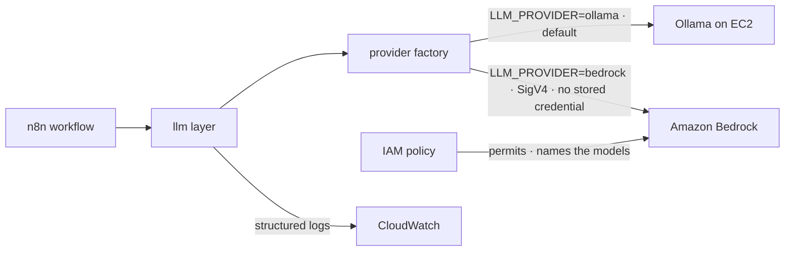
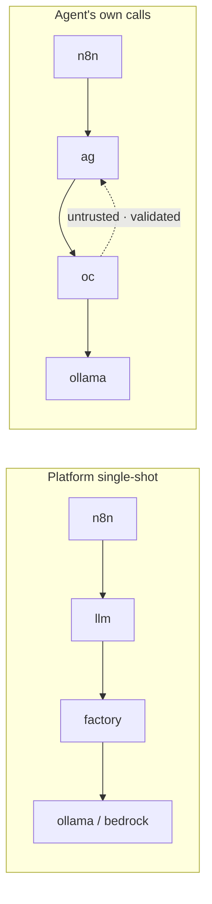

# Designing a Provider-Agnostic LLM Layer for an Event-Driven AI Agent Platform on AWS

## Introduction

The moment a system hardcodes a single inference backend, it inherits that backend everywhere — its cost curve, its operational model, and its deployment constraints propagate into every call site. Changing backends later stops being a configuration decision and becomes a code change, with all the review, testing, and release risk that implies. That coupling is the problem a provider-agnostic LLM architecture is meant to dissolve: an LLM provider abstraction turns backend selection into a *deployment* decision rather than a software change. Callers depend on a stable contract; which model service answers a given request is resolved at deployment time, not compiled in.

Only once that boundary exists do the familiar trade-offs — cost, operational overhead, data residency — become choices a deployment can make instead of properties baked into the binary. This repository, an event-driven, AWS-native AI agent platform written primarily in Go, confronts the coupling directly in its inference layer. It defines a narrow `llm.Provider` contract and resolves the concrete backend from a single environment variable, keeping a self-hosted Ollama instance as the default while making Amazon Bedrock available behind the same interface. This article documents that design: how the provider abstraction is structured, how the managed backend is reached without storing a credential, and why the platform keeps its own inference calls architecturally separate from the calls made by the agent it hosts.

## Background

The platform is organized as a standard Go project that separates its entry points, business logic, infrastructure definitions, and documentation. Its runtime is event-driven: an EventBridge Scheduler triggers a Lambda that starts and stops an EC2 host, blending serverless ingestion with an on-demand compute host so the front door stays available while heavier compute runs only when needed. Around that spine sit the components that do the actual work — an `n8n` workflow layer, an agent (`ag`) and its orchestrator (`oc`), a shared LLM layer (`llm`), and the inference backends themselves.

The platform performs two kinds of language-model work, and they are not the same. Its own single-shot tasks — summarising and generating release notes — run through the `llm` layer. Separately, the embedded agent makes its own model calls through the orchestrator. Before Bedrock was introduced, the single-shot path ran against a self-hosted Ollama backend on EC2 as its default and only option. That default is deliberate: a self-hosted model on an on-demand host bounds cost predictably, which is the same reasoning that governs the platform's start/stop compute model.

## Engineering Problem

A single hardcoded inference backend forces one cost and operations profile onto every environment. Self-hosted Ollama on EC2 keeps spend bounded and predictable, but it commits every deployment to running and maintaining that compute — patching the host, sizing it, keeping the model available. An environment that would rather trade fixed operational overhead for pay-per-use managed inference has no way to make that choice without editing the code that calls the model.

Cost, though, is only the most visible pressure. The same rigidity shows up across the software lifecycle. Local development wants a lightweight model that runs on a laptop without AWS access at all; production wants managed inference it does not have to operate; and both should exercise the *same* code path so that what passes in development is what runs in production. Behavioural consistency across environments is hard to guarantee when the backend is a compile-time fact rather than a configured one. A hardcoded backend tends to grow parallel code paths — one that talks to the real service, another stubbed out for tests or local runs — and those paths drift. Testing compounds the problem: business logic that reaches directly for a concrete client cannot be exercised without standing up that client, so unit tests either contact a live model or are not written at all. What the platform needed was a single seam that every environment shares, so that local, test, and production runs differ only in which backend is selected — never in the logic that calls it.

Adding a managed backend introduces a second, sharper problem: authentication. A managed AWS LLM service must be reached securely, and the obvious path — storing an API key or long-lived credential somewhere the platform can read it — creates a secret to provision, rotate, and protect on every host that runs the code. The platform needed a way to authenticate to a managed model service with no stored credential at all, while still constraining exactly which models a given deployment is permitted to invoke. Backend flexibility that came at the price of scattered secrets would trade one operational burden for a worse one.

## Solution Overview

The platform models the inference backend behind an `llm.Provider` interface and selects the concrete implementation through a factory keyed on a single environment variable, `LLM_PROVIDER`. Setting it to `ollama` — the default — resolves the self-hosted backend; setting it to `bedrock` resolves the managed one. Callers depend only on the interface and never learn which backend answered.

Amazon Bedrock is reached over AWS SigV4 with no stored credential. Authentication rides on the host's IAM role, and an IAM policy does double duty: it permits access to Bedrock and names the specific models that may be invoked. The set of callable models is therefore an infrastructure decision expressed in policy, not a value embedded in code.

Regardless of which backend the factory returns, every provider emits structured logs to CloudWatch. Operators and callers see uniform telemetry whether inference ran on self-hosted Ollama or managed Bedrock, so observability does not fork with the backend.

## Architecture

The single-shot inference path runs `n8n → llm → factory`, and the factory fans out to one of two backends. With `LLM_PROVIDER=ollama` the factory routes to the self-hosted `ollama` backend; with `LLM_PROVIDER=bedrock` it routes to `bedrock` over SigV4 with no stored credential. The `iampol` component points at `bedrock`, permitting access and naming the allowed models. The `llm` layer writes structured logs to `cw` (CloudWatch) on either path.

The agent's own inference is a separate path that the provider abstraction does not touch. There, `n8n` orchestrates the agent (`ag`), which calls its orchestrator (`oc`) with an HTTPS token, an idempotency key, and a mandatory budget; the orchestrator makes the agent's own model calls to `ollama`. The repository's diagram marks this explicitly: on `oc → ollama`, the platform is *not* in this path. The return edge, `oc → ag`, is labelled untrusted and validated before use — agent output is treated as data to check, not as a trusted result to consume directly.

Keeping these two paths distinct is a design decision, not an accident of layout. The platform's trusted single-shot work flows through the swappable provider layer; the agent's own model calls run through the orchestrator with a mandatory budget and are held at arm's length. One boundary governs cost and vendor choice; the other governs trust.

The two backends behind the single-shot path sit at opposite ends of the build-versus-buy spectrum, and the abstraction exists so a deployment can pick either without the calling code noticing. The comparison below summarises how they differ:

| Aspect | Ollama | Amazon Bedrock |
| --- | --- | --- |
| Infrastructure | Self-hosted model server on an EC2 host the platform runs | Fully managed AWS service; no inference infrastructure to operate |
| Authentication | Reached directly as a self-hosted backend (no request signing) | AWS SigV4 request signing via the host's IAM role |
| Credentials | None stored | None stored — access flows from the IAM role |
| Cost Model | Fixed cost of the running EC2 host; bounded and predictable | Pay-per-use managed pricing |
| Operational Overhead | Patch, size, and keep the host and model available | None — managed by AWS |
| Default Backend | Yes — selected when `LLM_PROVIDER` is unset | Opt-in — selected with `LLM_PROVIDER=bedrock` |

Neither column is presented as the correct choice; the point of the table is that both are reachable through one interface, so the decision is a deployment setting rather than a property of the code.

## Implementation Details

Adding Bedrock is the addition of a second concrete `llm.Provider` behind the interface that already existed — and the most important property of that change is what it did *not* touch. The calling contract did not move. Code that asked the `llm` layer to summarise text or draft release notes kept calling the same method, existing business logic required no changes, and every caller continued to compile unchanged. The provider interface stayed stable; the new backend simply satisfies it.

This is Go's preference for programming to interfaces rather than implementations, applied at an architectural seam. Because callers depend on the small `llm.Provider` surface and not on any concrete client, a new provider is additive: it implements the same methods and slots in behind the factory. The interface absorbs the difference between backends, so the blast radius of adding one is confined to the provider layer and its configuration.

Backend choice is a configuration concern rather than a code concern. The `LLM_PROVIDER` environment variable drives the factory, so a deployment selects Ollama or Bedrock by setting a value, not by branching at call sites or shipping a different build. Ollama remains the default when the variable is unset, preserving existing behaviour for every environment that does not opt in.

Bedrock authentication is SigV4-based and leans on the host's IAM role rather than any embedded key. The accompanying IAM policy names the permitted models, so the boundary of what the deployment may invoke is defined in infrastructure. Changing which models are reachable is a policy edit, and the code carries no secret to leak.

## Engineering Decisions

The interface-plus-factory structure is chosen over conditional logic at each call site. Scattering `if provider == "bedrock"` checks across the codebase would couple every caller to the set of known backends and force edits in many places each time a backend is added. A single factory concentrates that decision in one location, and a new provider slots in by implementing the interface — callers are untouched.

Role-based SigV4 authentication is chosen over stored credentials for the managed backend. This removes the secret-management problem entirely: there is no key to provision, rotate, or accidentally commit, and access is governed by the same AWS IAM machinery that controls the rest of the platform's permissions. Folding the list of callable models into that policy means the security boundary and the capability boundary are described in one place.

Preserving the self-hosted default keeps cost bounded for deployments that want it, while making the managed backend an opt-in. The platform does not force pay-per-use inference on every environment; it makes the trade available to environments that prefer to shed operational work. This mirrors the platform's broader posture of bounding cost through on-demand compute.

## Repository Changes

The substantive change is a single code feature: Amazon Bedrock added as a second `llm.Provider` behind the existing interface. It extends capability while leaving the calling contract stable — a feature-only change with no accompanying fixes. Alongside it, a documentation change records the prior version's changelog entry. The narrowness matters: adding a whole new managed inference backend touched the provider layer and its configuration, not the callers, because the interface absorbed the difference.

## Benefits

Deployment flexibility is the most direct result. An operator moves a deployment between self-hosted and managed inference by setting `LLM_PROVIDER`, with no rebuild and no change to the code that consumes model output. Different environments can run different backends from the same source — a lightweight local model during development, managed Bedrock in production — while exercising one shared code path.

The security posture improves because there is no stored LLM credential to manage. Access to Bedrock is mediated by an AWS IAM role and SigV4, and the IAM policy constrains which models can be invoked — the platform cannot call a model the policy does not name.

Testing benefits from the same seam. Because callers depend on the `llm.Provider` interface rather than a concrete client, a mock provider that satisfies the interface can be substituted in unit tests, letting business logic be exercised without contacting either Ollama or Bedrock. Tests stay fast, deterministic, and free of network or infrastructure dependencies.

Maintainability follows from the interface as well. A future provider requires only a new implementation of the same contract and a factory entry; the calling code and the shape of the abstraction stay put. Observability stays uniform because every provider emits the same structured logs to CloudWatch, so operators read one telemetry format regardless of which backend answered.

## Tradeoffs

The two backends carry opposite operational profiles, and choosing between them is a real trade rather than a free win. Self-hosted Ollama on EC2 bounds cost and keeps inference in infrastructure the platform controls, but it carries the compute and maintenance burden of running that host. Managed Bedrock removes the infrastructure work but shifts spend to pay-per-use and introduces a dependence on the managed provider. Neither is universally correct; the abstraction exists precisely so the choice can be made per environment.

The abstraction itself has a cost, and it is more than a layer of indirection. A provider interface naturally exposes the lowest common denominator between the backends it spans: it can only offer capabilities that every implementation can honour. Features that one provider supports and another does not — streaming responses, tool calling, provider-specific request parameters, or model-specific capabilities — do not fit cleanly behind a shared contract. Surfacing them would mean either widening the interface so every provider must account for the feature, or introducing provider-specific escape hatches that let callers reach past the abstraction. Both approaches have consequences, and this design does not prescribe one; the point is simply that a uniform interface trades access to each backend's differentiated features for the portability it provides. That constraint is the price of keeping callers vendor-agnostic.

## Applying the Pattern

The structure generalises beyond this platform to any system that must stay portable across inference backends or, more broadly, across interchangeable third-party services. The recipe has four parts. Define a narrow provider interface that captures only what callers actually need, so implementations stay small and substitutable. Resolve the concrete implementation in a configuration-driven factory keyed on a single variable, so switching backends is a deployment decision. Authenticate to managed services with a role and request signing rather than stored credentials, and let the access policy also define the boundary of what may be called. Emit the same structured telemetry from every implementation, so observability does not fragment as backends multiply.

Applied together, these turn a vendor commitment into a per-deployment setting. The interface keeps callers ignorant of the backend, the factory makes selection external, role-based auth removes the secret, and uniform logging keeps operations consistent across whatever backends are added later.

## Conclusion

A thin provider abstraction changes the question "which LLM backend?" from a commitment expressed in code into a choice expressed in deployment configuration. This platform models inference behind an `llm.Provider` interface, resolves the backend from `LLM_PROVIDER` through a factory, and keeps self-hosted Ollama as the default with managed Amazon Bedrock available beside it. Pairing that flexibility with AWS IAM and SigV4 keeps it credential-free — the managed backend is reached over signed requests with no stored secret, and the IAM policy names the models a deployment may call. The result is a provider-agnostic LLM architecture that can move between self-hosted and managed compute without touching calling code, while the agent's own model calls stay deliberately outside that path and its output stays untrusted until validated.
