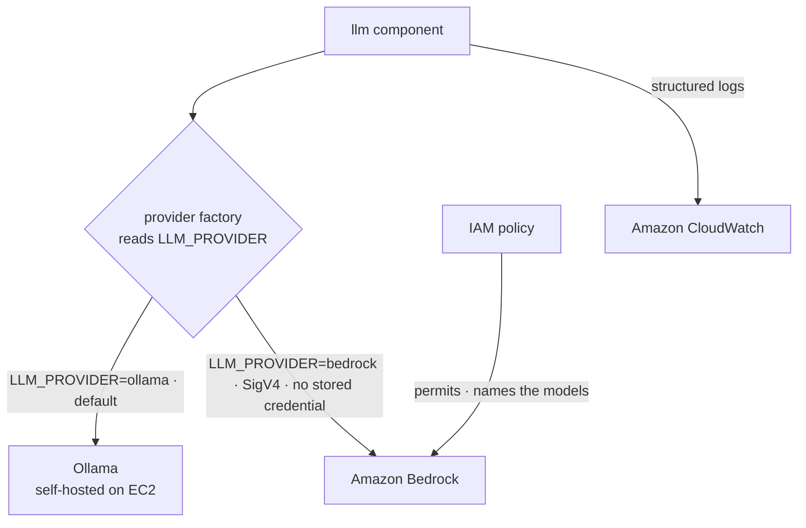

# Designing a Pluggable LLM Provider Layer for an AI Agent Platform on AWS

## Why This Matters

The platform's single-shot language-model work — summarising a repository, drafting release notes — ran against exactly one backend: a self-hosted Ollama process on an on-demand Amazon EC2 host. That coupling tied model availability, scaling, and reliability to a single machine. When the host was down or under-provisioned, the platform had no managed path to fall back to or scale into. Backend choice was fixed in the deployment, not a decision the operator could make. The pressure here is portability and availability: a system that generates content from a language model should not be permanently bound to one process on one instance.

## The Existing Architecture

The platform is event-driven and AWS-native. A workflow hands work to n8n, which orchestrates the agent; separately, n8n routes the platform's own single-shot work — summarise, release notes — through an `llm` component. That `llm` component already resolved a concrete model backend and emitted structured logs to Amazon CloudWatch.

This path is deliberately distinct from the agent's own model calls, which flow `ag → oc → ollama`. The platform is not in that path, and that boundary is intentional. The existing design worked for a single backend. Its limitation was that the backend was hard-wired: the `llm` component could reach only the self-hosted Ollama host, with no way to select a managed alternative.

## The Engineering Constraint

- Adding a managed backend must not change the default behaviour. Existing deployments that use Ollama must keep working, unchanged, with no new required configuration.
- The caller contract must stay stable. Code that calls the `llm` component must not need to know which backend answers.
- Managed inference must be reached without storing long-lived credentials. No API keys or static secrets may live in the deployment.
- Access to managed models must be least-privilege — scoped to specific models, not blanket permission to an entire service.
- Observability must be uniform. A managed backend has to produce the same structured Amazon CloudWatch logs as the self-hosted one, so operators read one log shape regardless of provider.

## The Solution

The change introduces Amazon Bedrock as a second `llm.Provider` behind a factory. The factory selects the concrete implementation at runtime from the `LLM_PROVIDER` environment variable: `ollama` remains the default, and `bedrock` is opt-in. Both implementations satisfy the same `llm.Provider` interface, so callers are unaware of which backend runs.

Amazon Bedrock is reached over SigV4 through the AWS SDK for Go v2, with no stored credential. An AWS IAM policy permits the Bedrock calls and names the specific models the platform may invoke. Because selection is configuration rather than code, an operator switches between self-hosted and managed inference by setting one variable — and a deployment that sets nothing continues to use Ollama exactly as before.

## Architecture Summary

| Concern | Implementation |
| --- | --- |
| Backend selection | Factory keyed on `LLM_PROVIDER` (`ollama` default, `bedrock` opt-in) |
| Provider contract | Both backends implement the `llm.Provider` interface |
| Self-hosted path | Ollama on an on-demand Amazon EC2 host |
| Managed path | Amazon Bedrock via AWS SDK for Go v2 |
| Managed auth | SigV4, no stored credential |
| Authorisation | AWS IAM policy permitting Bedrock and naming the models |
| Observability | Structured logs to Amazon CloudWatch from the `llm` path |
| Scope of change | Additive; default runtime behaviour unchanged |

The two concrete providers differ along a small, well-defined set of axes:

| Axis | Ollama (default) | Amazon Bedrock (opt-in) |
| --- | --- | --- |
| Selection flag | `LLM_PROVIDER=ollama` | `LLM_PROVIDER=bedrock` |
| Hosting | Self-hosted on an on-demand Amazon EC2 host | Managed service |
| Authentication | Local process call | SigV4, no stored credential |
| Authorisation | None stated | AWS IAM policy naming the models |
| Role | Default provider | Second, opt-in provider |

## Architecture Diagram

The `llm` component receives single-shot work and delegates backend choice to the factory. The factory reads `LLM_PROVIDER` and returns either the Ollama implementation or the Bedrock implementation; both honour the same interface, so the request path above the factory is identical. When the Bedrock implementation is selected, calls are signed with SigV4 and authorised by an IAM policy that names the permitted models. Regardless of which provider answers, the `llm` path writes structured logs to Amazon CloudWatch.

## Key Implementation Details

### Selection through the factory

The factory reads `LLM_PROVIDER` and constructs the matching `llm.Provider`. An unset or `ollama` value yields the self-hosted implementation; `bedrock` yields the managed one. Callers depend only on the interface, never on a concrete type, so adding the second backend touched the factory and the new implementation — not the call sites. This is why the change is additive: the contract that surrounds the `llm` component did not move, and existing deployments resolve to the same Ollama provider they always used.

### Credential-free Bedrock access

The Bedrock implementation authenticates with SigV4 through the AWS SDK for Go v2 and stores no credential. Authorisation comes from an AWS IAM policy that both permits the Bedrock action and names the specific models the platform may invoke. Access is therefore scoped at the model level rather than granted broadly across the service. No API key or static secret is embedded in the deployment; identity and permission are supplied by the surrounding AWS environment and constrained by the policy.

### Uniform observability

The Bedrock provider emits the same structured Amazon CloudWatch logs as the existing Ollama path. Operators read one log shape whether the request was answered locally or by the managed service. This keeps the observability contract stable across the swap: switching `LLM_PROVIDER` changes the backend, not the telemetry an on-call engineer inspects.

## Why These Decisions Were Made

### A provider interface plus a factory

Isolating callers from backend choice made the managed backend an additive change. The alternative — branching on backend type inside each caller — would have spread provider knowledge across the codebase and made the default hard to preserve. A single interface with a factory keeps one seam to extend, and it keeps Ollama as the untouched default so existing deployments carry no risk from the addition.

### SigV4 and a model-scoped IAM policy

Reaching Amazon Bedrock over SigV4 avoids embedding a long-lived credential in the deployment, which would have to be stored, rotated, and guarded. Naming the permitted models in the IAM policy enforces least privilege at the model level rather than granting the whole service. Authentication and authorisation are handled by the AWS environment, not by application secrets.

### Keeping the agent's model calls out of the platform path

The platform routes only its own single-shot work through the `llm` component. The agent's own model calls follow the separate `ag → oc → ollama` path, where the platform is deliberately absent. This preserves a clean trust and responsibility boundary: the provider abstraction governs the platform's inference, not the agent's.

## Repository Impact

A second `llm.Provider` implementation was added alongside the existing Ollama provider, selected by the factory on `LLM_PROVIDER`. An AWS IAM policy was added to authorise Amazon Bedrock and name the permitted models. The Bedrock provider was wired to emit the same structured Amazon CloudWatch logs as the existing path, and the repository's architecture diagram was updated to show the factory choosing between Ollama and Bedrock, including the SigV4 no-stored-credential edge and the policy that names the models. The default runtime behaviour was left unchanged — deployments that set no provider still resolve to Ollama.

## Benefits

- Self-hosted or managed inference is chosen by configuration, not by editing code.
- The self-hosted path remains the safe default, so existing deployments are unaffected.
- Managed access is credential-free and least-privilege, scoped to named models via AWS IAM.
- Observability is consistent across providers through structured Amazon CloudWatch logs.
- New backends can be added behind the same interface without disturbing callers.

## Tradeoffs

- Amazon Bedrock introduces a managed, usage-billed dependency, replacing the fixed cost profile of the self-hosted Ollama host with per-request charges.
- Two backends now sit behind one interface, so both the Ollama and Bedrock implementations must be maintained and kept contract-compatible.
- The managed path adds an AWS IAM policy that must be kept in step with the set of models the platform is allowed to call.

## What This Enables Next

With the factory in place, the platform can run managed inference wherever the self-hosted host is unsuitable — capacity limits, host downtime, or environments where operating an Ollama instance is undesirable. The provider seam also establishes a repeatable shape for integration: any further backend can be added as another `llm.Provider` selected by the same environment variable, authorised by its own least-privilege policy, and observed through the same structured logs. The abstraction turns backend choice into a deployment-time decision rather than a code change.

## Conclusion

The reusable pattern here is a small provider interface fronted by a configuration-driven factory. By defining `llm.Provider` and selecting the implementation from `LLM_PROVIDER` at runtime, the platform turns its language-model backend into a swappable dependency — self-hosted Ollama by default, managed Amazon Bedrock when configured — without disturbing any caller. Credential-free SigV4 access and an IAM policy that names the permitted models keep the managed path least-privilege, and shared Amazon CloudWatch logging keeps observability uniform across the swap. For engineers building similar systems, the practical takeaway is to isolate any external backend behind a narrow interface, drive selection from configuration with the safe option as the default, and let the surrounding AWS identity — not stored secrets — carry authorisation. That keeps capability additive and the existing contract intact.
