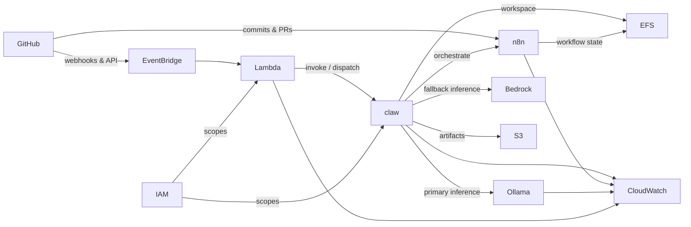
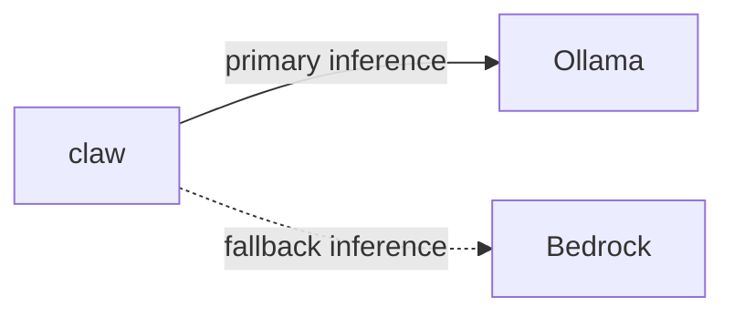

# Designing an Event-Driven AI Agent Platform on AWS with Resilient Dual-Model Inference

## Introduction

An AI agent platform that reacts to repository activity has to do three difficult things at once: absorb events from an external source it does not control, run model inference that may fail, and coordinate multi-step workflows without letting any one component become a single point of failure. This repository documents such a platform — an AWS-native, event-driven system whose design is captured as architecture documentation before implementation. The source of truth is a component graph in `docs/architecture/diagrams.md` that names every service and every relationship in the event-to-artifact path, and a semantic-version release flow that governs how the platform advances.

The design decision that shapes everything else is that inference is treated as a fallible dependency rather than a given. The orchestration core, named claw, routes work to a self-hosted primary inference provider and an AWS-managed fallback, so a model backend being unavailable degrades quality rather than halting the pipeline. The rest of the platform — event ingestion, orchestration, shared state, artifact storage, permission scoping, and telemetry — is arranged around keeping that flow moving and observable.

## Background

The repository describes an AI agent platform on AWS: its overall architecture, design goals, AWS service selection, component interactions, data flow, deployment strategy, and technology choices. It is written primarily in Go, built and released through GitHub Actions with Go modules and Make, and laid out as a standard Go project that separates entry points, business logic, infrastructure definitions, and documentation into distinct top-level areas.

What distinguishes the repository at this stage is that the architecture is expressed diagram-first. Rather than reverse-engineering a system from code, the platform commits its intended topology — the components, their responsibilities, and the edges between them — to versioned documentation that the build-out is measured against. The architecture graph enumerates every active component — GitHub, Amazon EventBridge, AWS Lambda, the claw orchestrator, n8n, Ollama, Amazon Bedrock, Amazon EFS, Amazon S3, AWS IAM, and Amazon CloudWatch — and the labelled relationships that connect them, and a separate release-management diagram encodes how versions move from a change through pre-release, release-candidate, and stable states. The documentation is the deliverable that later code must conform to.

## Engineering Problem

Three problems have to be solved together, and each constrains the others.

The first is reliable ingestion. GitHub emits events the platform must react to, but GitHub is external and its delivery cadence is not under the platform's control. Compute must not be coupled directly to the source system, or a burst of repository activity would push load straight onto the components that run agent work.

The second is inference availability. Agent work depends on a model backend, and a model backend is the component most likely to be slow, saturated, or offline. If the orchestrator calls a single inference endpoint synchronously, that endpoint's availability becomes the platform's availability.

The third is coordinating multi-step workflows while keeping permissions tight and behaviour observable. Agent tasks are not single calls; they are sequences that touch a workflow engine, an inference provider, a shared workspace, and durable storage. Each of those touchpoints is a place where an over-broad IAM role widens the blast radius, and each is a place where missing telemetry turns a failure into a mystery.

## Solution Overview

The platform routes GitHub events through Amazon EventBridge, which dispatches to AWS Lambda. Lambda invokes claw, the orchestration core, over the relationship the graph labels *invoke / dispatch*. claw then drives the rest of the work: it orchestrates n8n workflows, calls inference, and persists results.

Inference is where the resilience decision lives. claw calls Ollama as primary inference and Amazon Bedrock as fallback, so the self-hosted provider carries normal load while the managed provider backstops it. State and outputs are separated by durability requirement: claw uses Amazon EFS as a workspace and writes finished artifacts to Amazon S3, while n8n uses the same EFS for workflow state. Every compute component runs under an AWS IAM boundary scoped to it, and the active components emit logs and metrics to Amazon CloudWatch so the event flow can be traced from ingress to artifact.

## Architecture

The architecture graph is the authoritative description, and the article follows its components and edges rather than a simplified sketch.

There are two ingress paths from GitHub. The primary path carries webhooks and API traffic into Amazon EventBridge, which routes events onward. A second path lets commit and pull-request activity reach the n8n workflow engine directly. From EventBridge, events are handed to AWS Lambda, and Lambda invokes the claw orchestrator.

claw is the hub. It fans out across five relationships: it orchestrates n8n, calls Ollama for primary inference and Amazon Bedrock for fallback inference, uses Amazon EFS as its workspace, and writes artifacts to Amazon S3. n8n has its own edge to storage — writing workflow state to the same Amazon EFS — so the workflow engine and the orchestrator share a filesystem.

Two cross-cutting concerns wrap the compute. AWS IAM scopes permissions for both the dispatcher and the orchestrator — AWS Lambda and claw. Amazon CloudWatch is the common observability sink: claw, n8n, Ollama, and Lambda all carry logs and metrics into one place.

## Implementation Details

The implementation is grounded in the documented relationships, and at this milestone the repository claims documentation rather than running code — the architecture leads the build.

The dispatch chain is deliberately thin. Amazon EventBridge routes to AWS Lambda, and Lambda's single documented responsibility toward the orchestrator is to invoke and dispatch. Keeping Lambda as a dispatcher rather than a place where agent logic lives means the serverless layer stays short-lived and stateless, and the long-running coordination happens in claw.

claw's edges describe a clear division of storage responsibility. The workspace on Amazon EFS is scratch and working state that both claw and n8n can reach, since n8n writes its workflow state to that same EFS. The artifacts relationship to Amazon S3 is for durable outputs that should outlive any single workflow run. Orchestration itself flows from claw into n8n, with claw invoking workflow steps rather than n8n pulling work.

The platform is Go-based and released through GitHub Actions, Go modules, and Make. The release-management diagram encodes the version lifecycle the project follows: a change is classified as major, minor, or patch, advanced to a pre-release state, and then either promoted straight to stable or routed through release candidates before it is considered released.

## Engineering Decisions

**Primary/fallback inference.** The single most consequential decision is that claw calls Ollama first and Amazon Bedrock second. Self-hosting the primary provider keeps typical inference under the platform's own control, and pairing it with a managed provider means the platform does not inherit the availability ceiling of a single backend. The fallback is not a different feature — it is the same inference relationship expressed twice with different reliability characteristics.

The two providers sit behind the same inference relationship but carry opposite operational profiles, which is exactly what makes pairing them a resilience move rather than redundancy for its own sake:

| Aspect | Ollama (primary) | Amazon Bedrock (fallback) |
| --- | --- | --- |
| Role in the graph | Primary inference | Fallback inference |
| Hosting | Self-hosted by the platform | Managed AWS service |
| Availability ownership | The platform owns uptime | AWS owns uptime; available on demand |
| Operational burden | Capacity, model management, health | None to operate |
| Engaged when | Normal load | Primary path is unavailable or degraded |

Neither provider is presented as the better choice; the point is that expressing inference as a primary paired with a managed fallback raises the availability floor without surrendering control of the normal path.

**Per-component IAM scoping.** AWS IAM scopes Lambda and claw independently rather than granting both a shared role. The dispatcher and the orchestrator have different jobs — one invokes, one reads and writes storage and calls inference — so their permission boundaries differ, and a compromise or misconfiguration in one does not confer the other's access.

**EFS as shared workspace, S3 for artifacts.** Placing the working state of claw and n8n on a common Amazon EFS filesystem lets the orchestrator and the workflow engine collaborate on the same files without shipping data between them. Reserving Amazon S3 for artifacts keeps durable outputs on object storage designed for that lifetime, separate from the mutable workspace.

**Documentation-first.** Encoding the eleven-component architecture and the semantic-version release flow before implementation makes the intended system reviewable as a design, and gives later code a specification to satisfy rather than a shape to discover after the fact.

## Repository Changes

The work at this milestone is Milestone 1 — the initial architecture, documented only. The changes embed the AWS architecture diagram in the README and add an AWS service-view architecture diagram as an SVG, so the topology is visible both on the project's front page and as a standalone service diagram. A changelog entry records the prior version. Every analyzed change falls under the Documentation category; there are no feature or fix changes claimed. The substance of the change is the architecture itself becoming a versioned, reviewable artifact.

## Benefits

Decoupling ingestion behind Amazon EventBridge and AWS Lambda isolates the source system from compute. GitHub's event rate does not translate into direct pressure on claw; the event bus absorbs and routes, and the dispatcher is short-lived.

Inference fallback raises the floor on reliability. Because Amazon Bedrock backstops Ollama, the loss of the self-hosted provider is a degradation of capacity, not an outage — the managed provider is available on demand without the platform owning its uptime.

Least-privilege IAM limits blast radius. Scoping AWS Lambda and claw separately means each component holds only the permissions its role requires. And routing claw, n8n, Ollama, and Lambda uniformly into Amazon CloudWatch gives one place to follow a request from ingress to artifact, which shortens both incident triage and onboarding for engineers new to the system.

## Tradeoffs

Running Ollama as the primary provider means the platform owns inference operations — capacity, model management, and the health of a self-hosted service — in exchange for control and predictable primary-path behaviour. A fully managed-only design would shed that ownership but forfeit that control.

Sharing Amazon EFS between claw and n8n couples the orchestrator and the workflow engine around a common filesystem. The convenience of collaborating on the same files comes with a shared failure and contention surface that neither component fully owns.

The event-driven fan-out adds components to reason about. Amazon EventBridge, AWS Lambda, claw, and n8n each sit on the critical path, and each edge — dispatch, orchestrate, inference, storage — is a boundary that can fail independently. That is the cost of removing the single points of failure the design set out to eliminate.

Documentation-first carries its own tradeoff: at this milestone the architecture leads implementation, so the graph describes intended structure that subsequent work must realise rather than a system already running in full.

## Applying the Pattern

The reusable shape is a chain: a managed event bus receives external events, a serverless dispatcher hands them to an orchestrator, the orchestrator drives a workflow engine and calls a pluggable primary/fallback inference layer, and results are split between a shared workspace and durable artifact storage — with every compute component under its own scoped AWS IAM boundary and all of them logging to one telemetry sink.

An engineer building something similar would keep the dispatcher thin and stateless, put coordination and retry logic in the orchestrator, and — the key idea — express inference as a relationship with a primary and a fallback rather than a single endpoint. The pattern fits any system that must react to events it does not control, run AI work that has to stay available, and remain auditable end to end.

## What's Next

Milestone 1 establishes the architecture baseline the platform is built against. With the component graph and the relationships fixed in documentation, the foundation is in place to implement each edge against a known contract: the dispatch path from Amazon EventBridge through AWS Lambda into claw, the orchestration of n8n workflows, the primary/fallback inference switch between Ollama and Amazon Bedrock, and the split between the Amazon EFS workspace and Amazon S3 artifacts. The versioned release flow — a change classified as major, minor, or patch, promoted through pre-release and, where needed, release candidates before stable — gives that build-out a defined path from documented design to released implementation. The architecture being a durable, versioned artifact is what makes the incremental realisation of each component tractable.

## Conclusion

The platform is an event-driven, AWS-native AI agent system designed so that neither inference nor permissions is a single point of failure. GitHub events enter through Amazon EventBridge, AWS Lambda dispatches them to the claw orchestrator, and claw coordinates n8n workflows while calling Ollama first and Amazon Bedrock as fallback, persisting working state to Amazon EFS and durable artifacts to Amazon S3, under per-component AWS IAM and uniform Amazon CloudWatch telemetry. The most adaptable part of the work is not any one service choice but the diagram-driven design itself — an explicit component graph that another engineer can read, reason about, and rebuild against for their own event-to-artifact pipeline.
