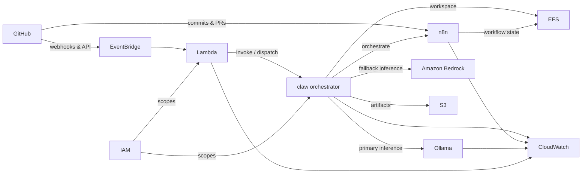

# Designing an Event-Driven AI Agent Platform on AWS with Resilient Primary–Fallback Inference

## Why This Matters

An agent platform that reacts to GitHub activity runs LLM inference on every trigger it accepts. When that inference depends on a single managed provider, both reliability and cost concentrate at one point: an outage stalls the platform, and per-token pricing sets an unavoidable floor under routine work.

The triggers themselves compound the pressure. Commits, pull requests, and webhooks arrive unpredictably and in bursts. Binding event receipt directly to heavy inference lets a slow model run hold the ingress path open, drop signals under load, and turn a spike in repository activity into a queue of stalled work.

This repository's architecture is built to separate those concerns.

## The Existing Architecture

The repository documents an event-driven, AWS-native system written primarily in Go. It follows a standard Go layout that separates deployment entry points, business logic, infrastructure definitions, and documentation, so the platform's wiring is readable independently of the code that implements each component.

At the center sits `claw`, the core orchestrator. Around it, event ingestion enters through Amazon EventBridge and AWS Lambda, workflow orchestration runs through `n8n`, inference is served by `ollama` and Amazon Bedrock, and durable state lives in Amazon EFS and Amazon S3. Every component reports to Amazon CloudWatch.

The layout communicates the design clearly. Its limitation is that a documented topology only becomes resilient when the paths through it — ingestion and inference — are deliberately decoupled and given fallbacks.

## The Engineering Constraint

The design has to satisfy several hard requirements at once:

- **Inference must stay available.** `claw` depends on `ollama` for primary inference and needs a defined path to fall back to when that primary is unavailable, rather than failing the request.
- **Inference must stay affordable.** The routine, high-volume path cannot sit permanently on a metered managed provider.
- **Event delivery must not block on execution.** GitHub trigger delivery has to complete regardless of how long agent execution takes downstream.
- **Bursts must be absorbed.** Unpredictable commit and pull-request volume cannot back-pressure onto the ingress path.
- **Access must be least-privilege.** `lam` and `claw` each need their own scoped permissions, not a shared broad role.
- **The system must be observable uniformly.** Every component has to emit telemetry to one place.

## The Solution

The platform splits the flow into an ingestion path and an execution path. GitHub events reach Amazon EventBridge, which routes them to AWS Lambda, and `lam` invokes or dispatches `claw`. Event receipt therefore completes without waiting on inference, absorbing whatever volume GitHub produces.

`claw` owns execution. It orchestrates `n8n`, then runs inference on `ollama` as the primary and fails over to Amazon Bedrock as the fallback. This dual-path routing is the core mechanism: the self-hosted primary carries routine load, and the managed provider stands in when the primary cannot serve.

State is shared deliberately. `claw` uses Amazon EFS as its workspace and writes artifacts to Amazon S3, while `n8n` persists workflow state on the same EFS mount. A second GitHub path delivers commits and pull requests directly to `n8n`.

## Architecture Summary

| Concern | Implementation |
| --- | --- |
| Event ingestion | GitHub → Amazon EventBridge → AWS Lambda (`gh → eb → lam`) |
| Orchestrator dispatch | `lam` invokes/dispatches `claw` |
| Workflow orchestration | `claw` orchestrates `n8n`; GitHub also sends commits & PRs to `n8n` |
| Primary inference | `claw → ollama` |
| Fallback inference | `claw → bedrock` |
| Workspace / workflow state | Amazon EFS, shared by `claw` and `n8n` |
| Durable artifacts | Amazon S3, written by `claw` |
| Access control | IAM scopes `lam` and `claw` independently |
| Observability | `claw`, `n8n`, `ollama`, and `lam` emit logs & metrics to Amazon CloudWatch |

The two inference backends play deliberately different roles:

| Dimension | Ollama (primary) | Amazon Bedrock (fallback) |
| --- | --- | --- |
| Role in `claw` routing | First choice for inference | Failover when the primary is unavailable |
| Hosting model | Self-hosted | AWS-managed |
| Cost model | Runs on owned infrastructure | Metered managed service |
| Observability | Emits logs & metrics to CloudWatch | Managed AWS service |

## Architecture Diagram

A GitHub event enters through Amazon EventBridge and AWS Lambda, and `lam` hands it to `claw`. The orchestrator drives `n8n` and resolves inference against `ollama` first and Amazon Bedrock second, reading and writing its workspace on Amazon EFS and depositing artifacts in Amazon S3. IAM bounds `lam` and `claw` separately, and each active component streams telemetry to Amazon CloudWatch.

## Key Implementation Details

### EventBridge-to-Lambda dispatch

The ingestion path is a fixed chain: `gh → eb → lam → claw`. GitHub delivers webhooks and API events to Amazon EventBridge, which routes them to AWS Lambda, and `lam` performs the `invoke / dispatch` into the orchestrator. Because the handoff to `claw` is an invocation rather than an inline call into inference, event acceptance finishes independently of execution time. A separate GitHub path delivers commits and pull requests straight to `n8n`, so workflow triggers do not have to traverse the EventBridge front door.

### Dual inference routing in `claw`

`claw` resolves every inference request against `ollama` as the primary and Amazon Bedrock as the fallback. The self-hosted primary handles routine load; the managed provider is the defined failover when the primary cannot serve. This keeps the high-volume path on owned infrastructure while guaranteeing a second backend for continuity, without changing how callers inside `claw` request inference.

### Shared EFS workspace and S3 artifacts

`claw` mounts Amazon EFS as its workspace, and `n8n` persists workflow state on the same file system, giving the orchestrator and the workflow engine a common substrate to collaborate over. Durable outputs go elsewhere: `claw` writes artifacts to Amazon S3, separating transient working state from the results that must outlive a run.

### Per-component IAM scoping

IAM scopes permissions for `lam` and `claw` independently rather than through one shared role. The dispatcher and the orchestrator each carry only the access their job requires, so the broad permissions `claw` needs to reach inference, EFS, and S3 are not extended to the Lambda sitting on the ingress path.

## Why These Decisions Were Made

### Self-hosted primary with a managed fallback

Routing to `ollama` first trades the convenience of a single managed provider for control over inference cost and availability. Routine work runs on owned infrastructure instead of a metered service, and Amazon Bedrock exists as the fallback so that control does not come at the expense of continuity. A fully managed-only design would remove the operational burden but reinstate the single-point cost and dependency the platform is built to avoid.

### Decoupling ingestion from execution

Placing Amazon EventBridge and AWS Lambda between GitHub and `claw` absorbs unpredictable trigger volume. The alternative — calling inference inline on event receipt — would let long agent runs hold the ingress path open and drop signals during bursts. The dispatch boundary lets ingestion scale on its own terms.

### Independent IAM per component

Scoping `lam` and `claw` separately enforces least privilege. A single shared role would be simpler to define but would hand the exposed ingress function the same reach the orchestrator needs across inference and storage.

## Repository Impact

The work at this stage is documentation that makes the design communicable and shared. The AWS architecture diagram is embedded directly in the README, and a service-view architecture diagram is added in SVG form, so the topology renders where contributors encounter it. Milestone 1 establishes the initial architecture as documentation only, giving the platform a reference model — the components, the ingestion and inference paths, the shared EFS state, and the IAM and CloudWatch wiring — that later implementation work can build against.

## Benefits

- **Inference resilience:** a defined fallback to Amazon Bedrock exists whenever `ollama` is unavailable.
- **Cost control:** routine inference runs on the self-hosted primary rather than a metered provider by default.
- **Loose coupling:** event ingestion through EventBridge and Lambda scales independently of agent execution in `claw`.
- **Least privilege:** IAM scopes `lam` and `claw` separately, limiting each component's reach.
- **Uniform observability:** `claw`, `n8n`, `ollama`, and `lam` emit logs and metrics to one place in Amazon CloudWatch.
- **A shared reference model:** the embedded diagrams give contributors a single, accurate view of the system.

## Tradeoffs

- Self-hosting `ollama` as the primary adds the operational burden of running inference infrastructure that a fully managed provider would remove.
- The two-path inference strategy plus `claw` and `n8n` as distinct orchestration components increases the moving parts and the integration surface between them.
- Sharing one Amazon EFS mount between `claw` and `n8n` couples the orchestrator and the workflow engine to a common state dependency that both must manage.

## What This Enables Next

With Milestone 1 documented, the platform has a settled reference for the ingestion path, the primary–fallback inference routing, the shared EFS workspace, and the per-component IAM boundaries. That model is what makes the described components implementable against a fixed contract: each can be built and wired to match a topology already agreed on, rather than negotiated during construction. The decoupling boundary and the second inference backend also establish the foundation for handling higher trigger volume and inference-provider changes without reworking how events reach the orchestrator.

## Conclusion

The reusable pattern this repository demonstrates is a split between an ingestion plane and an execution plane, paired with primary–fallback routing for the expensive dependency inside it. Amazon EventBridge and AWS Lambda decouple unpredictable GitHub triggers from `claw`, and `claw` routes inference to a self-hosted `ollama` primary before failing over to a managed Amazon Bedrock fallback. Shared Amazon EFS state, S3 artifacts, per-component IAM, and unified CloudWatch telemetry hold the rest of the system together.

For engineers building similar platforms, the practical takeaway is to treat inference like any other critical dependency: give the high-volume path an owned primary for control and cost, keep a managed provider as the defined fallback for availability, and put a dispatch boundary between event receipt and the work those events set in motion.
