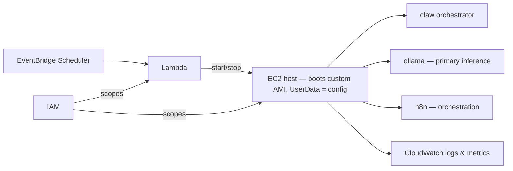

# Baking Versioned Custom AMIs for Fast, Reproducible Spot Startup on AWS

## Introduction

The AI agent platform documented in this repository runs its heaviest work on an EC2 compute host that is started and stopped on demand rather than left running. Reaching the milestone of optimizing that host's startup meant confronting a cost that had been hidden inside the boot path: every time the instance came up, it re-installed its entire software stack from scratch. The engineering response was to stop installing software at boot and instead bake a versioned, immutable machine image ahead of time, then reduce the instance's UserData to configuration only.

This article documents how that image is built, how the platform boots from it, and why the repository treats the AMI as a versioned, tagged artifact with its own build lifecycle. The subject is the design — the build sequence, the sanitization steps, the control channel, and the drift check — not any single point in time when it shipped.

## Background

The platform is event-driven and AWS-native. Its front door is serverless: GitHub events reach the system through EventBridge, an EventBridge Scheduler drives a Lambda function, and that Lambda starts and stops the EC2 compute host. The host itself runs the heavier, longer-lived processes — the `claw` orchestrator that dispatches work, `ollama` for primary inference with Bedrock as fallback, and `n8n` for workflow orchestration — with EFS as the shared workspace, S3 for artifacts, IAM scoping permissions to both the Lambda and the host, and CloudWatch collecting logs and metrics across all of them.

This split is deliberate. Serverless ingestion keeps the front door always available at near-zero idle cost, while the on-demand EC2 host bounds the cost of the compute-heavy inference and orchestration work by existing only when needed. The consequence of an on-demand host, though, is that its startup time is on the critical path of real work. Whatever the host does before it is ready to serve is latency the whole pipeline pays, every time the scheduler brings it up.

## Engineering Problem

The compute host previously configured itself imperatively at boot. Its UserData ran a full install sequence — a system update, then Docker, the Go, Node, and Python toolchains, the CloudWatch agent, and the platform's own drain agent — before the machine could do anything useful. This has three compounding problems.

It is slow. Package installation and a `dnf update` dominate boot time, so an on-demand host that should be a fast responder instead spends minutes provisioning itself before the first unit of work.

It is not reproducible. An imperative install resolves package versions against upstream repositories at the moment it runs. Two instances launched days apart from the same UserData can end up with different software, because the sources they pull from moved underneath them. That is configuration drift baked directly into the boot path.

It is failure-prone. Every install step is a network operation that can fail, and every failure happens at the worst possible time — during startup, on the critical path, on a host that may be a Spot instance with a limited lifetime. The more the boot does, the larger the surface for a boot to fail.

## Solution Overview

The repository moves installation off the boot path. All software that used to be installed at startup is pre-installed once into a custom AMI, which is built as a versioned, immutable artifact and tagged with its `Project`, `Component`, and `Version`. The compute host then launches from that image, and its UserData shrinks to configuration only — the host no longer installs anything at boot, it merely configures what is already present.

The image is produced by a repeatable build lifecycle rather than an ad-hoc snapshot. A stock Amazon Linux 2023 builder instance is provisioned, verified, sanitized of all machine-specific identity, quiesced, and captured with `create-image`; the resulting AMI and its snapshot are tagged; and the builder is always terminated. Systems Manager serves as the control and observability channel for the unattended build, so no SSH access to the builder is required.

## Architecture

There are two graphs to understand: how the image is built, and where it lands at run time.

The build-time flow is a sequence between a developer-driven build process (`Dev`), the builder instance (`B`), S3, SSM, and EC2. The process resolves the next version, refuses to proceed if that version already exists, stages its scripts and the drain agent to S3, and launches a stock AL2023 builder. The builder pulls its scripts from S3, installs the stack, records what it did, and signals completion. The build process observes progress through SSM, triggers cleanup, waits for the instance to stop, captures the image, tags it, and terminates the builder.

```mermaid
sequenceDiagram
    participant Dev as Build process
    participant S3
    participant EC2
    participant B as Builder (AL2023)
    participant SSM
    Dev->>Dev: resolve next version; refuse if it exists
    Dev->>S3: upload provision.sh, cleanup.sh, drain agent
    Dev->>EC2: run-instances (stock AL2023)
    B->>S3: fetch scripts
    B->>B: dnf update; docker, go, node, python, CW agent
    B->>B: install drain agent (code, not config)
    B->>B: write /etc/ami-manifest.json; touch ami-build.done
    Dev->>SSM: done? failed? where are you?
    SSM->>Dev: last line of the build log
    Dev->>SSM: run cleanup.sh (sanitize + shutdown)
    Dev->>EC2: wait instance-stopped (real success signal)
    Dev->>EC2: create-image (quiesced filesystem)
    Dev->>EC2: tag AMI + snapshot (Project, Component, Version)
    Dev->>EC2: terminate builder (on every exit path)
```

The same sequence, read as discrete lifecycle stages and the reason each one exists:

| Stage | Purpose |
| --- | --- |
| Resolve Version | Prevent duplicate immutable builds |
| Stage Assets | Upload build inputs to S3 |
| Provision Builder | Launch clean Amazon Linux builder |
| Install Software | Bake runtime into image |
| Sanitize | Remove machine-specific identity |
| Shutdown | Quiesce filesystem |
| Capture Image | Create immutable AMI |
| Tag Resources | Version and audit image |
| Terminate Builder | Eliminate unused infrastructure |

At run time, the baked AMI is what the on-demand host launches from. The EventBridge Scheduler drives the Lambda that starts and stops the EC2 host; that host boots from the custom AMI with UserData reduced to configuration, and it runs the platform's workloads with IAM scoping permissions and CloudWatch capturing logs and metrics.



The payoff of the entire build lifecycle is visible in that second graph: the software the builder installed is already present when the host boots, so start-up becomes a launch plus configuration rather than a launch plus a full install.

## Implementation Details

The build begins by resolving the next version and refusing to continue if an image at that version already exists. That refusal is more than a guardrail — it is what makes the build idempotent at the level of version identity. Re-running a build for a version that already exists produces no new image and mutates nothing, so a version is never silently overwritten and always refers to exactly one immutable image. Version identity and image identity are therefore the same thing: naming a version names a specific, unchangeable set of bytes, which is the property every later stage — launching, auditing, reasoning about a host — depends on.

The provisioning and cleanup scripts, along with the drain agent, are staged in S3 rather than embedded in the launch request. The builder fetches them from S3, which keeps the build inputs as versioned objects and separates what the builder runs from how it is launched. Provisioning runs `dnf update` and installs Docker, the Go, Node, and Python toolchains, and the CloudWatch agent, then installs the platform's drain agent as code rather than as boot-time configuration. Before finishing, the builder writes `/etc/ami-manifest.json` to record what the image contains and touches `ami-build.done` as a completion marker.

Throughout, the build process drives and observes the builder entirely through Systems Manager. It queries SSM for status — whether the build is done, failed, or still running — and SSM returns the last line of the build log; the same channel later triggers cleanup. Choosing SSM as the control plane is a security and operability decision, not just a convenience. The builder needs no inbound SSH access and therefore no open SSH port, which removes an entire class of exposure from the build host. There are no SSH keys to generate, distribute, rotate, or revoke, so the administrative surface that key management usually brings simply does not exist. And because SSM is the single operational control plane for the build, an otherwise unattended process gains centralized, auditable visibility — status, logs, and cleanup all flow through one governed channel rather than an interactive session on the box.

Cleanup is the step that turns a running machine into a distributable image. It strips credentials, SSH keys, the machine-id, and the SSM registration, then runs `cloud-init clean` so that cloud-init and UserData will run again on instances launched from the image rather than treating first-boot state as already complete. Skipping the cloud-init reset would leave every future instance believing it had already been initialized. Cleanup ends with `shutdown -h now`.

The image is only captured after the instance has actually stopped. The build process waits for `instance-stopped` and treats that as the real success signal, then runs `create-image` against the now-quiesced filesystem — capturing a consistent on-disk state rather than a live one. The resulting AMI and its backing snapshot are tagged with `Project`, `Component`, and `Version`, so both the image and its storage are identifiable and auditable after the fact.

## Engineering Decisions

Several choices in the lifecycle are worth calling out because they encode operational discipline, not just mechanics. Underneath them is a single principle: the host is treated as immutable infrastructure. It is not patched in place or modified after launch; it is replaced by rebuilding a new versioned image and launching from it. That stance — rebuild rather than patch, replace rather than mutate — is what makes deployments predictable and runtime environments reproducible, because every instance of a version is built from the same baked artifact rather than converging toward a desired state at boot.

The builder is terminated on every exit path. A build that fails partway through still tears down its builder, so failed builds do not leave orphaned instances accruing cost or lingering as confusing state. The teardown is a property of the process, not of the happy path.

Instance-stopped is treated as the success signal rather than a completion marker inside the machine. The image is captured from a filesystem that has genuinely settled after `shutdown`, which is why `create-image` operates on a quiesced disk. Tying capture to the observed stop, rather than to a flag the machine sets while still running, is what makes the snapshot trustworthy.

The drain agent ships as code and is paired with a drift check. Baking software into an immutable image raises a specific hazard: the image and a running host can silently diverge over time. Delivering the drain agent as code inside the image and then checking for drift keeps the baked artifact and the running state honest, so the guarantee that a host matches its image is verified rather than assumed. This is the acknowledgement that immutability alone does not eliminate drift — it relocates the question to whether the running host still matches what was baked.

The documentation follows the same immutability discipline. One "as built" architecture diagram is designated as living and kept current, while older diagrams are explicitly marked as snapshots. That prevents the common failure where several diagrams drift from reality and a reader cannot tell which one to trust; there is a single authoritative view, and the frozen ones are labelled as frozen.

## Repository Changes

The work is infrastructure and documentation only — there are no application-logic changes. The change set is the build system that produces and versions the AMI, the infrastructure that launches from it, the drain-agent drift check, and the architecture documentation, including a hand-authored "as built" SVG.

The infrastructure is defined as code. The platform's CloudFormation templates span EC2, EventBridge and its Scheduler, IAM, Lambda, Logs, and S3, defining the serverless ingestion, the compute host, the messaging and scheduling that drive it, and the IAM scoping that constrains both the Lambda and the host. The AMI build lifecycle plugs into that existing topology: the image it produces is what the EC2 portion of the stack launches.

## Benefits

Startup becomes fast and predictable because installation is no longer on the boot path. A host that boots from the baked image runs pre-installed software and only applies configuration, which is what makes it a viable on-demand and Spot responder.

Hosts are reproducible. Because the version refuses duplicates and the image is captured once and reused, every instance launched from a given version is identical — the drift introduced by resolving package versions at each boot is gone.

The boot-time failure surface shrinks. Configuration is far less likely to fail than a full install of Docker, three language toolchains, and an agent over the network, so booting is more reliable precisely because it does less.

Versioned immutable images also improve deployment confidence, because they make rollback a first-class operation. When a new image misbehaves, recovery is to launch the previous version — a known-good runtime that still exists intact, because versions are never overwritten. The rollback replays no installation logic and resolves no packages; it simply boots an artifact that was already built and validated, so the recovered host is byte-for-byte the one that worked before. Predictable roll-forward and predictable rollback are two sides of the same versioning property, and together they raise the operational reliability of every deployment.

The images are auditable. Tagging the AMI and snapshot with `Project`, `Component`, and `Version`, together with the `/etc/ami-manifest.json` recorded at build time, means any running host can be traced back to a specific, versioned image and its contents.

And the cost model holds: the on-demand compute host still bounds cost by existing only when the scheduler brings it up, now without paying an install tax each time it does.

## Tradeoffs

Baking images is not free. It introduces a build pipeline and an image-versioning scheme that must be owned and maintained — the resolve-refuse-provision-sanitize-snapshot-tag-terminate lifecycle is now a piece of infrastructure in its own right, where before there was only a UserData script.

Immutable images go stale. Software frozen into an image does not receive updates until a new image is built, so security patches and version bumps now arrive on a rebuild cadence rather than at every boot. The reproducibility that eliminates drift is the same property that requires deliberate rebuilds to move forward.

Drift still has to be actively checked. The immutable image guarantees what was baked, but not that a long-running host still matches it, which is exactly why the drain agent carries a drift check. Immutability moves the drift problem; it does not delete it.

Immutable infrastructure also accumulates. Every `create-image` produces an AMI backed by its own EBS snapshot, and because versions are never overwritten, images and their snapshots pile up build after build. Left unmanaged, that accumulation becomes operational clutter: old images that should be retired, deregistered AMIs whose snapshots linger, and a growing catalogue that is harder to reason about. Choosing immutability therefore also means owning image lifecycle governance — a policy for which versions to keep, when to retire old images, and how to clean up the snapshots they leave behind. The versioning that makes rollback trivial is the same versioning that makes lifecycle management a standing operational responsibility.

## Applying the Pattern

An engineer facing slow, drift-prone EC2 or Spot startup can reuse this shape directly. The core move is to identify the work a host does at boot that never actually needs to happen at boot — installation, toolchain setup, agent deployment — and relocate it into a versioned golden image built ahead of time. What genuinely varies per instance stays in UserData as configuration; everything else is baked.

The build itself is worth running as a disciplined lifecycle rather than a manual snapshot: resolve a version and refuse to overwrite it, stage build inputs in S3, provision a stock builder, verify and observe it through SSM instead of opening SSH, sanitize every trace of machine identity and reset cloud-init before capture, wait for a real stop signal, capture from the quiesced filesystem, tag the image and its snapshot, and tear down the builder on every path. Pairing the immutable image with a drift check on whatever agent must stay in sync closes the loop that immutability alone leaves open.

## Conclusion

The repository replaces imperative, per-boot host bootstrapping with versioned, immutable AMIs and a UserData reduced to configuration. Installation moves off the critical path into a repeatable build lifecycle controlled through SSM and sanitized before capture, and the running host is kept honest with a drift check on the drain agent. The result is startup that is fast, reproducible, and auditable for an on-demand compute host inside an event-driven AWS system — and a build-and-boot pattern that transfers cleanly to any EC2 or Spot workload where boot time and configuration drift are the constraints that matter.

The deeper payoff, though, is not the speed. Faster startup is the visible result; the durable one is that the host has become something the team can reason about with certainty. Every EC2 instance launched from a given version behaves identically, and that single guarantee is what makes the runtime reproducible, auditable, and safe to roll back — because a version is a fixed artifact, not a process whose outcome depends on the day it ran. Treating the machine image as immutable infrastructure turns the host from a thing that is configured into a thing that is versioned, and a versioned host is one an engineering team can deploy, recover, and trust on the same terms every time.
