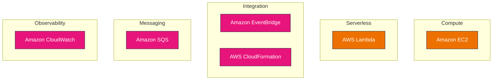
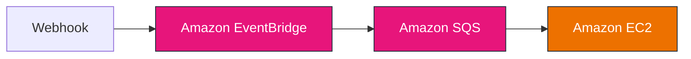
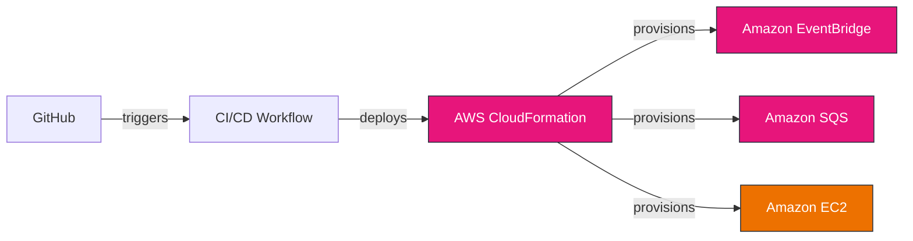

# Architecture Diagrams: widget

_Repository-level architecture overview · Event-driven platform_

> **Notes:** diagrams are generated from the repository README, documented AWS integrations, automation workflows, and the current project structure. The architecture document is intentionally **version-independent** so it can be reused across releases, branches, and generated documentation workflows.

---

## Platform Overview

Widget is an event-driven pipeline: a webhook publishes to EventBridge, which buffers events in SQS; a scheduled EC2 worker drains the queue and processes each widget. The platform is classified as **event-driven** because external events are ingested and routed through Amazon SQS and Amazon EventBridge for asynchronous processing before orchestration and inference execution.

---

## Deployment Architecture — AWS Integration

_Deployment architecture_

**Type:** Deployment Diagram · **Complexity:** low

### AWS Services Used

- **AWS Lambda** — event handling and dispatch to the orchestration layer
- **Amazon EventBridge** — asynchronous event ingestion and routing
- **Amazon SQS** — message queue buffering asynchronous work
- **Amazon EC2** — on-demand compute for workloads that are not serverless
- **AWS CloudFormation** — provisions infrastructure as code
- **Amazon CloudWatch** — centralized logs and metrics

---

## Logical Architecture — Data Flow

_Logical architecture_

**Type:** Data Flow Diagram · **Complexity:** low

### Key Components

- Webhook
- **Amazon EventBridge** — asynchronous event ingestion and routing
- **Amazon SQS** — message queue buffering asynchronous work
- **Amazon EC2** — on-demand compute for workloads that are not serverless

---

## CI/CD & Infrastructure Automation

_Delivery and infrastructure automation_

**Type:** Deployment Diagram · **Complexity:** medium

### Deployment Characteristics

- **GitHub** — source of webhooks, commits, and pull requests that trigger the pipeline
- **CI/CD Workflow** — runs validation and build steps for each change
- **AWS CloudFormation** — provisions infrastructure as code
- **Amazon EventBridge** — asynchronous event ingestion and routing
- **Amazon SQS** — message queue buffering asynchronous work
- **Amazon EC2** — on-demand compute for workloads that are not serverless

---

## Architecture Intelligence

| Attribute | Value |
| --- | --- |
| **Architecture style** | Event-driven platform |
| **Primary workflow** | Webhook → Amazon EventBridge → Amazon SQS → Amazon EC2 |
| **Infrastructure complexity** | medium |
| **Operational model** | Infrastructure as Code on AWS |
| **Centralized observability** | Amazon CloudWatch |
| **Estimated reading time** | 4 min |

---

## Generation Context

This document is generated from the **current repository state**, including the README, documentation, workflows, and project structure available at generation time. No release-specific version information is embedded in the architecture document.
