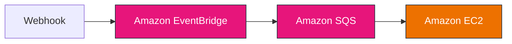
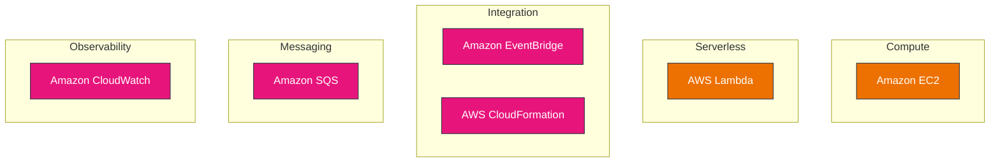

# Release Architecture: widget v1.0.0

_Architecture impact analysis derived from the release blog_

> **Source:** This document is generated from the release-specific `blog.md` artifact and captures the architectural impact of **v1.0.0**.

---

## Release Context

- **Repository:** widget
- **Release:** v1.0.0
- **Primary Engineering Theme:** Shipping Widget v1.0.0: An Event-Driven Pipeline on AWS

---

## What Changed in This Release

First production release of Widget. Adds an EventBridge-driven ingestion pipeline, an SQS durable buffer, a hardened EC2 worker, and CloudFormation infrastructure. Breaking: the legacy polling endpoint is removed.

---

## Affected AWS Components

- **Amazon EventBridge** — asynchronous event ingestion and routing
- **Amazon EC2** — on-demand compute for workloads that are not serverless
- **Amazon SQS** — message queue buffering asynchronous work

---

## Updated Architecture Flow

**widget v1.0.0 — Event-Driven Flow**

**widget v1.0.0 — High-Level AWS Architecture**

---

## Operational Impact

- Single-region, single public subnet; serverless front door, scheduled EC2 compute.
- SQS absorbs bursts; the worker processes within a scheduled window.
- SQS provides durable buffering and retries; a dead-letter queue captures poison messages.

---

## Security Considerations

IMDSv2 enforced, least-privilege IAM, secrets in AWS Secrets Manager, HMAC-verified webhooks.

---

## Relationship to the Platform

Widget is an event-driven pipeline: a webhook publishes to EventBridge, which buffers events in SQS; a scheduled EC2 worker drains the queue and processes each widget.

---

## Generation Context

This document is generated from the release-specific `blog.md` artifact for **v1.0.0** and represents the architectural impact of that release rather than a permanent repository-wide architecture reference.
