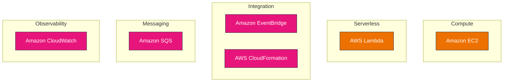
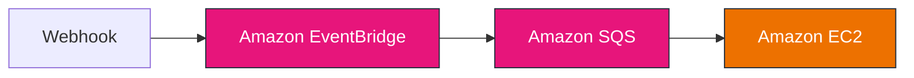
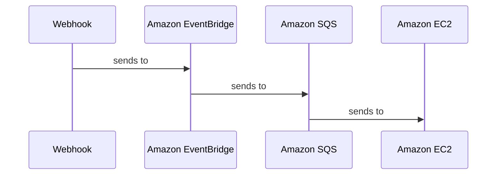
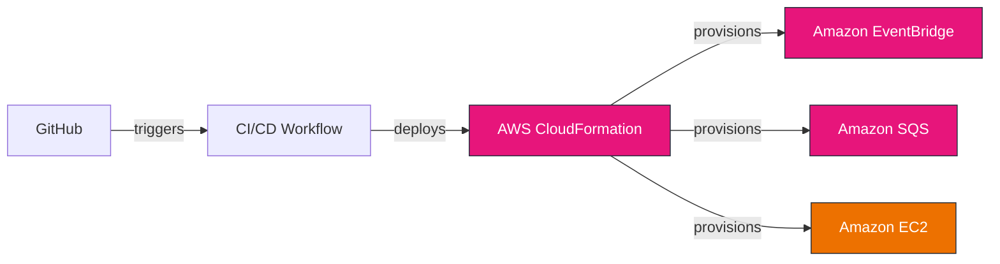
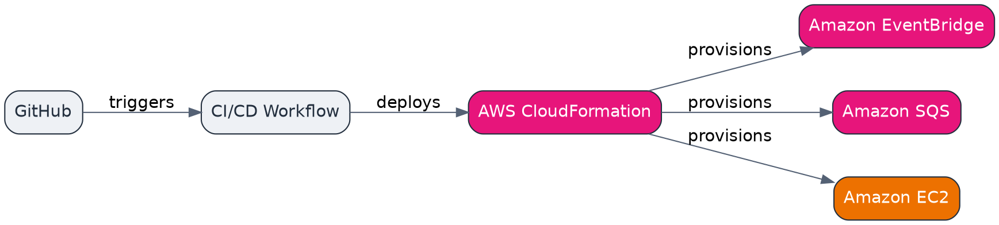

# Architecture Diagrams: acme/widget v1.0.0

_4 diagrams · Event-driven serverless architecture · confidence 91/100_

## Platform Overview

Widget is an event-driven pipeline: a webhook publishes to EventBridge, which buffers events in SQS; a scheduled EC2 worker drains the queue and processes each widget.

---

## widget v1.0.0 — High-Level AWS Architecture

_Services grouped by category_

**Type:** High-Level Architecture · **Complexity:** low · **Confidence:** 100/100

## Introduction The system decouples events from generation. ## Architecture EventBridge routes to SQS, drained by an EC2 worker. ## Conclusion The pattern generalises to event-driven workloads.

**AWS services:** AWS Lambda, Amazon EventBridge, Amazon SQS, Amazon EC2, AWS CloudFormation, Amazon CloudWatch

**Grounded in:** AWS Lambda, Amazon EventBridge, Amazon SQS, Amazon EC2, AWS CloudFormation, Amazon CloudWatch

```dot
digraph Architecture {
  rankdir=TB;
  graph [fontname="Helvetica", splines=true, nodesep=0.5, ranksep=0.6];
  node [shape=box, style="rounded,filled", fontname="Helvetica", fillcolor="#EEF1F5", color="#232F3E"];
  edge [fontname="Helvetica", color="#546174"];

  subgraph cluster_0 {
    label="Compute";
    style="rounded";
    color="#B7C0CD";
    Amazon_EC2 [label="Amazon EC2", fillcolor="#ED7100", fontcolor="#FFFFFF"];
  }
  subgraph cluster_1 {
    label="Serverless";
    style="rounded";
    color="#B7C0CD";
    AWS_Lambda [label="AWS Lambda", fillcolor="#ED7100", fontcolor="#FFFFFF"];
  }
  subgraph cluster_2 {
    label="Integration";
    style="rounded";
    color="#B7C0CD";
    Amazon_EventBridge [label="Amazon EventBridge", fillcolor="#E7157B", fontcolor="#FFFFFF"];
    AWS_CloudFormation [label="AWS CloudFormation", fillcolor="#E7157B", fontcolor="#FFFFFF"];
  }
  subgraph cluster_3 {
    label="Messaging";
    style="rounded";
    color="#B7C0CD";
    Amazon_SQS [label="Amazon SQS", fillcolor="#E7157B", fontcolor="#FFFFFF"];
  }
  subgraph cluster_4 {
    label="Observability";
    style="rounded";
    color="#B7C0CD";
    Amazon_CloudWatch [label="Amazon CloudWatch", fillcolor="#E7157B", fontcolor="#FFFFFF"];
  }

}
```

Graphviz (DOT)

**PNG export:** 1920x1080 (16:9), 144 DPI, transparent background

---

## widget v1.0.0 — Event-Driven Flow

_Grounded in the release's described flows_

**Type:** Event-Driven Architecture · **Complexity:** low · **Confidence:** 90/100

## Introduction The system decouples events from generation. ## Architecture EventBridge routes to SQS, drained by an EC2 worker. ## Conclusion The pattern generalises to event-driven workloads.

**AWS services:** Amazon EventBridge, Amazon SQS, Amazon EC2

**Grounded in:** webhook → EventBridge → SQS → EC2 worker

Graphviz (DOT)

**PNG export:** 1920x1080 (16:9), 144 DPI, transparent background

---

## widget v1.0.0 — Request Sequence

**Type:** Sequence Diagram · **Complexity:** low · **Confidence:** 90/100

## Introduction The system decouples events from generation. ## Architecture EventBridge routes to SQS, drained by an EC2 worker. ## Conclusion The pattern generalises to event-driven workloads.

**AWS services:** Amazon EventBridge, Amazon SQS, Amazon EC2

**Grounded in:** webhook → EventBridge → SQS → EC2 worker

Graphviz (DOT)

**PNG export:** 1920x1080 (16:9), 144 DPI, transparent background

---

## widget v1.0.0 — CI/CD & Infrastructure Automation

_Delivery and infrastructure automation_

**Type:** CI/CD Pipeline · **Complexity:** medium · **Confidence:** 86/100

## Introduction The system decouples events from generation. ## Architecture EventBridge routes to SQS, drained by an EC2 worker. ## Conclusion The pattern generalises to event-driven workloads.

**AWS services:** AWS CloudFormation, Amazon EventBridge, Amazon SQS, Amazon EC2

**Grounded in:** infrastructure/pipeline.yaml

Graphviz (DOT)

**PNG export:** 1920x1080 (16:9), 144 DPI, transparent background

---

## Architecture Intelligence

- **Style:** Event-driven serverless · **Deployment:** Single-region, single public subnet; serverless front door, scheduled EC2 compute.
- **Infrastructure complexity:** medium
- **Primary workflow:** Webhook → Amazon EventBridge → Amazon SQS → Amazon EC2
- **Operational model:** Infrastructure as Code on AWS
- **Cloud services:** AWS Lambda, Amazon EventBridge, Amazon SQS, Amazon EC2, AWS CloudFormation, Amazon CloudWatch
- **Compute:** Amazon EC2
- **Serverless:** AWS Lambda
- **Messaging:** Amazon SQS
- **Integration:** Amazon EventBridge, AWS CloudFormation
- **Observability:** Amazon CloudWatch
- **Estimated reading time:** 4 min · **Diagram confidence:** 91/100

